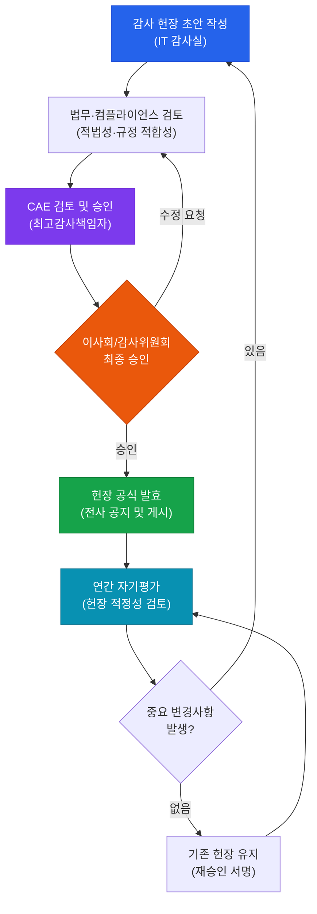

# 감사 헌장 및 표준

**Audit Charter and Standards**

:::info 관련 표준
- **CISA Domain 1**: IT 감사 프로세스 (Information Systems Auditing Process)
- **ISACA ITAF 1001**: Audit Charter
- **ISACA ITAF 1002**: Organizational Independence
- **ISACA ITAF 1003**: Professional Independence
- **IIA Standard 1000**: Purpose, Authority, and Responsibility
- **ISO 19011**: Guidelines for Auditing Management Systems
:::

<table>
  <colgroup>
    <col style={{width: '20%'}} />
    <col style={{width: '80%'}} />
  </colgroup>
  <tbody>
    <tr><td><strong>문서번호</strong></td><td>BP-AUD-01</td></tr>
    <tr><td><strong>제개정일</strong></td><td>2026-05-18</td></tr>
    <tr><td><strong>관리부서</strong></td><td>IT 감사실</td></tr>
    <tr><td><strong>적용범위</strong></td><td>전사 IT 감사 활동</td></tr>
    <tr><td><strong>통제목적</strong></td><td>감사 활동의 권한·책임·독립성을 명문화하여 감사의 신뢰성과 효과성을 확보한다.</td></tr>
  </tbody>
</table>

---

## 1. 개요 및 배경

감사 헌장(Audit Charter)은 IT 감사 기능의 목적, 권한, 책임 및 독립성을 공식적으로 정의하는 최상위 문서이다. 경영진 및 이사회 또는 감사위원회의 승인을 받아야 하며, IT 감사실이 조직 내에서 합법적으로 운영될 수 있는 법적·제도적 기반을 제공한다. 헌장 없이 수행된 감사는 법적 효력과 내부 권위가 결여되어 감사 결과의 수용도가 낮아질 위험이 있다.

ISACA의 IT 감사 프레임워크(ITAF: IT Assurance Framework)는 감사 표준을 일반 표준(General Standards), 수행 표준(Performance Standards), 보고 표준(Reporting Standards)의 세 계층으로 구분한다. 이 세 계층은 감사인의 자격·독립성부터 현장 작업 방법론, 최종 보고서 작성까지 감사의 전 생애주기를 포괄한다.

조직의 IT 환경이 복잡해질수록 감사 헌장의 역할은 더욱 중요해진다. 클라우드 전환, 디지털 트랜스포메이션, 공급망 리스크 등 새로운 위협 환경에서 IT 감사실이 경영진과 이사회에 신뢰할 수 있는 독립적 의견을 제공하려면 헌장에 근거한 명확한 역할과 권한이 필수적이다.

---

## 2. 핵심 개념 및 원칙

### 2.1 ITAF 표준 체계

| 표준 계층 | 표준 번호 | 주요 내용 | 핵심 요구사항 |
|-----------|-----------|-----------|---------------|
| **일반 표준** (General) | 1001~1008 | 감사인 자격, 독립성, 전문성 | 헌장, 조직적 독립성, 개인적 독립성, 합리적 기대, 전문성과 주의의무 |
| **수행 표준** (Performance) | 1201~1207 | 감사 계획, 수행, 증거 | 계획, 감독, 범위, 리스크 평가, 자원 배분, 증거 수집, 감사 조서 |
| **보고 표준** (Reporting) | 1401~1402 | 보고서 내용 및 형식 | 보고, 후속 조치 |

### 2.2 감사 헌장 필수 구성 요소 6가지

| 구성 요소 | 설명 | 실무 포인트 |
|-----------|------|-------------|
| **목적 (Purpose)** | IT 감사의 존재 이유와 기여 가치 | 조직 전략 목표와 연계 명시 |
| **권한 (Authority)** | 감사 접근권, 기록 열람권, 인터뷰 권한 | 이사회/감사위원회 서명 포함 |
| **책임 (Responsibility)** | 감사 수행 범위 및 보고 의무 | 외부 감사와의 역할 구분 |
| **독립성 (Independence)** | 감사 대상으로부터의 독립 선언 | 겸직 금지 조항 명기 |
| **전문성 (Competency)** | 감사인 자격 기준 및 지속 교육 | CISA 등 자격증 요건 |
| **윤리 (Ethics)** | ISACA 윤리 강령 준수 서약 | 이해충돌 신고 절차 포함 |

### 2.3 감사 독립성 유지 방법

**조직적 독립성 (Organizational Independence)**
- IT 감사실은 최고감사책임자(CAE: Chief Audit Executive)에게 직접 보고
- CAE는 감사위원회 또는 이사회에 기능적으로 보고
- 감사 대상 부서(IT 운영, 개발 등)와 동일 보고 체계 금지

**개인적 독립성 (Individual Independence)**
- 최근 1년 이내 감사 대상 업무 수행 이력이 있는 감사인 제외
- 재무적 이해관계 보유 시 해당 감사에서 배제
- 친인척 관계 등 이해충돌 사전 신고 의무

### 2.4 ISACA 윤리 강령 6대 원칙

| 원칙 | 내용 |
|------|------|
| **정직성 (Honesty)** | 감사 결과를 왜곡 없이 정확하게 보고 |
| **객관성 (Objectivity)** | 편견 없는 독립적 판단 유지 |
| **기밀성 (Confidentiality)** | 감사 과정에서 취득한 정보의 무단 공개 금지 |
| **역량 (Competency)** | 지속적 전문성 개발 및 자격 유지 |
| **법규 준수 (Compliance)** | 관련 법규 및 표준 준수 |
| **전문직업성 (Professionalism)** | IT 감사 직업의 명예와 신뢰성 유지 |

---

## 3. 프로세스 / 방법론

### 3.1 감사 헌장 수립 및 관리 프로세스

### 3.2 ITAF 표준 계층 관계도

```mermaid
flowchart LR
    subgraph General["일반 표준 (1001-1008)"]
        G1["헌장 (1001)"]
        G2["조직적 독립성 (1002)"]
        G3["개인적 독립성 (1003)"]
        G4["합리적 기대 (1004)"]
        G5["전문성·주의의무 (1005)"]
    end

    subgraph Performance["수행 표준 (1201-1207)"]
        P1["계획 (1201)"]
        P2["감독 (1202)"]
        P3["범위 (1203)"]
        P4["증거 수집 (1205)"]
        P5["감사 조서 (1206)"]
    end

    subgraph Reporting["보고 표준 (1401-1402)"]
        R1["보고 (1401)"]
        R2["후속 조치 (1402)"]
    end

    General --> Performance
    Performance --> Reporting

    style G1 fill:#2563EB,stroke:#1D4ED8,color:#fff
    style G2 fill:#2563EB,stroke:#1D4ED8,color:#fff
    style G3 fill:#2563EB,stroke:#1D4ED8,color:#fff
    style P1 fill:#7C3AED,stroke:#6D28D9,color:#fff
    style P4 fill:#7C3AED,stroke:#6D28D9,color:#fff
    style R1 fill:#16A34A,stroke:#15803D,color:#fff
    style R2 fill:#16A34A,stroke:#15803D,color:#fff
```

### 3.3 독립성 위협 유형 및 대응 방안

| 위협 유형 | 예시 | 대응 방안 |
|-----------|------|-----------|
| **자기검토 위협** | 자신이 구축한 시스템 감사 | 해당 감사에서 배제, 다른 감사인 지정 |
| **이해관계 위협** | 감사 대상 회사 주식 보유 | 주식 처분 또는 감사 배제 |
| **친밀성 위협** | 피감사인과 개인적 친분 | 이해충돌 신고, 팀장 판단 후 배제 검토 |
| **협박 위협** | 피감사인의 감사 방해 시도 | CAE 즉시 보고, 기록 보존 |
| **자기이익 위협** | 감사 결과에 따른 인센티브 | 성과 평가와 감사 결과 분리 |

---

## 4. CISA 감사 체크리스트

<table>
  <colgroup>
    <col style={{width: '7%'}} />
    <col style={{width: '23%'}} />
    <col style={{width: '38%'}} />
    <col style={{width: '32%'}} />
  </colgroup>
  <thead>
    <tr>
      <th>ID</th>
      <th>통제 목적</th>
      <th>감사 수행 절차</th>
      <th>필수 증적 파일</th>
    </tr>
  </thead>
  <tbody>
    <tr>
      <td><strong>AC-01</strong></td>
      <td>감사 헌장의 존재 및 최신성 확인</td>
      <td>1. 감사 헌장 문서 요청 및 버전 확인 2. 최종 개정일과 조직 변화 시점 비교 3. 헌장의 목적·권한·책임 요소 완전성 검토</td>
      <td>감사 헌장 원본 개정 이력 기록 버전 관리 로그</td>
    </tr>
    <tr>
      <td><strong>AC-02</strong></td>
      <td>이사회/감사위원회 공식 승인 확인</td>
      <td>1. 감사위원회 회의록에서 헌장 승인 결의 확인 2. 승인 서명자의 권한 적정성 검토 3. 승인 일자와 헌장 발효일 일치 여부 확인</td>
      <td>감사위원회 회의록 이사회 결의서 서명된 헌장 사본</td>
    </tr>
    <tr>
      <td><strong>AC-03</strong></td>
      <td>조직적 독립성 구조 적정성 평가</td>
      <td>1. IT 감사실의 보고 체계 조직도 검토 2. CAE의 이사회/감사위원회 직접 보고 경로 확인 3. 감사 대상 부서와의 보고선 분리 여부 확인</td>
      <td>조직도 (최신본) 보고 체계 기술서 CAE 임명 문서</td>
    </tr>
    <tr>
      <td><strong>AC-04</strong></td>
      <td>감사인 개인 독립성 관리 체계 확인</td>
      <td>1. 이해충돌 신고 양식 및 절차 검토 2. 현 감사 팀원의 이해충돌 신고서 확인 3. 자기검토 위협 사례 존재 여부 확인</td>
      <td>이해충돌 신고서 독립성 선언서 이해충돌 관리 대장</td>
    </tr>
    <tr>
      <td><strong>AC-05</strong></td>
      <td>연간 자기평가(Self-Assessment) 수행 확인</td>
      <td>1. 전년도 자기평가 보고서 요청 2. 자기평가 범위(ITAF 준수 여부) 적정성 검토 3. 자기평가 결과의 경영진 보고 여부 확인</td>
      <td>연간 자기평가 보고서 개선 계획서 경영진 보고 기록</td>
    </tr>
    <tr>
      <td><strong>AC-06</strong></td>
      <td>ISACA 윤리 강령 준수 체계 확인</td>
      <td>1. 윤리 강령 교육 이수 기록 검토 2. 윤리 위반 신고 채널 존재 여부 확인 3. 최근 3년 윤리 관련 징계 사례 조회</td>
      <td>윤리 교육 이수증 서약서 원본 징계 기록부</td>
    </tr>
  </tbody>
</table>

---

## 5. 관련 표준 및 참고

| 표준/가이드라인 | 발행기관 | 관련 조항 | 적용 포인트 |
|----------------|----------|-----------|-------------|
| ITAF (IT Assurance Framework) | ISACA | 1001~1402 | IT 감사 전 영역 표준 체계 |
| IIA International Standards | IIA | 1000, 1100 | 내부감사 헌장 및 독립성 |
| ISO 19011:2018 | ISO | 5.3, 5.4 | 감사 프로그램 관리, 감사인 역량 |
| COBIT 2019 | ISACA | MEA01, MEA02 | 모니터링, 평가 및 감사 |
| COSO Internal Control | COSO | Component 5 | 모니터링 활동 |
| 내부감사기준 | 한국내부감사협회 | 1000~1130 | 국내 내부감사 적용 표준 |

---

## 관련 문서

- [1.2 리스크 기반 감사 계획](/docs/audit-process/risk-based-planning)
- [1.3 감사 수행 및 증거 수집](/docs/audit-process/audit-execution)
- [1.5 보고 및 후속 조치](/docs/audit-process/reporting)
- [2.1 IT 거버넌스 프레임워크](/docs/it-governance/governance-framework)
- [감사 도구 및 템플릿](/docs/audit-toolkits/audit-templates)
