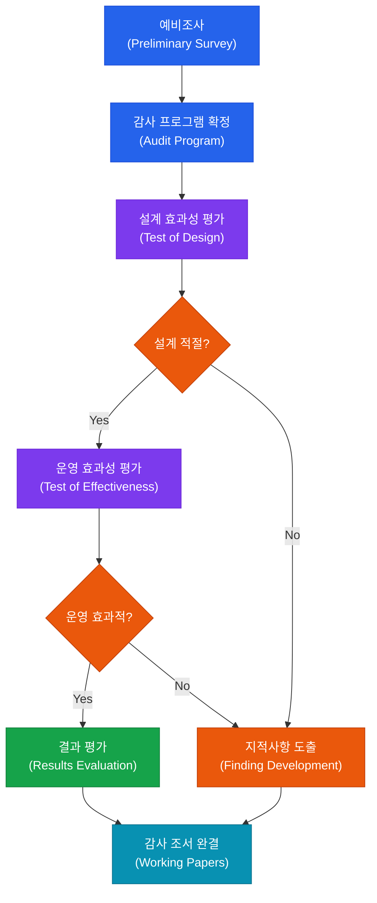
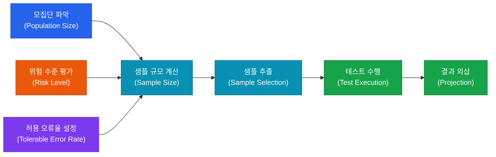

# 감사 수행 및 증거 수집
**Audit Execution & Evidence Collection**

:::info 관련 표준
CISA Domain 1.3 · ISACA Evidence Standards · IIA Standard 2310 (Identifying Information) · PCAOB AS 2301 (Auditor's Response to the Risks of Material Misstatement)
:::

<table>
  <colgroup>
    <col style={{width: '20%'}} />
    <col style={{width: '80%'}} />
  </colgroup>
  <tbody>
    <tr><td><strong>문서번호</strong></td><td>BP-AUD-03</td></tr>
    <tr><td><strong>제개정일</strong></td><td>2026-05-18</td></tr>
    <tr><td><strong>관리부서</strong></td><td>IT 감사실</td></tr>
    <tr><td><strong>적용범위</strong></td><td>개별 감사 프로젝트</td></tr>
    <tr><td><strong>통제목적</strong></td><td>충분하고 적절한 감사 증거 수집을 통해 감사 의견의 신뢰성 및 재현 가능성 확보</td></tr>
  </tbody>
</table>

---

## 1. 개요 및 배경

감사 수행(Audit Execution) 단계는 감사계획에서 식별한 위험 및 통제 목표를 바탕으로 실질적인 테스트를 설계하고 증거를 수집하는 과정이다. 본 단계의 출발점은 **예비조사(Preliminary Survey)**로, 감사 대상 조직·프로세스·시스템에 대한 충분한 이해를 확보함으로써 이후 통제 테스트의 방향을 구체화한다. 예비조사 없이 테스트를 곧바로 시작하면 불필요한 자원 낭비와 누락 위험이 발생한다.

통제 테스트는 **설계 효과성 평가(Test of Design, ToD)**와 **운영 효과성 평가(Test of Effectiveness, ToE)** 두 단계로 구성된다. ToD는 통제가 식별된 위험을 경감할 수 있도록 올바르게 설계되었는지를 평가하며, ToE는 해당 통제가 감사 기간 동안 지속적이고 일관되게 작동했는지를 검증한다. 두 평가 모두 통과해야 해당 통제를 신뢰할 수 있다고 결론 내릴 수 있다.

수집된 감사 증거는 SAVANT 원칙(Sufficient, Appropriate, Valid, Accurate, Necessary, Timely)에 따라 평가된다. 감사인은 수집한 증거를 감사 조서(Working Papers)에 체계적으로 문서화하여 감사 결론의 근거를 명확히 하고 후속 검토 및 재감사를 지원해야 한다.

---

## 2. 핵심 개념 및 원칙

### 2.1 예비조사(Preliminary Survey)

| 구분 | 내용 |
|------|------|
| **목적** | 감사 대상 환경 이해, 고위험 영역 식별, 감사 범위 및 초점 구체화 |
| **주요 활동** | 조직도·업무 흐름도 검토, 이전 감사 결과 분석, 핵심 담당자 인터뷰, 정책·절차서 검토, 시스템 인벤토리 파악 |
| **산출물** | 감사 대상 업무 기술서(Entity Description), 위험·통제 매트릭스(RCM), 감사 프로그램(Audit Program) |

### 2.2 통제 테스트 유형 비교

| 구분 | 설계 효과성 평가 (ToD) | 운영 효과성 평가 (ToE) |
|------|----------------------|----------------------|
| **목적** | 통제가 위험을 경감하도록 올바르게 설계되었는지 확인 | 통제가 감사 기간 중 지속적으로 작동했는지 확인 |
| **수행 시점** | 감사 초기, 프로세스 이해 단계 | 설계 효과성 확인 후 실시 |
| **주요 기법** | 인터뷰, 관찰, 문서 검토 | 재수행(Re-performance), 샘플링 테스트 |
| **결과 판단** | 통제 논리가 적절한가? | 통제가 예외 없이 실행되었는가? |
| **실패 시 영향** | ToE 수행 불필요, 통제 재설계 권고 | 운영 개선 권고, 보완 통제 제안 |

### 2.3 샘플링 방법론 비교

| 유형 | 방법 | 특징 | 적용 상황 |
|------|------|------|-----------|
| **통계적 - 무작위** | Random Sampling | 모집단 각 항목의 선택 확률 동일 | 모집단 균질, 완전한 목록 확보 시 |
| **통계적 - 체계적** | Systematic Sampling | 일정 간격으로 샘플 추출 (n번째 항목) | 순차 데이터, 주기적 거래 |
| **통계적 - 층화** | Stratified Sampling | 모집단을 하위 그룹으로 분류 후 각 층에서 추출 | 고액 거래 등 고위험 항목 집중 검토 시 |
| **비통계적 - 판단** | Judgmental Sampling | 감사인 전문적 판단에 기반하여 선택 | 특정 위험 집중 검토, 소규모 모집단 |
| **비통계적 - 편의** | Haphazard Sampling | 의도 없이 임의 선택 (무작위와 다름) | 예비 테스트, 보완적 절차 |

### 2.4 감사 증거 유형 및 SAVANT 원칙

**감사 증거 5가지 유형**

| 유형 | 설명 | 예시 |
|------|------|------|
| **물리적(Physical)** | 감사인이 직접 관찰하거나 검사한 실물 | 서버 랙 현장 점검, 잠금장치 확인 |
| **문서(Documentary)** | 종이 또는 전자 형태의 기록 | 계약서, 시스템 로그, 승인 기록 |
| **증언(Testimonial)** | 인터뷰, 설문, 진술서 | 담당자 인터뷰 메모, 확인서 |
| **분석적(Analytical)** | 데이터 간 관계 분석 및 추세 비교 | 거래 추세 분석, 비율 비교 |
| **디지털(Digital)** | 시스템에서 추출한 전자적 증거 | DB 쿼리 결과, 이벤트 로그 |

**SAVANT 원칙**

| 원칙 | 영문 | 의미 |
|------|------|------|
| **S** | Sufficient | 감사 결론을 지지하기에 충분한 양 |
| **A** | Appropriate | 감사 목적에 적합하고 관련성 있음 |
| **V** | Valid | 검증 가능하고 논리적으로 타당 |
| **A** | Accurate | 오류 없이 정확한 정보 반영 |
| **N** | Necessary | 감사 목적 달성에 필요한 최소한 |
| **T** | Timely | 감사 기간 및 테스트 시점과 일치 |

### 2.5 주요 감사 기법

| 기법 | 설명 | 활용 목적 |
|------|------|-----------|
| **인터뷰(Interview)** | 담당자 진술을 통해 프로세스 및 통제 이해 | 예비조사, ToD 수행 |
| **관찰(Observation)** | 프로세스 수행 현장을 직접 확인 | 통제 작동 여부 확인 |
| **재수행(Re-performance)** | 감사인이 통제 절차를 직접 수행하여 결과 검증 | ToE 수행, 가장 강력한 증거 |
| **분석적 절차(Analytical Procedures)** | 기대값과 실제값 비교, 이상치 탐지 | 위험 식별, 결론 검증 |
| **문서 검토(Inspection)** | 정책·절차서·기록물의 내용 및 준거 여부 검토 | 설계 타당성 및 이행 여부 확인 |

---

## 3. 프로세스/방법론

### 3.1 감사 수행 전체 흐름

### 3.2 샘플 규모 결정 프로세스

---

## 4. CISA 감사 체크리스트

<table>
  <colgroup>
    <col style={{width: '7%'}} />
    <col style={{width: '23%'}} />
    <col style={{width: '38%'}} />
    <col style={{width: '32%'}} />
  </colgroup>
  <thead>
    <tr><th>ID</th><th>통제 목적</th><th>감사 수행 절차</th><th>필수 증적 파일</th></tr>
  </thead>
  <tbody>
    <tr>
      <td><strong>AUD-03-01</strong></td>
      <td>예비조사 완료 및 문서화</td>
      <td>
        1. 예비조사 결과물(Entity Description, RCM) 존재 여부 확인 
        2. 이전 감사 결과 및 지적사항 반영 여부 검토 
        3. 핵심 담당자 인터뷰 수행 여부 및 메모 확인 
        4. 감사 프로그램과 RCM 연계성 검토
      </td>
      <td>감사 대상 업무 기술서 위험·통제 매트릭스(RCM) 예비조사 인터뷰 메모 감사 프로그램</td>
    </tr>
    <tr>
      <td><strong>AUD-03-02</strong></td>
      <td>샘플 규모 적정성 확인</td>
      <td>
        1. 샘플링 방법론 선택 근거 문서화 여부 확인 
        2. 모집단 크기, 위험 수준, 허용 오류율 기록 여부 검토 
        3. 통계적 샘플링 적용 시 샘플 크기 계산 공식 검증 
        4. 판단 샘플링 시 선택 근거의 합리성 평가
      </td>
      <td>샘플링 방법론 기술서 모집단 목록(Population List) 샘플 크기 계산 근거 샘플 선택 결과 목록</td>
    </tr>
    <tr>
      <td><strong>AUD-03-03</strong></td>
      <td>감사 증거 충분성 및 적절성 확보</td>
      <td>
        1. 수집된 증거가 SAVANT 원칙 각 항목을 충족하는지 평가 
        2. 증거 유형별(물리적/문서/증언/분석적/디지털) 수집 현황 검토 
        3. 디지털 증거의 원본성 및 무결성(해시값 등) 확인 
        4. 증거와 감사 결론 간의 논리적 연결 고리 검토
      </td>
      <td>증거 수집 목록(Evidence Index) 디지털 증거 해시값 기록 증거-통제 목표 연계표 증거 적절성 검토 메모</td>
    </tr>
    <tr>
      <td><strong>AUD-03-04</strong></td>
      <td>감사 조서 완결성 및 관리 적정성</td>
      <td>
        1. 모든 감사 조서에 작성자·검토자·날짜 표기 여부 확인 
        2. 조서 간 상호 참조(Cross-Reference) 일관성 검토 
        3. 미결(Open) 이슈 항목의 해소 여부 확인 
        4. 접근 통제 및 보관 정책 준수 여부 검토
      </td>
      <td>감사 조서 목록 및 인덱스 조서 검토 서명 기록 미결 이슈 추적 로그 조서 보관·접근 통제 기록</td>
    </tr>
  </tbody>
</table>

---

## 5. 관련 표준 및 참고

| 표준/프레임워크 | 관련 조항 | 내용 요약 |
|----------------|-----------|-----------|
| **CISA Review Manual** | Domain 1.3 | 감사 증거 수집 및 통제 테스트 절차 |
| **IIA Standard 2310** | Identifying Information | 감사 목적 달성을 위한 정보 식별·분석·평가·문서화 |
| **ISACA ITAF** | Section 1203 | 증거 수집 및 감사 기법 기준 |
| **PCAOB AS 2301** | Audit Procedures | 중요왜곡표시 위험 대응 테스트 설계 기준 |
| **ISO/IEC 27007** | Section 6.4 | 정보보안 감사 수행 지침 |

---

## 관련 문서

- [1.1 감사 거버넌스 및 윤리](/docs/audit-process/audit-charter)
- [1.2 감사 계획 수립](/docs/audit-process/risk-based-planning)
- [1.4 감사 데이터 분석 (CAATs)](/docs/audit-process/caats)
- [1.5 보고 및 후속 조치](/docs/audit-process/reporting)
