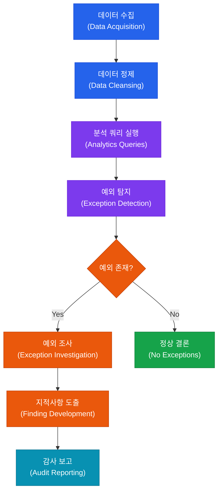

# 감사 데이터 분석 (CAATs)
**Computer-Assisted Audit Techniques & Audit Data Analytics**

:::info 관련 표준
CISA Domain 1.4 · ISACA CAAT Guidelines · IIA GTAG 16 (Data Analysis Technologies) · AICPA Audit Data Analytics Guide
:::

<table>
  <colgroup>
    <col style={{width: '20%'}} />
    <col style={{width: '80%'}} />
  </colgroup>
  <tbody>
    <tr><td><strong>문서번호</strong></td><td>BP-AUD-04</td></tr>
    <tr><td><strong>제개정일</strong></td><td>2026-05-18</td></tr>
    <tr><td><strong>관리부서</strong></td><td>IT 감사실 / IT 보안운영팀</td></tr>
    <tr><td><strong>적용범위</strong></td><td>데이터 기반 감사</td></tr>
    <tr><td><strong>통제목적</strong></td><td>전수 데이터 분석을 통한 감사 효율 향상, 이상거래 탐지 및 지속적 감사 체계 구축</td></tr>
  </tbody>
</table>

---

## 1. 개요 및 배경

CAATs(Computer-Assisted Audit Techniques)는 컴퓨터 기술을 활용하여 감사 절차를 수행하는 모든 방법론을 통칭한다. 전통적인 표본 추출 기반 감사와 달리, CAATs는 전체 모집단(100% 데이터)을 대상으로 분석을 수행함으로써 이상 거래, 오류, 사기 패턴을 빠짐없이 탐지할 수 있다. ISACA는 CAATs를 IT 감사의 필수 역량으로 규정하며, CISA 시험에서도 독립적인 도메인 영역으로 다루고 있다.

현대의 IT 환경에서 감사 대상 데이터는 ERP 시스템, 클라우드 플랫폼, API 로그 등 다양한 소스에서 방대한 규모로 생성된다. 이러한 환경에서 수작업 기반의 샘플링 감사는 한계가 명확하며, ACL(Galvanize)·IDEA·Python·SQL 등의 도구를 활용한 CAATs 적용이 실무 표준으로 자리 잡고 있다. 특히 Python 기반의 데이터 분석 라이브러리(pandas, numpy, scikit-learn)는 복잡한 이상치 탐지와 머신러닝 기반 감사 모델 구축을 가능하게 한다.

지속적 감사(Continuous Auditing)와 지속적 모니터링(Continuous Monitoring)은 CAATs의 고도화된 적용 형태로, 자동화된 데이터 파이프라인을 통해 실시간 또는 주기적으로 통제 효과성을 검증한다. 두 개념은 목적과 주체에서 차이가 있으며, 함께 운영될 때 상호 보완적인 감사 생태계를 구성한다.

---

## 2. 핵심 개념 및 원칙

### 2.1 CAATs 도구 유형 비교

| 유형 | 주요 도구 | 특징 | 적합 사용 사례 | 한계 |
|------|-----------|------|----------------|------|
| **전문 감사 소프트웨어** | ACL (Galvanize), IDEA | GUI 기반, 감사 특화 기능(Benford's Law, 중복 탐지 내장), 감사 증적 자동 생성 | 대용량 재무 데이터 분석, 비IT 감사인 활용 | 라이선스 비용 높음, 커스텀 분석 제한 |
| **스프레드시트** | MS Excel, Google Sheets | 접근성 높음, 피벗 테이블·VLOOKUP 활용, 간편한 시각화 | 소규모 데이터, 빠른 임시 분석 | 대용량 처리 한계, 버전 관리 어려움, 재현성 낮음 |
| **스크립트(Python)** | Python (pandas, numpy, matplotlib, scikit-learn) | 유연성 최고, 머신러닝 적용 가능, 자동화 용이, 오픈소스 | 대용량 로그 분석, 이상치 탐지 모델, 반복 감사 | 프로그래밍 역량 필요, 재현 환경 관리 필요 |
| **스크립트(SQL)** | MySQL, PostgreSQL, MS SQL Server | DB 직접 쿼리, 조인·집계 강점, 대용량 처리 효율 | 거래 데이터 완전성 검증, 권한 분리 확인 | 복잡한 통계 분석 제한, DB 접근 권한 필요 |

### 2.2 주요 분석 기법 6가지

| 기법 | 설명 | 감지 대상 | 도구 예시 |
|------|------|-----------|-----------|
| **완전성 검증** | 시퀀스 번호·필드 누락 여부 확인, 모집단 전체 포괄 | 거래 누락, 문서 번호 단절 | SQL COUNT/SEQUENCE, ACL |
| **중복 탐지** | 동일 키(금액+날짜+공급업체)로 중복 레코드 식별 | 이중 지급, 중복 등록 | SQL GROUP BY HAVING COUNT > 1, IDEA |
| **갭 분석** | 순번 또는 날짜 연속성에서의 단절 구간 탐지 | 문서 삭제·위변조, 번호 건너뜀 | Python pandas diff(), ACL GAPS |
| **추세 분석** | 시계열 데이터에서 이상 패턴·급등락 식별 | 비정상적 증가, 계절성 이탈 | Python matplotlib, Excel 차트 |
| **이상치 탐지** | 통계적 기준(Z-score, IQR, Benford's Law)으로 비정상 값 식별 | 반올림 오류, 권한 초과 거래, 사기 패턴 | Python scikit-learn, ACL Benford |
| **계층화(Stratification)** | 데이터를 금액·날짜·부서 등으로 분류하여 분포 분석 | 특정 구간 집중 위험, 임계값 회피 | SQL CASE WHEN, IDEA Stratify |

### 2.3 지속적 감사 vs 지속적 모니터링 비교

| 구분 | 지속적 감사 (Continuous Auditing) | 지속적 모니터링 (Continuous Monitoring) |
|------|----------------------------------|----------------------------------------|
| **주체** | 내부감사 부서 | 경영진 / IT 운영팀 |
| **목적** | 독립적 통제 효과성 검증 및 보증 제공 | 운영 성과 및 통제 작동 현황 모니터링 |
| **주기** | 자동화된 감사 프로그램 주기 실행 (일별·주별) | 실시간 또는 준실시간 |
| **산출물** | 감사 의견, 예외 보고서, 지적사항 | 대시보드, 알림(Alert), 운영 지표 |
| **독립성** | 감사 부서의 독립성 유지 필수 | 운영 부서 자체 수행, 독립성 불필요 |
| **규제 요건** | SOX 404, IIA 표준 | COSO, ISO 27001 운영 통제 |

---

## 3. 프로세스/방법론

### 3.1 CAATs 지속적 감사 파이프라인

### 3.2 데이터 품질 검증 및 무결성 확인 흐름

---

## 4. CISA 감사 체크리스트

<table>
  <colgroup>
    <col style={{width: '7%'}} />
    <col style={{width: '23%'}} />
    <col style={{width: '38%'}} />
    <col style={{width: '32%'}} />
  </colgroup>
  <thead>
    <tr><th>ID</th><th>통제 목적</th><th>감사 수행 절차</th><th>필수 증적 파일</th></tr>
  </thead>
  <tbody>
    <tr>
      <td><strong>AUD-04-01</strong></td>
      <td>데이터 원본 무결성 확보</td>
      <td>
        1. 데이터 추출 시점의 해시값(MD5/SHA-256) 기록 여부 확인 
        2. 원본 시스템 DB와 분석용 데이터셋의 레코드 수·합계 일치 여부 검증 
        3. 데이터 추출 권한 및 접근 로그 확인 
        4. 데이터 전송 과정에서의 변조 방지 조치 검토
      </td>
      <td>데이터 추출 해시값 기록 원본-분석본 레코드 대사표 데이터 접근 권한 기록 데이터 전달 확인서</td>
    </tr>
    <tr>
      <td><strong>AUD-04-02</strong></td>
      <td>쿼리 및 스크립트 검증</td>
      <td>
        1. 분석 쿼리/스크립트의 독립적 검토(Peer Review) 수행 여부 확인 
        2. 테스트 데이터셋에서의 사전 검증(Validation) 결과 확인 
        3. 쿼리 로직과 감사 목표 간 연계성 문서화 여부 검토 
        4. 쿼리 버전 관리(Git 등) 적용 여부 확인
      </td>
      <td>쿼리/스크립트 소스 파일 동료 검토(Peer Review) 기록 테스트 실행 결과 버전 관리 이력</td>
    </tr>
    <tr>
      <td><strong>AUD-04-03</strong></td>
      <td>분석 결과 재현 가능성 확보</td>
      <td>
        1. 분석 환경(OS, 도구 버전, 라이브러리) 문서화 여부 확인 
        2. 동일 데이터셋으로 분석을 재실행했을 때 결과 일치 여부 검증 
        3. 난수 시드(Random Seed) 설정 여부(샘플링 포함 시) 확인 
        4. 분석 절차서(Runbook) 존재 및 최신화 여부 검토
      </td>
      <td>분석 환경 명세서 재실행 결과 비교 기록 분석 절차서(Runbook) 난수 시드 설정 기록</td>
    </tr>
    <tr>
      <td><strong>AUD-04-04</strong></td>
      <td>개인정보 및 민감정보 보호</td>
      <td>
        1. 분석 데이터 내 개인정보(주민번호, 계좌번호 등) 포함 여부 확인 
        2. 민감정보 마스킹·익명화 처리 여부 검토 
        3. 분석 결과물의 접근 통제 및 보관 정책 준수 여부 확인 
        4. 데이터 분석 완료 후 임시 파일 삭제 여부 검증
      </td>
      <td>개인정보 처리 현황표 마스킹·익명화 처리 기록 분석 결과물 접근 통제 기록 임시 파일 삭제 확인서</td>
    </tr>
  </tbody>
</table>

---

## 5. 관련 표준 및 참고

| 표준/프레임워크 | 관련 조항 | 내용 요약 |
|----------------|-----------|-----------|
| **CISA Review Manual** | Domain 1.4 | CAATs 도구 유형 및 적용 기준 |
| **IIA GTAG 16** | Data Analysis Technologies | 감사 데이터 분석 기술 및 도구 활용 지침 |
| **AICPA Audit Data Analytics Guide** | Chapter 3-5 | 재무감사에서의 데이터 분석 적용 방법론 |
| **ISACA ITAF** | Section 1204 | IT 감사에서의 컴퓨터 보조 감사 기법 |
| **NIST SP 800-137** | Section 3.2 | 지속적 모니터링 프로그램 구축 지침 |

---

## 관련 문서

- [1.2 감사 계획 수립](/docs/01-audit-process/audit-planning)
- [1.3 감사 수행 및 증거 수집](/docs/01-audit-process/audit-execution)
- [1.5 보고 및 후속 조치](/docs/01-audit-process/reporting)
- [5.1 IT 일반통제 감사](/docs/05-it-general-controls/itgc-overview)
