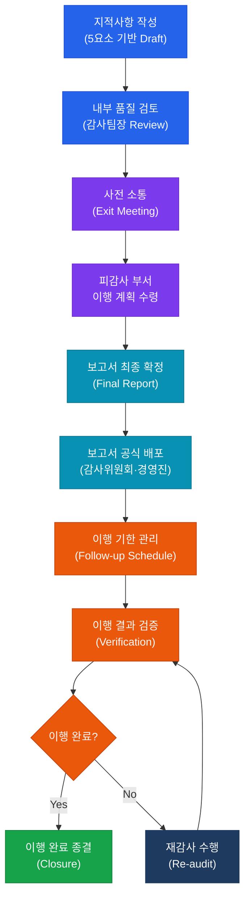
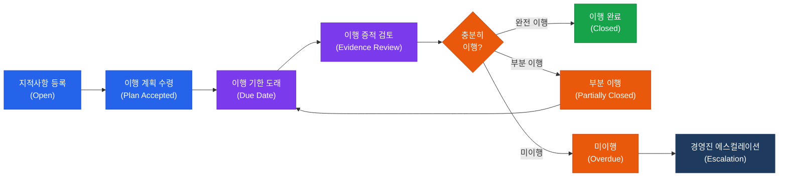

# 보고 및 후속 조치
**Audit Reporting & Follow-up**

:::info 관련 표준
CISA Domain 1.5 · ISACA Reporting Standards · IIA Standard 2400 (Communicating Results) · IIA Standard 2500 (Monitoring Progress)
:::

<table>
  <colgroup>
    <col style={{width: '20%'}} />
    <col style={{width: '80%'}} />
  </colgroup>
  <tbody>
    <tr><td><strong>문서번호</strong></td><td>BP-AUD-05</td></tr>
    <tr><td><strong>제개정일</strong></td><td>2026-05-18</td></tr>
    <tr><td><strong>관리부서</strong></td><td>IT 감사실</td></tr>
    <tr><td><strong>적용범위</strong></td><td>감사 보고서 작성 및 이행 관리</td></tr>
    <tr><td><strong>통제목적</strong></td><td>감사 지적사항의 명확한 전달, 경영진 이행 책임 확보 및 개선 이행 여부 추적 관리</td></tr>
  </tbody>
</table>

---

## 1. 개요 및 배경

감사 보고(Audit Reporting)는 감사 수행 과정에서 수집된 증거와 도출된 지적사항을 이해관계자에게 명확하고 객관적으로 전달하는 단계다. 감사 보고서는 단순한 문제 나열이 아니라 조직의 위험 현황과 개선 방향을 제시하는 경영 도구로 기능해야 하며, IIA는 의사소통이 정확(Accurate)·객관적(Objective)·명확(Clear)·간결(Concise)·건설적(Constructive)·완전(Complete)·적시적(Timely)이어야 한다고 규정한다.

감사 지적사항(Finding)의 품질은 감사 보고서 전체의 신뢰성을 결정한다. 지적사항은 **조건(Condition)·기준(Criteria)·원인(Cause)·영향(Effect)·권고사항(Recommendation)**의 5요소를 모두 포함해야 이해관계자가 문제의 실체와 시급성을 정확히 파악하고 이행 계획을 수립할 수 있다. 이 구조는 ISACA와 IIA 모두에서 감사 지적사항의 표준 양식으로 인정받고 있다.

보고서 발행 이후의 후속 조치(Follow-up) 단계는 감사의 실질적 가치를 결정하는 핵심 단계다. 지적사항에 대한 이행 계획이 실제로 실행되었는지, 통제 취약점이 개선되었는지를 추적·검증하지 않으면 감사는 단순한 점검 행위에 그친다. 감사인은 이행 기한 도래 시 피감사 부서의 이행 결과를 검증하고, 미이행 또는 부분이행 시 재감사(Re-audit)를 수행하여 최고경영진에게 보고해야 한다.

---

## 2. 핵심 개념 및 원칙

### 2.1 감사 지적사항(Finding) 5요소

| 요소 | 영문 | 설명 | 작성 예시 |
|------|------|------|-----------|
| **조건** | Condition | 현재 실제로 발생하고 있는 상황 (감사에서 발견한 사실) | "서버 관리자 계정 패스워드가 90일 이상 변경되지 않은 계정이 전체의 43%(15/35개)에 해당함을 확인하였다." |
| **기준** | Criteria | 조건을 판단하는 근거 (정책·규정·표준·모범관행) | "내부 정보보안 정책 제12조는 특권 계정 패스워드를 90일마다 변경하도록 규정하고 있다." |
| **원인** | Cause | 왜 조건과 기준 간의 차이가 발생했는가 | "패스워드 만료 정책이 Active Directory에 적용되지 않아 자동 강제 변경이 이루어지지 않고 있다." |
| **영향** | Effect | 조건이 지속될 경우 발생할 수 있는 위험 또는 실제 피해 | "공격자가 탈취한 자격증명을 장기간 사용하여 무단 접근, 데이터 유출 및 시스템 침해가 발생할 수 있다." |
| **권고사항** | Recommendation | 조건을 개선하기 위한 구체적이고 실행 가능한 제안 | "AD 그룹정책(GPO)에 특권 계정 패스워드 만료 90일 정책을 즉시 적용하고, 분기별 준수 현황을 점검할 것을 권고한다." |

### 2.2 지적사항 위험 등급 기준

| 등급 | 기준 | 이행 권고 기한 | 보고 대상 | 사례 |
|------|------|----------------|-----------|------|
| **Critical** | 즉각적인 재무적 손실·데이터 유출·법적 제재 위험. 핵심 통제 부재 | 즉시 (14일 이내) | 이사회·감사위원회·CEO | 관리자 계정 공유, 암호화 미적용 고객 데이터 저장 |
| **High** | 중대한 통제 취약점, 조직 목표 달성에 심각한 위협 | 30~60일 이내 | CISO·CIO·경영진 | 취약한 패스워드 정책, 불필요한 관리자 권한 |
| **Medium** | 통제 미흡, 위험이 존재하나 즉각적 피해 가능성 낮음 | 60~90일 이내 | IT 책임자·관련 부서장 | 정기 검토 미수행, 절차서 미갱신 |
| **Low** | 모범관행 미충족, 효율성 또는 효과성 개선 기회 | 90~180일 이내 | 담당 관리자 | 로그 보관 기간 단기, 교육 미이수 |

### 2.3 감사 보고서 구성 요소 및 작성 순서

| 순서 | 구성 요소 | 내용 |
|------|-----------|------|
| 1 | **표지 및 배포 목록** | 감사 제목, 감사 기간, 발행일, 수신자 목록, 기밀등급 |
| 2 | **요약(Executive Summary)** | 감사 목적·범위·핵심 지적사항 요약, 경영진 권고 |
| 3 | **감사 배경 및 목적** | 감사 수행 이유, 목적, 감사 기간 및 팀 구성 |
| 4 | **감사 범위 및 방법론** | 감사 대상 시스템·프로세스, 적용 기준, 수행 절차 |
| 5 | **지적사항 및 권고사항** | Finding 5요소 기반 개별 지적사항 (위험 등급 표시) |
| 6 | **피감사 부서 의견** | 각 지적사항에 대한 이행 계획 및 책임자·기한 |
| 7 | **결론** | 전반적 통제 효과성 평가 및 종합 의견 |
| 8 | **부록** | 감사 범위 상세, 기준 목록, 샘플링 근거, 용어집 |

---

## 3. 프로세스/방법론

### 3.1 보고서 작성 및 배포 프로세스

### 3.2 Follow-up 이행 추적 상태 관리

---

## 4. CISA 감사 체크리스트

<table>
  <colgroup>
    <col style={{width: '7%'}} />
    <col style={{width: '23%'}} />
    <col style={{width: '38%'}} />
    <col style={{width: '32%'}} />
  </colgroup>
  <thead>
    <tr><th>ID</th><th>통제 목적</th><th>감사 수행 절차</th><th>필수 증적 파일</th></tr>
  </thead>
  <tbody>
    <tr>
      <td><strong>AUD-05-01</strong></td>
      <td>지적사항 5요소 완전성 확인</td>
      <td>
        1. 보고서 내 각 지적사항에 조건·기준·원인·영향·권고사항이 모두 포함되었는지 확인 
        2. 조건과 기준 간 명확한 차이(Gap)가 기술되었는지 검토 
        3. 권고사항이 구체적이고 실행 가능하며 책임자가 명시되었는지 확인 
        4. 위험 등급 분류 기준과 실제 등급 간 일관성 검토
      </td>
      <td>감사 보고서 초안 및 최종본 지적사항 5요소 검토 체크리스트 위험 등급 결정 근거 품질 검토(QA) 기록</td>
    </tr>
    <tr>
      <td><strong>AUD-05-02</strong></td>
      <td>경영진 보고 적시성 확보</td>
      <td>
        1. 감사 종료 후 보고서 발행까지 소요 기간이 내부 정책(예: 30일) 이내인지 확인 
        2. Critical·High 등급 지적사항에 대한 즉시 보고(Immediate Communication) 이행 여부 검토 
        3. Exit Meeting 개최 여부 및 피감사 부서 참석자 기록 확인 
        4. 감사위원회·이사회 보고 일정 준수 여부 검토
      </td>
      <td>보고서 발행일 및 감사 종료일 기록 즉시 보고 이메일·메모 기록 Exit Meeting 회의록 감사위원회 보고 일정표</td>
    </tr>
    <tr>
      <td><strong>AUD-05-03</strong></td>
      <td>이행 기한 준수 및 추적 관리</td>
      <td>
        1. 모든 지적사항에 이행 기한과 책임자가 지정되어 있는지 확인 
        2. 이행 추적 대장(Tracking Log)이 최신화되어 있는지 검토 
        3. 기한 초과 지적사항에 대한 에스컬레이션 절차 이행 여부 확인 
        4. 이행 계획 변경(기한 연장 등) 시 승인 절차 준수 여부 검토
      </td>
      <td>지적사항 이행 추적 대장 이행 기한 및 책임자 지정 기록 에스컬레이션 이력 이행 계획 변경 승인 기록</td>
    </tr>
    <tr>
      <td><strong>AUD-05-04</strong></td>
      <td>재감사 및 이행 검증 수행</td>
      <td>
        1. 이행 완료 보고 접수 후 충분한 이행 증적이 제출되었는지 검토 
        2. Critical·High 등급 지적사항에 대한 현장 재수행(Re-performance) 여부 확인 
        3. 이행 완료 판정 기준의 문서화 및 일관성 검토 
        4. 미이행 또는 부적절 이행으로 인한 지적사항 재등록 현황 검토
      </td>
      <td>이행 증적 검토 기록 재수행(Re-performance) 결과 이행 완료 판정 기준서 재등록 지적사항 목록</td>
    </tr>
  </tbody>
</table>

---

## 5. 관련 표준 및 참고

| 표준/프레임워크 | 관련 조항 | 내용 요약 |
|----------------|-----------|-----------|
| **CISA Review Manual** | Domain 1.5 | 감사 보고 및 후속 조치 기준 |
| **IIA Standard 2400** | Communicating Results | 감사 결과 전달 요건 (정확·객관·명확·건설적·완전·적시) |
| **IIA Standard 2500** | Monitoring Progress | 이행 모니터링 및 경영진 수용 위험 관리 |
| **IIA Standard 2600** | Communicating the Acceptance of Risks | 경영진이 잔여 위험 수용 시 CAE 보고 의무 |
| **ISACA ITAF** | Section 1401 | IT 감사 결과 보고 지침 |

---

## 관련 문서

- [1.3 감사 수행 및 증거 수집](/docs/01-audit-process/audit-execution)
- [1.4 감사 데이터 분석 (CAATs)](/docs/01-audit-process/caats)
- [1.1 감사 거버넌스 및 윤리](/docs/01-audit-process/audit-governance)
- [2.1 IT 거버넌스 프레임워크](/docs/02-governance/it-governance-framework)
