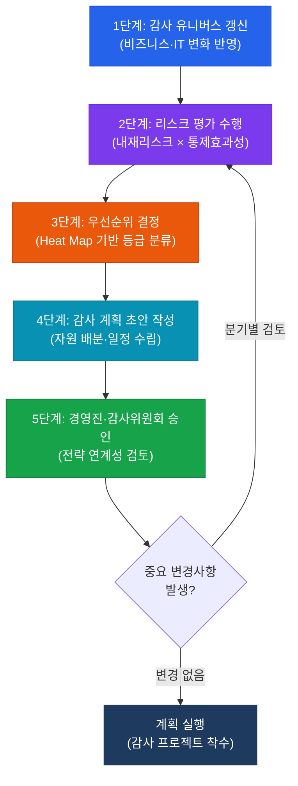
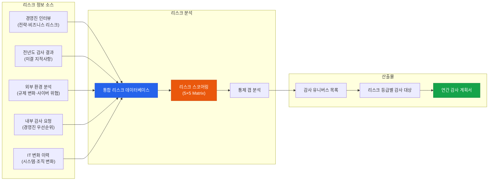

# 리스크 기반 감사 계획

**Risk-Based Audit Planning**

:::info 관련 표준
- **CISA Domain 1**: IT 감사 프로세스 (Information Systems Auditing Process)
- **ISACA ITAF 1201**: Planning
- **ISACA ITAF 1203**: Scope
- **ISACA ITAF 1204**: Risk Assessment
- **COSO ERM 2017**: Enterprise Risk Management Framework
- **IIA Standard 2010**: Planning
- **ISO 31000**: Risk Management Guidelines
:::

<table>
  <colgroup>
    <col style={{width: '20%'}} />
    <col style={{width: '80%'}} />
  </colgroup>
  <tbody>
    <tr><td><strong>문서번호</strong></td><td>BP-AUD-02</td></tr>
    <tr><td><strong>제개정일</strong></td><td>2026-05-18</td></tr>
    <tr><td><strong>관리부서</strong></td><td>IT 감사실</td></tr>
    <tr><td><strong>적용범위</strong></td><td>연간 감사 계획 수립</td></tr>
    <tr><td><strong>통제목적</strong></td><td>조직의 리스크 프로파일에 기반하여 감사 자원을 최고 리스크 영역에 우선 배분함으로써 감사의 효과성과 효율성을 극대화한다.</td></tr>
  </tbody>
</table>

---

## 1. 개요 및 배경

리스크 기반 감사 계획(Risk-Based Audit Planning)은 조직 전체의 잠재적 위험 영역을 체계적으로 식별하고, 리스크 수준이 높은 영역에 감사 자원을 우선 투입하는 전략적 접근법이다. 전통적인 일정 기반(calendar-based) 또는 순환 기반(rotation-based) 감사 계획과 달리, 리스크 기반 접근법은 조직의 변화하는 위협 환경에 동적으로 대응하고 이사회와 경영진이 가장 중요하게 여기는 통제 영역을 집중적으로 다룬다.

감사 유니버스(Audit Universe)는 리스크 기반 계획의 출발점으로, 조직의 모든 감사 가능한 단위(auditable unit)를 망라한 목록이다. IT 분야에서는 애플리케이션 포트폴리오, 인프라 구성요소, IT 프로세스, 프로젝트, 서드파티 관계 등이 포함된다. 완전하고 정확한 감사 유니버스 없이는 리스크 기반 계획이 불완전해지며, 중요한 위험 영역이 감사 범위에서 누락될 수 있다.

연간 감사 계획은 최소 연 1회 수립되어야 하며, 중요한 조직 변화(인수합병, 신규 서비스 출시, 사이버 침해 사고 등) 발생 시 수시로 검토·조정되어야 한다. ISACA ITAF는 감사 계획이 경영진의 리스크 관리 프레임워크와 연계되어 이중 작업(duplication of effort)을 방지하고 통합적 보증(combined assurance)을 제공할 것을 권고한다.

---

## 2. 핵심 개념 및 원칙

### 2.1 감사 유니버스(Audit Universe) 구성 요소

| 유니버스 분류 | 세부 항목 | 업데이트 주기 |
|---------------|-----------|---------------|
| **비즈니스 프로세스** | 핵심 업무 프로세스, 지원 프로세스 | 연간 |
| **IT 애플리케이션** | ERP, CRM, 핵심 업무 시스템, 레거시 | 반기 |
| **IT 인프라** | 서버, 네트워크, 클라우드, DB | 반기 |
| **IT 프로젝트** | 진행 중인 주요 IT 프로젝트 | 분기 |
| **서드파티/아웃소싱** | IT 서비스 제공자, 클라우드 CSP | 연간 |
| **규제 준수 영역** | 개인정보보호, 금융규제, 보안 | 연간 |

### 2.2 리스크 평가 방정식

```
잔여 리스크(Residual Risk) = 내재 리스크(Inherent Risk) × [1 - 통제 효과성(Control Effectiveness)]
```

| 리스크 요소 | 평가 기준 | 점수 범위 |
|-------------|-----------|-----------|
| **내재 리스크** | 비즈니스 임팩트 × 발생 가능성 | 1~25 (5×5 매트릭스) |
| **통제 효과성** | 설계 적절성 × 운영 효과성 | 0%~100% |
| **잔여 리스크** | 최종 감사 우선순위 결정 기준 | Low/Medium/High/Critical |

### 2.3 리스크 스코어링 5×5 Heat Map

| 발생 가능성 \ 임팩트 | 매우 낮음(1) | 낮음(2) | 보통(3) | 높음(4) | 매우 높음(5) |
|---------------------|-------------|---------|---------|---------|-------------|
| **매우 높음(5)** | 5 (Medium) | 10 (High) | 15 (High) | 20 (Critical) | 25 (Critical) |
| **높음(4)** | 4 (Low) | 8 (Medium) | 12 (High) | 16 (Critical) | 20 (Critical) |
| **보통(3)** | 3 (Low) | 6 (Medium) | 9 (Medium) | 12 (High) | 15 (High) |
| **낮음(2)** | 2 (Low) | 4 (Low) | 6 (Medium) | 8 (Medium) | 10 (High) |
| **매우 낮음(1)** | 1 (Low) | 2 (Low) | 3 (Low) | 4 (Low) | 5 (Medium) |

### 2.4 감사 우선순위 기준

| 우선순위 등급 | 잔여 리스크 점수 | 감사 주기 | 자원 배분 |
|---------------|----------------|-----------|-----------|
| **P1 (Critical)** | 16~25 | 연 1회 이상 | 30% |
| **P2 (High)** | 10~15 | 연 1회 | 40% |
| **P3 (Medium)** | 5~9 | 2년에 1회 | 20% |
| **P4 (Low)** | 1~4 | 3년에 1회 | 10% |

---

## 3. 프로세스 / 방법론

### 3.1 리스크 기반 연간 감사 계획 수립 5단계



### 3.2 리스크 평가 데이터 소스 및 수집 방법



### 3.3 감사 자원 배분(Resource Allocation) 기준

| 배분 기준 | 고려 요소 | 실무 지침 |
|-----------|-----------|-----------|
| **리스크 수준** | 잔여 리스크 점수 | Critical/High 영역에 전체 자원의 70% 이상 |
| **감사 복잡성** | 기술적 전문성 요구도 | 고도 기술 영역은 외부 전문가 활용 검토 |
| **규제 요건** | 필수 준수 감사 영역 | 법적 의무 감사는 별도 자원 확보 |
| **경영진 요청** | 이해관계자 우선순위 | 전략적 중요성 반영 |
| **전년도 결과** | 미결 지적사항 비율 | 미결 비율 30% 이상 시 재감사 우선 고려 |

---

## 4. CISA 감사 체크리스트

<table>
  <colgroup>
    <col style={{width: '7%'}} />
    <col style={{width: '23%'}} />
    <col style={{width: '38%'}} />
    <col style={{width: '32%'}} />
  </colgroup>
  <thead>
    <tr>
      <th>ID</th>
      <th>통제 목적</th>
      <th>감사 수행 절차</th>
      <th>필수 증적 파일</th>
    </tr>
  </thead>
  <tbody>
    <tr>
      <td><strong>RP-01</strong></td>
      <td>감사 유니버스의 완전성 및 최신성 확인</td>
      <td>1. 감사 유니버스 문서 요청 및 최종 갱신일 확인<br/>2. 최근 조직 변화(인수·신규 시스템)와 유니버스 반영 여부 비교<br/>3. IT 부문 조직도와 유니버스 범위 일치 여부 검토</td>
      <td>감사 유니버스 목록<br/>IT 자산 목록(CMDB)<br/>조직 변경 이력</td>
    </tr>
    <tr>
      <td><strong>RP-02</strong></td>
      <td>리스크 평가의 체계성 및 문서화 확인</td>
      <td>1. 리스크 평가 방법론 문서 검토<br/>2. 리스크 스코어링 산정 근거 표본 검증 (10개 이상)<br/>3. 내재 리스크와 통제 효과성 평가 기준 적정성 검토</td>
      <td>리스크 평가 방법론<br/>리스크 스코어링 워크시트<br/>Heat Map 산출물</td>
    </tr>
    <tr>
      <td><strong>RP-03</strong></td>
      <td>감사 우선순위화의 리스크 기반 정합성 확인</td>
      <td>1. 최우선 감사 대상과 리스크 등급 상위 항목 일치 여부 검토<br/>2. 저리스크 항목이 우선 배정된 경우 정당성 문서 확인<br/>3. 이전 년도와 우선순위 변경 사유 분석</td>
      <td>연간 감사 계획서<br/>리스크 등급 대비 감사 일정 매핑<br/>우선순위 결정 회의록</td>
    </tr>
    <tr>
      <td><strong>RP-04</strong></td>
      <td>감사위원회/경영진 공식 승인 확인</td>
      <td>1. 감사위원회 회의록에서 연간 계획 승인 결의 확인<br/>2. 승인 일자와 감사 시작일 선후 관계 확인<br/>3. 중간 변경 시 추가 승인 여부 확인</td>
      <td>감사위원회 승인 회의록<br/>서명된 연간 감사 계획서<br/>계획 변경 승인 기록</td>
    </tr>
    <tr>
      <td><strong>RP-05</strong></td>
      <td>감사 자원(인력·시간)의 충분성 평가</td>
      <td>1. 연간 감사 일정 대비 가용 인력·시간 비교<br/>2. 전문 기술 요구 감사에 적합 인력 배정 여부 검토<br/>3. 외부 전문가 활용 계획 및 예산 확인</td>
      <td>감사 자원 계획표<br/>감사인 역량 매트릭스<br/>외부 전문가 계약서</td>
    </tr>
    <tr>
      <td><strong>RP-06</strong></td>
      <td>비즈니스 전략과 감사 계획의 연계성 확인</td>
      <td>1. 회사 전략 목표와 감사 계획 우선순위 정합성 분석<br/>2. 경영진 인터뷰 수행 여부 및 결과 반영 확인<br/>3. 외부 위협(사이버, 규제 변화) 반영 적정성 검토</td>
      <td>경영진 인터뷰 기록<br/>전략 목표 대비 감사 맵핑<br/>외부 환경 분석 보고서</td>
    </tr>
  </tbody>
</table>

---

## 5. 관련 표준 및 참고

| 표준/가이드라인 | 발행기관 | 관련 조항 | 적용 포인트 |
|----------------|----------|-----------|-------------|
| ITAF (IT Assurance Framework) | ISACA | 1201, 1203, 1204 | IT 감사 계획 및 리스크 평가 |
| COSO ERM 2017 | COSO | 전체 | 엔터프라이즈 리스크 관리 연계 |
| ISO 31000:2018 | ISO | 6.4, 6.5 | 리스크 평가 및 처리 방법론 |
| IIA Standard 2010 | IIA | 2010, 2010.A1 | 감사 계획 수립 요건 |
| NIST SP 800-30 | NIST | Rev.1 | IT 리스크 평가 가이드 |
| 금융회사 내부통제기준 | 금융감독원 | 3조~5조 | 국내 금융권 내부감사 계획 |

---

## 관련 문서

- [1.1 감사 헌장 및 표준](/docs/audit-process/audit-charter)
- [1.3 감사 수행 및 증거 수집](/docs/audit-process/audit-execution)
- [1.4 감사 데이터 분석 (CAATs)](/docs/audit-process/caats)
- [2.2 IT 리스크 관리 프레임워크](/docs/it-governance/frameworks)
- [5.1 정보보안 리스크 평가](/docs/information-security/iam)
