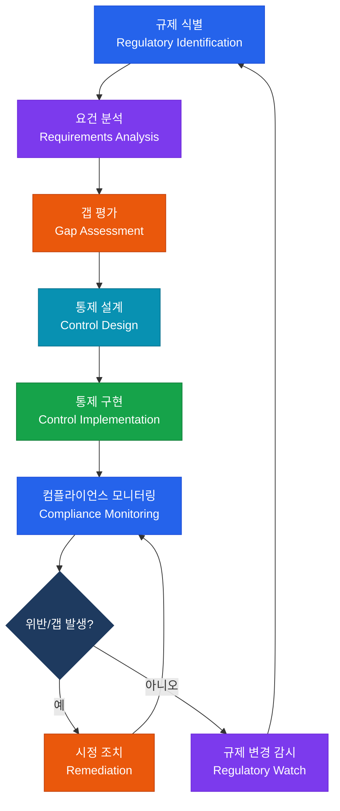

# IT 규제 및 컴플라이언스
**IT Regulatory Compliance**

:::info 관련 표준
CISA Domain 2.3 / SOX Section 302·404 / GDPR / 개인정보 보호법 / 정보통신망법 / PCI-DSS v4.0
:::

<table>
  <colgroup>
    <col style={{width: '20%'}} /><col style={{width: '80%'}} />
  </colgroup>
  <tbody>
    <tr><td><strong>문서번호</strong></td><td>BP-GOV-03</td></tr>
    <tr><td><strong>제개정일</strong></td><td>2025-01-15 (v2.1)</td></tr>
    <tr><td><strong>관리부서</strong></td><td>IT 컴플라이언스팀</td></tr>
    <tr><td><strong>적용범위</strong></td><td>글로벌 IT 규제 대응 — 상장법인 및 개인정보 처리 시스템 전체</td></tr>
    <tr><td><strong>통제목적</strong></td><td>법적·규제적 의무 준수를 통한 법적 리스크 최소화 및 이해관계자 신뢰 확보</td></tr>
  </tbody>
</table>

---

## 1. 개요 및 배경

IT 컴플라이언스(IT Regulatory Compliance)란 조직이 운영하는 정보 시스템과 데이터 처리 활동이 적용 가능한 법률, 규제, 표준, 계약 의무를 충족하는지 지속적으로 검증하고 유지하는 활동이다. 글로벌 규제 환경은 다음과 같은 흐름으로 강화되고 있다.

- **기업 회계 투명성**: 2002년 엔론(Enron) 사태 이후 미국 SOX법 제정 → 재무보고 신뢰성을 위한 IT 통제 의무화
- **개인정보 보호**: GDPR(2018) 시행 이후 국내 개인정보 보호법 대폭 개정(2023), 과징금 상한이 매출액의 3%로 상향
- **결제 보안**: PCI-DSS가 v4.0(2022)으로 개정되며 위험 기반 접근 방식 도입
- **국경 간 데이터 이전**: 표준 계약 조항(SCC), 적정성 결정, 데이터 현지화(Data Localization) 요건 증가

CISA 수험자는 각 규제가 IT 일반통제(ITGC)와 어떻게 매핑되는지 이해하고, 컴플라이언스 감사 시 요건·통제·테스트의 논리적 연결을 설계할 수 있어야 한다.

---

## 2. 핵심 개념 및 원칙

### 2.1 SOX IT 일반 통제(ITGC) 4대 영역

SOX Section 404는 경영진의 내부통제 평가를 의무화하며, 외부 감사인은 ITGC의 설계 및 운영 효과성을 검토한다.

| 영역 | 주요 통제 항목 | 감사 포인트 |
|------|--------------|-----------|
| **접근 관리 (Access Management)** | 사용자 계정 생성·변경·삭제 프로세스, 특권 계정 통제, 직무 분리(SoD), 접근 권한 정기 검토 | 퇴직자 계정 즉시 비활성화 여부, 관리자 계정 최소 권한 적용, 권한 검토 주기(반기) |
| **변경 관리 (Change Management)** | 변경 요청 → 승인 → 테스트 → 이관 프로세스, 긴급 변경 사후 승인, 소스코드 형상 관리 | 승인 없는 운영 환경 직접 변경 여부, 개발자의 운영 환경 접근 통제, 변경 로그 무결성 |
| **운영 관리 (IT Operations)** | 배치 작업(Batch Job) 모니터링, 오류 처리 및 재처리 통제, SLA 관리, 인시던트 관리 | 배치 실패 알림 및 재처리 절차, 운영 로그 보존 기간(최소 1년), 문제 반복 발생 분석 |
| **백업 및 복구 (Backup & Recovery)** | 백업 스케줄 및 매체 관리, 오프사이트 보관, 복구 테스트(DR Test) 수행 | 백업 성공률 모니터링, 오프사이트 암호화 저장, 연 1회 이상 복구 테스트 증적 |

**SOX 302 vs 404 비교**:

| 구분 | SOX Section 302 | SOX Section 404 |
|------|----------------|----------------|
| 대상 | CEO/CFO | 경영진 + 외부 감사인 |
| 범위 | 분기보고서(10-Q), 연간보고서(10-K) | 연간보고서(10-K)만 |
| 내용 | 재무제표의 정확성 서명 확인 | 내부통제 설계·운영 효과성 평가 |
| ITGC 연관 | IT 시스템 신뢰성 선언 포함 | ITGC 상세 평가 필수 |

### 2.2 GDPR 6대 처리 원칙

| 원칙 | 내용 | 위반 시 과징금 |
|------|------|--------------|
| **적법성·공정성·투명성** (Lawfulness, Fairness, Transparency) | 처리 근거(동의/계약/법적 의무 등) 명확화, 정보주체에 투명한 고지 | 최대 2천만 유로 또는 전 세계 매출 4% |
| **목적 제한** (Purpose Limitation) | 수집 목적 이외 처리 금지, 목적 변경 시 재동의 | 동일 |
| **최소화** (Data Minimisation) | 목적 달성에 필요한 최소한의 개인정보만 수집 | 동일 |
| **정확성** (Accuracy) | 부정확 정보 즉시 삭제·정정, 최신성 유지 | 동일 |
| **저장 기간 제한** (Storage Limitation) | 목적 달성 후 삭제 또는 익명화, 보존 기간 문서화 | 동일 |
| **무결성·기밀성** (Integrity & Confidentiality) | 기술적·관리적 보호조치, 비인가 접근 방지 | 동일 |

**GDPR 정보주체 권리 8가지**:

1. **열람권** (Right of Access, Art.15) — 처리 여부·목적·항목 확인
2. **정정권** (Right to Rectification, Art.16) — 부정확 정보 수정 요구
3. **삭제권** (Right to Erasure, Art.17) — '잊혀질 권리', 처리 근거 소멸 시
4. **처리 제한권** (Right to Restriction, Art.18) — 정확성 이의 제기 기간 중 처리 제한
5. **이동권** (Right to Data Portability, Art.20) — 기계가독 형식으로 데이터 이전
6. **반대권** (Right to Object, Art.21) — 정당한 이익 근거 처리에 반대
7. **자동화 의사결정 거부권** (Art.22) — 프로파일링 등 자동 처리 기반 결정 거부
8. **동의 철회권** (Art.7(3)) — 언제든지 동의 철회 가능, 철회 전 처리 적법성 유지

**72시간 침해 신고 의무 (Art.33)**:
- 개인정보 침해 인지 후 **72시간 이내** 감독기관에 신고
- 정보주체에게 고위험 침해 시 **지체 없이** 통보 (Art.34)
- 프로세서(수탁자)는 **지체 없이** 컨트롤러(위탁자)에 통보

**DPO(개인정보 보호책임자) 지정 의무 요건**:
- 공공기관
- 대규모 정기적·체계적 모니터링 수행 컨트롤러/프로세서
- 민감정보 또는 범죄 관련 개인정보 대규모 처리

### 2.3 국내 개인정보 보호법 주요 내용

**2023년 개정 주요 내용**:

| 개정 항목 | 내용 |
|----------|------|
| 과징금 상향 | 위반 행위 관련 매출액의 3% (이전: 5억 원 정액) |
| 개인정보 이동권 도입 | 정보주체가 다른 기관에 개인정보 이전 요구 가능 |
| 가명처리 활용 확대 | 과학적 연구·통계·공익 목적 가명정보 활용 허용 |
| 국외 이전 규정 강화 | 보호 수준 동등성 평가 제도 신설 |
| 개인정보 보호위원회 권한 강화 | 방통위, 행안부로 분산된 감독 기능 통합 |

**PIA(개인정보 영향평가) 대상 및 절차**:

대상: 공공기관 중 5만 명 이상 민감정보 처리, 내·외부 시스템 연계로 50만 명 이상 처리, 100만 명 이상 처리하는 시스템 신규 구축·변경

절차: 대상 여부 판단 → 영향평가 기관 선정 → 개인정보 흐름도 작성 → 위험도 평가(위협·취약점 분석) → 개선 권고 → 보호위원회 제출(공공기관) → 이행 점검

### 2.4 PCI-DSS v4.0 구조

**12개 요건 체계**:

| 요건 그룹 | 요건 번호 | 내용 |
|----------|---------|------|
| **안전한 네트워크 구축** | 1 | 네트워크 보안 통제 설치·유지 |
| | 2 | 시스템 구성요소에 보안 기본값 적용 |
| **카드 소유자 데이터 보호** | 3 | 저장된 계정 데이터 보호 |
| | 4 | 공개 네트워크 전송 시 암호화 |
| **취약점 관리** | 5 | 악성코드 방어 |
| | 6 | 보안 시스템·소프트웨어 개발·유지 |
| **강력한 접근 통제** | 7 | 비즈니스 필요 기반 접근 제한 |
| | 8 | 사용자 식별 및 인증 |
| | 9 | 카드 소유자 데이터 물리적 접근 제한 |
| **네트워크 모니터링** | 10 | 네트워크 접근 로깅 및 모니터링 |
| | 11 | 시스템·네트워크 정기 테스트 |
| **정보보안 정책** | 12 | 정보보안 정책 수립·유지 |

**SAQ vs RoC 비교**:

| 구분 | SAQ (Self-Assessment Questionnaire) | RoC (Report on Compliance) |
|------|-----------------------------------|--------------------------|
| 대상 | 소규모 가맹점, 저위험 처리 환경 | Level 1 가맹점(연 600만 건 이상), 서비스 제공업체 |
| 방법 | 자체 평가 | QSA(자격 심사인) 현장 감사 |
| 유효 기간 | 연간 | 연간 |
| SAQ 유형 | A, A-EP, B, B-IP, C, C-VT, D, P2PE 등 | 해당 없음(단일) |

---

## 3. 프로세스/방법론

### 3.1 준거성 감사 체크리스트 설계: 규제 요건 → 통제 → 테스트 매핑

컴플라이언스 감사의 핵심은 적용 규제의 개별 요건을 내부 통제와 1:1 또는 N:1로 매핑하고, 각 통제의 설계 및 운영 효과성을 검증하는 테스트 절차를 구체화하는 것이다.

**매핑 설계 3단계**:

1. **요건 식별**: 규제 조문 또는 표준 통제 항목 번호 부여 (예: GDPR Art.32, SOX 404-CC1.1)
2. **통제 연결**: 조직의 내부 정책·절차·기술적 장치 중 해당 요건을 이행하는 통제 매핑
3. **테스트 설계**: 통제의 존재·설계·운영 효과성을 검증하기 위한 증거 수집 절차 명시

### 3.2 컴플라이언스 관리 프로세스

### 3.3 규제별 통제-테스트 매핑 예시

| 규제 요건 | 내부 통제 | 테스트 절차 | 증거 유형 |
|----------|---------|-----------|---------|
| SOX 404: 접근 관리 | 분기별 접근 권한 검토 | 최근 4분기 검토 결과 확인, 미조치 항목 확인 | 검토 보고서, 이메일 승인 이력 |
| GDPR Art.32: 기술적 조치 | 전송 데이터 TLS 1.2 이상 암호화 | 주요 시스템 SSL 설정 점검, 스캔 결과 확인 | SSL 랩스 스캔 결과, 방화벽 정책 |
| 개인정보 보호법 제29조: 안전조치 | 개인정보 취급자 연 1회 교육 | 교육 이수 현황, 미이수자 조치 확인 | 교육 이수 명단, LMS 스크린샷 |
| PCI-DSS Req.8: 인증 | MFA 적용 (CDE 접근) | CDE 접근 계정 전수 MFA 설정 확인 | AD/IAM 정책 스크린샷, 계정 목록 |

---

## 4. CISA 감사 체크리스트

<table>
  <colgroup>
    <col style={{width: '7%'}} /><col style={{width: '23%'}} />
    <col style={{width: '38%'}} /><col style={{width: '32%'}} />
  </colgroup>
  <thead>
    <tr><th>ID</th><th>통제 목적</th><th>감사 수행 절차</th><th>필수 증적 파일</th></tr>
  </thead>
  <tbody>
    <tr>
      <td><strong>AUD-C01</strong></td>
      <td>규제 목록 최신성 유지 (Regulatory Inventory Currency)</td>
      <td>
        1. 적용 규제·표준 목록(Register) 입수 
        2. 목록의 최종 검토일·버전 확인 
        3. 최근 12개월 내 발효/개정 규제 누락 여부 확인 
        4. 담당 법무/컴플라이언스 인터뷰 수행
      </td>
      <td>
        규제 목록(Regulatory Register) 
        최종 검토 회의록 
        외부 법률 자문 보고서
      </td>
    </tr>
    <tr>
      <td><strong>AUD-C02</strong></td>
      <td>법적 의무 이행률 측정 (Legal Obligation Fulfillment Rate)</td>
      <td>
        1. 규제별 의무 이행 현황 매트릭스 입수 
        2. 미이행 항목의 위험 수준 평가 
        3. 이행 계획(Remediation Plan) 수립 여부 확인 
        4. 이전 감사 지적 사항 재검토
      </td>
      <td>
        컴플라이언스 현황 대시보드 
        미이행 항목 시정 계획 
        이전 감사 보고서 및 조치 결과
      </td>
    </tr>
    <tr>
      <td><strong>AUD-C03</strong></td>
      <td>개인정보 침해 신고 절차 충족 (Breach Notification Procedure)</td>
      <td>
        1. 침해 대응 절차서(BRP) 입수 및 72시간 규정 반영 확인 
        2. 최근 2년 침해 사고 이력 확인, 신고 기한 준수 여부 
        3. 침해 탐지→에스컬레이션→신고 역할 명확성 확인 
        4. 연간 모의 훈련(Tabletop Exercise) 수행 여부
      </td>
      <td>
        침해 대응 절차서 
        사고 이력 로그 및 신고 기록 
        모의 훈련 결과 보고서
      </td>
    </tr>
    <tr>
      <td><strong>AUD-C04</strong></td>
      <td>외부 규제 감사 대응 체계 (External Audit Readiness)</td>
      <td>
        1. 최근 외부 감사 보고서(SOC 2, PCI QSA 등) 입수 
        2. 지적 사항(Finding) 조치 완료 여부 확인 
        3. 감사 대응 담당자 지정 및 증적 보관 체계 확인 
        4. 다음 감사 일정 및 준비 계획 확인
      </td>
      <td>
        외부 감사 보고서(최근 2년) 
        지적 사항 조치 확인서 
        증적 보관 목록 및 접근 권한 현황
      </td>
    </tr>
  </tbody>
</table>

---

## 5. 관련 표준 및 참고

| 표준/규제 | 발행 기관 | 핵심 내용 |
|----------|---------|---------|
| SOX Section 302·404 | 미국 의회 | IT 일반통제(ITGC) 감사 의무화 |
| GDPR | EU | 개인정보 처리 원칙·정보주체 권리 |
| 개인정보 보호법 | 개인정보 보호위원회 | 국내 개인정보 처리 전반 |
| PCI-DSS v4.0 | PCI SSC | 카드 결제 환경 보안 |
| ISO/IEC 27001:2022 | ISO/IEC | 정보보안 관리체계(ISMS) |
| NIST SP 800-53 Rev.5 | NIST | 연방 정보 시스템 보안 통제 |
| COBIT 2019 | ISACA | IT 거버넌스·관리 목표 |

---

## 관련 문서

- [IT 거버넌스 프레임워크](/docs/it-governance/it-strategy)
- [데이터 거버넌스 및 프라이버시](./data-governance.md)
- [정보보안 관리](/docs/information-security/infrastructure-security)
