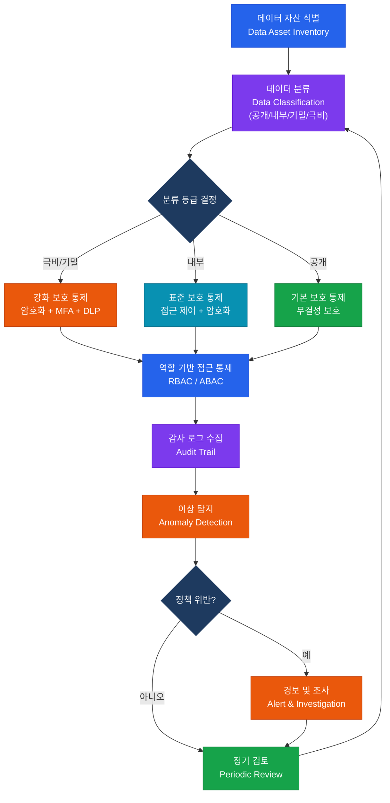

# 데이터 거버넌스 및 프라이버시
**Data Governance & Privacy**

:::info 관련 표준
CISA Domain 2.4 / DAMA DMBOK v2 / ISO/IEC 27701:2019 / GDPR Art.25 / 개인정보 보호법
:::

<table>
  <colgroup>
    <col style={{width: '20%'}} /><col style={{width: '80%'}} />
  </colgroup>
  <tbody>
    <tr><td><strong>문서번호</strong></td><td>BP-GOV-04</td></tr>
    <tr><td><strong>제개정일</strong></td><td>2025-02-10 (v1.3)</td></tr>
    <tr><td><strong>관리부서</strong></td><td>데이터거버넌스팀</td></tr>
    <tr><td><strong>적용범위</strong></td><td>전사 데이터 자산 — 정형·비정형 데이터 및 개인정보 처리 시스템 전체</td></tr>
    <tr><td><strong>통제목적</strong></td><td>데이터 자산의 품질·보안·프라이버시를 보장하고 규제 의무를 이행하는 거버넌스 체계 확립</td></tr>
  </tbody>
</table>

---

## 1. 개요 및 배경

데이터 거버넌스(Data Governance)는 데이터 자산의 가용성, 사용성, 무결성, 보안을 보장하기 위한 의사결정 권한과 책임을 정의하는 조직 전반의 체계이다. DAMA International의 DMBOK(Data Management Body of Knowledge)은 데이터 관리를 11개 지식 영역으로 정의하며, 그 중심에 데이터 거버넌스를 위치시킨다.

현대 조직이 데이터 거버넌스를 강화해야 하는 주요 배경:

- **규제 의무**: GDPR, 개인정보 보호법, 금융 데이터 규정 등 위반 시 과징금 및 평판 손실
- **데이터 품질 리스크**: 부정확한 데이터 기반 의사결정으로 인한 비즈니스 손실
- **데이터 가치 실현**: AI·분석 투자 ROI 달성을 위한 신뢰 가능한 데이터 기반 필요
- **사이버 보안**: 민감 데이터의 체계적 분류 없이는 적절한 보호 통제 적용 불가

CISA 감사인은 데이터 거버넌스 체계의 설계 적절성과 운영 효과성을 평가하며, 특히 데이터 분류, 수명주기 관리, 프라이버시 통제가 핵심 감사 영역이다.

---

## 2. 핵심 개념 및 원칙

### 2.1 데이터 거버넌스 3대 역할 비교

| 구분 | 데이터 소유자 (Data Owner) | 데이터 관리자 (Data Steward) | 데이터 보관자 (Data Custodian) |
|------|--------------------------|----------------------------|-------------------------------|
| **정의** | 데이터에 대한 최종 책임을 지는 비즈니스 임원 | 데이터의 일상적 품질·정의를 관리하는 실무 담당자 | 데이터를 물리적으로 저장·관리하는 IT 기술 담당자 |
| **역할** | 접근 정책 승인, 분류 결정, 보존 기간 결정 | 메타데이터 관리, 데이터 품질 규칙 정의, 이슈 해결 | 백업·복구, 저장소 관리, 암호화 구현, 접근 제어 기술 설정 |
| **책임** | 데이터 비즈니스 가치 및 컴플라이언스 | 데이터 정확성·완전성·일관성 | 데이터 가용성·기밀성·무결성(기술적 측면) |
| **직위 예시** | 영업본부장, CFO, CISO | 데이터 분석가, 도메인 전문가 | DBA, 클라우드 인프라 엔지니어 |
| **의사결정** | 정책 수준 결정 | 운영 수준 결정 | 기술 구현 결정 |
| **RACI** | Accountable | Responsible | Responsible (기술) |

### 2.2 데이터 분류 4단계 체계

| 등급 | 레이블 | 정의 | 보호 요건 | 레이블링 기준 예시 |
|------|--------|------|----------|-----------------|
| **Level 1** | 공개 (Public) | 공개 배포 가능, 노출 시 피해 없음 | 무결성 보호(변조 방지) | 회사 홈페이지 콘텐츠, 보도자료 |
| **Level 2** | 내부 (Internal) | 임직원용, 외부 노출 시 경미한 피해 | 접근 제어(임직원 한정), 전송 암호화 | 사내 정책, 일반 업무 자료 |
| **Level 3** | 기밀 (Confidential) | 제한된 직원만 접근, 노출 시 심각한 손실 | 암호화(저장·전송), 엄격한 접근 제어, 감사 로그 | 고객 개인정보, 재무 예측, M&A 자료 |
| **Level 4** | 극비 (Restricted/Top Secret) | 소수 임원만 접근, 노출 시 치명적 손실 | 최고 수준 암호화, MFA 필수, DLP, 물리 보안 | 국가 안보 관련, 핵심 지식재산, CEO 미공개 의사결정 |

**레이블링 적용 방법**:
- 문서 헤더·푸터에 분류 등급 표기
- 이메일 제목 접두사 적용 (예: `[기밀]`)
- 파일 시스템 메타데이터 태그 자동 부여
- DLP(Data Loss Prevention) 솔루션과 연동

### 2.3 데이터 수명주기 8단계

| 단계 | 활동 | 주요 통제 |
|------|------|---------|
| **1. 생성·수집** (Create/Collect) | 데이터 입력, 자동 생성, 외부 수신 | 입력 유효성 검증, 출처 인증, 최소 수집 원칙 |
| **2. 저장** (Store) | DB 저장, 파일 시스템 기록 | 암호화(저장 중), 접근 제어, 백업 |
| **3. 사용** (Use) | 조회, 처리, 분석 | 목적 제한, 감사 로그, 최소 권한 |
| **4. 공유·전송** (Share/Transfer) | 내부 부서 간, 외부 제3자 제공 | 전송 암호화, 수신자 인증, 데이터 이전 계약(DTA) |
| **5. 보관** (Archive) | 장기 저장, 콜드 스토리지 이관 | 저장 암호화, 무결성 해시, 접근 감사 |
| **6. 파기** (Destroy/Delete) | 논리적 삭제, 물리적 파기 | DoD 7회 덮어쓰기 또는 물리 파기, 파기 증적 |
| **(부가) 보존 기간 관리** | 법적·규제 보존 요건 적용 | 보존 스케줄 문서화, 법적 홀드(Legal Hold) |
| **(부가) 이상 탐지** | 비정상 접근·유출 모니터링 | SIEM 연동, DLP 알림, 사용자 행위 분석(UEBA) |

### 2.4 Privacy by Design 7대 원칙 (ISO/IEC 27701 연계)

| 원칙 | 내용 | ISO/IEC 27701 매핑 |
|------|------|-------------------|
| **1. 사후 대응이 아닌 사전 예방** (Proactive, not Reactive) | 프라이버시 위험을 사전에 식별·예방 | 5.4 개인정보 위험 평가 |
| **2. 기본 설정으로서의 프라이버시** (Privacy as Default) | 시스템 기본값이 최대 개인정보 보호를 제공 | 6.15 개인정보 보호 기본 설정 |
| **3. 설계에 내재화된 프라이버시** (Privacy Embedded into Design) | 시스템 아키텍처에 프라이버시 통합, 부가 기능 아님 | 6.5 개인정보 처리 시스템 설계 |
| **4. 완전한 기능** (Full Functionality) | 기능성 vs 프라이버시 이분법 거부, 상호 보완 | 6.4 데이터 최소화 |
| **5. 전 수명주기 보호** (End-to-End Security) | 생성부터 파기까지 일관된 보호 | 6.13 개인정보 파기 |
| **6. 가시성과 투명성** (Visibility & Transparency) | 처리 활동 공개, 독립적 검증 가능 | 7.3 개인정보 처리방침 |
| **7. 사용자 중심의 프라이버시** (Respect for User Privacy) | 정보주체 권리 보장, 사용자 친화적 설계 | 7.3 정보주체 권리 |

### 2.5 ROPA(처리 활동 기록) 필수 기재 항목

GDPR Article 30에 따라 컨트롤러는 처리 활동 기록(Record of Processing Activities)을 유지해야 한다.

| 항목 | 설명 | 예시 |
|------|------|------|
| 컨트롤러 명칭 및 연락처 | 조직명, DPO 연락처 | (주)ABC, privacy@abc.com |
| 처리 목적 | 왜 처리하는가 | 채용 심사, 급여 지급 |
| 정보주체 유형 | 누구의 데이터인가 | 지원자, 임직원, 고객 |
| 개인정보 항목 | 어떤 데이터인가 | 성명, 생년월일, 이메일 |
| 수신자 유형 | 누구에게 제공하는가 | 노무법인, 세무법인 |
| 국외 이전 여부 | 제3국 이전 시 근거 | SCC, 적정성 결정 |
| 보존 기간 | 언제까지 보관하는가 | 퇴직 후 5년 (근로기준법) |
| 기술적·관리적 보호조치 | 어떻게 보호하는가 | AES-256 암호화, 역할 기반 접근 |

### 2.6 데이터 품질 6차원

| 차원 | 정의 | 측정 지표 | 미흡 시 리스크 |
|------|------|---------|-------------|
| **정확성** (Accuracy) | 실제 세계 값과 일치 | 오류 레코드 비율 | 잘못된 의사결정 |
| **완전성** (Completeness) | 필수 값이 모두 존재 | NULL 비율, 누락 필드 수 | 분석 왜곡 |
| **일관성** (Consistency) | 시스템 간 동일한 값 유지 | 크로스 시스템 불일치 건수 | 보고서 신뢰도 저하 |
| **적시성** (Timeliness) | 필요 시점에 최신 데이터 | 데이터 지연 시간(Latency) | 의사결정 지연 |
| **유효성** (Validity) | 정의된 형식·범위 내 값 | 포맷 오류율, 범위 초과 건수 | 시스템 처리 오류 |
| **유일성** (Uniqueness) | 중복 레코드 없음 | 중복 키 비율 | 이중 처리, 과다 청구 |

---

## 3. 프로세스/방법론

### 3.1 데이터 분류 → 보호통제 → 접근통제 → 감사추적 흐름

### 3.2 데이터 파기 절차 상세

**논리적 삭제**: 데이터베이스 레코드 삭제 + 백업 파기 + 색인 제거. 단, 스토리지 미디어 재활용 불가 시 암호화 삭제(Crypto Shredding) 사용.

**물리적 파기**: HDD 디가우징(Degaussing) → 물리 분쇄 → 파기 증적 발급. SSD/플래시는 디가우징 효과 없으므로 물리 분쇄 필수.

**파기 증적 보존**: 파기 일시, 파기 방법, 파기 대상 데이터 범위, 담당자 서명을 문서화하고 5년 이상 보존.

---

## 4. CISA 감사 체크리스트

<table>
  <colgroup>
    <col style={{width: '7%'}} /><col style={{width: '23%'}} />
    <col style={{width: '38%'}} /><col style={{width: '32%'}} />
  </colgroup>
  <thead>
    <tr><th>ID</th><th>통제 목적</th><th>감사 수행 절차</th><th>필수 증적 파일</th></tr>
  </thead>
  <tbody>
    <tr>
      <td><strong>AUD-DG01</strong></td>
      <td>데이터 분류 완전성 (Data Classification Completeness)</td>
      <td>
        1. 데이터 자산 목록(Data Inventory) 입수 
        2. 전체 데이터 자산 중 분류 완료 비율 계산 
        3. 미분류 데이터셋의 비즈니스 중요도 평가 
        4. 분류 기준의 적정성 및 최신성 확인
      </td>
      <td>
        데이터 자산 목록(Data Inventory) 
        분류 현황 현황표 
        데이터 분류 정책 문서
      </td>
    </tr>
    <tr>
      <td><strong>AUD-DG02</strong></td>
      <td>데이터 수명주기 정책 준수 (Lifecycle Policy Compliance)</td>
      <td>
        1. 데이터 수명주기 정책 및 보존 스케줄 입수 
        2. 주요 데이터 유형별 실제 보존 현황과 정책 비교 
        3. 보존 기간 초과 데이터 파기 이행 여부 
        4. 법적 홀드(Legal Hold) 적용·해제 프로세스 확인
      </td>
      <td>
        데이터 보존 스케줄 
        파기 이행 로그 
        법적 홀드 관리 대장
      </td>
    </tr>
    <tr>
      <td><strong>AUD-DG03</strong></td>
      <td>ROPA 최신성 유지 (ROPA Currency)</td>
      <td>
        1. ROPA(처리 활동 기록) 문서 입수 
        2. GDPR Art.30 및 개인정보 보호법 필수 항목 누락 점검 
        3. 신규·변경 처리 활동의 ROPA 반영 여부 확인 
        4. ROPA 정기 검토 주기 및 승인자 확인
      </td>
      <td>
        ROPA 문서(전체) 
        최근 12개월 변경 이력 
        DPO/CPO 검토 서명
      </td>
    </tr>
    <tr>
      <td><strong>AUD-DG04</strong></td>
      <td>개인정보 파기 절차 적정성 (Data Disposal Adequacy)</td>
      <td>
        1. 파기 절차서 및 승인 프로세스 확인 
        2. 최근 6개월 파기 실행 로그 샘플링(20건 이상) 
        3. 파기 방법의 데이터 등급 적합성 검토 
        4. 위탁사·클라우드 벤더의 파기 계약 조항 확인
      </td>
      <td>
        파기 절차서 
        파기 이행 확인서(서명 포함) 
        외부 파기 업체 계약서 및 인증서
      </td>
    </tr>
  </tbody>
</table>

---

## 5. 관련 표준 및 참고

| 표준 | 발행 기관 | 주요 내용 |
|------|---------|---------|
| DAMA DMBOK v2 | DAMA International | 데이터 관리 11대 지식 영역 정의 |
| ISO/IEC 27701:2019 | ISO/IEC | PIMS(개인정보 관리 시스템) — GDPR 연계 |
| GDPR Article 25 | EU | Privacy by Design 및 기본값 프라이버시 법적 근거 |
| NIST Privacy Framework | NIST | 프라이버시 위험 관리 5기능(Identify·Govern·Control·Communicate·Protect) |
| ISO 8000 | ISO | 데이터 품질 국제 표준 |
| 개인정보 보호법 | 개인정보 보호위원회 | 국내 개인정보 처리·보호 의무 전반 |

---

## 관련 문서

- [IT 규제 및 컴플라이언스](./compliance.md)
- [IT 거버넌스 프레임워크](./it-governance-framework.md)
- [정보보안 관리](../04-information-security/security-management.md)
