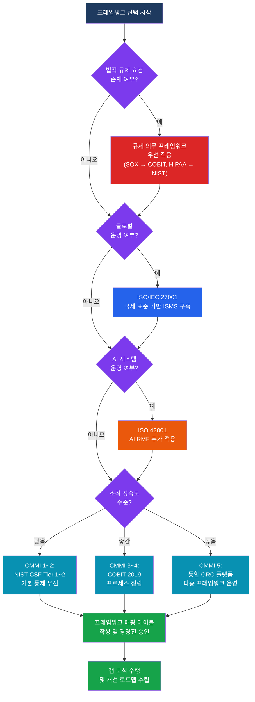

# 글로벌 위험 관리 프레임워크
**Global Risk Management Frameworks & Standards**

:::info 관련 표준
CISA Domain 2.2 / COBIT 2019 / NIST CSF 2.0 / ISO/IEC 27001:2022 / ISO 42001 / NIST AI RMF / COSO ERM
:::

<table>
  <colgroup>
    <col style={{width: '20%'}} />
    <col style={{width: '80%'}} />
  </colgroup>
  <tbody>
    <tr><td><strong>문서번호</strong></td><td>BP-GOV-02</td></tr>
    <tr><td><strong>제개정일</strong></td><td>2025-01-15 (초판) / 2026-03-01 (2차 개정)</td></tr>
    <tr><td><strong>관리부서</strong></td><td>IT 전략기획팀</td></tr>
    <tr><td><strong>적용범위</strong></td><td>전사 IT 위험 관리 프레임워크 채택, 운영, 평가 전반</td></tr>
    <tr><td><strong>통제목적</strong></td><td>조직이 적합한 글로벌 표준 프레임워크를 채택하고, 갭 분석을 통해 통제를 설계·이행하며, 경영진 승인 하에 지속적으로 운영함을 보증</td></tr>
  </tbody>
</table>

---

## 1. 개요 및 배경

### 1.1 프레임워크 활용의 필요성

IT 위험 관리 프레임워크는 조직이 사이버 위협, 운영 리스크, 규제 요건에 체계적으로 대응할 수 있도록 국제적으로 검증된 모범 사례(Best Practice)를 제공합니다. CISA 감사인은 조직이 프레임워크를 **단순 채택**에 그치지 않고 실제 통제로 구현하고 있는지를 평가합니다.

**주요 프레임워크 선택 기준**
- 규제 환경: 금융권(SOX, FFIEC), 의료(HIPAA), 국방(CMMC) 등 산업별 법적 의무 확인
- 조직 성숙도: CMMI 레벨 기반 현재 역량 수준에 적합한 프레임워크 선택
- 글로벌 운영 여부: 다국적 기업은 ISO 27001 등 국제 표준 우선 적용
- 비용·자원: 인증 취득 비용, 유지 관리 인력 등 총소유비용(TCO) 고려

---

## 2. 핵심 개념 및 원칙

### 2.1 COBIT 2019

COBIT(Control Objectives for Information and Related Technologies) 2019는 ISACA가 발표한 IT 거버넌스 및 관리 프레임워크로, **40개 거버넌스·관리 목표**를 제공합니다.

**COBIT 2019 구조**

| 영역 | 약어 | 목표 수 | 주요 내용 |
|------|------|---------|-----------|
| 거버넌스 (Evaluate·Direct·Monitor) | EDM | 5개 | 이해관계자 가치 보장, 위험 최적화, 자원 최적화 |
| 정렬·계획·조직 | APO | 14개 | IT 전략, 아키텍처, 혁신, 예산, 인력 |
| 구축·획득·실행 | BAI | 10개 | 프로그램 관리, 변경, 테스트, 지식 관리 |
| 서비스·지원·지원 | DSS | 6개 | 운영, 서비스 요청, 문제 관리, 연속성 |
| 모니터링·평가·사정 | MEA | 4개 | 성과 관리, 내부통제, 외부 준거성, IT 보증 |

**EDM(평가·지시·모니터링) 핵심 목표**
- EDM01: 거버넌스 프레임워크 설정 및 유지
- EDM02: 이익 실현 보장
- EDM03: 위험 최적화 보장
- EDM04: 자원 최적화 보장
- EDM05: 이해관계자 투명성 보장

**CMMI 성숙도 수준과 COBIT 연계**
- Level 0 (불완전): 프로세스 미존재
- Level 1 (초기): 임시방편적 프로세스
- Level 2 (관리): 계획·모니터링 수행
- Level 3 (정의): 표준화된 프로세스
- Level 4 (정량 관리): 측정 기반 관리
- Level 5 (최적화): 지속적 개선

### 2.2 NIST CSF 2.0 (Cybersecurity Framework)

NIST CSF 2.0(2024년 2월 발표)은 기존 CSF 1.1 대비 **통치(Govern) 기능을 신규 추가**하여 6대 핵심 기능(Core Functions)으로 구성됩니다.

**6대 핵심 기능**

| 기능 | 영문 | 주요 역할 | CSF 2.0 개선사항 |
|------|------|-----------|-----------------|
| 통치 | GOVERN | 사이버보안 위험 관리 전략·정책·역할 수립 | 신규 추가 (v2.0) |
| 식별 | IDENTIFY | 자산, 리스크, 공급망 위험 파악 | 공급망 리스크(SCRM) 강화 |
| 보호 | PROTECT | 접근 통제, 교육, 데이터 보호 구현 | 정체성 관리 강화 |
| 탐지 | DETECT | 사이버 사건 탐지 및 분석 | 지속적 모니터링 강화 |
| 대응 | RESPOND | 사고 대응 계획 실행 | 공급망 대응 통합 |
| 복구 | RECOVER | 복구 계획 실행 및 개선 | 커뮤니케이션 강화 |

**CSF 2.0 주요 개선사항**
- Tiers 1~4: 부분적 → 위험 정보화 → 반복 가능 → 적응적 (Adaptive)
- Profile: 현재(Current Profile) vs 목표(Target Profile) 갭 기반 로드맵 수립
- 공급망 사이버보안 위험 관리(C-SCRM) 통합 강화

### 2.3 ISO/IEC 27001:2022

**Annex A 통제 구조 변화: 14개 절 → 4개 테마**

| 테마 | 통제 수 | 주요 내용 |
|------|---------|-----------|
| 조직적 통제 (Organizational) | 37개 | 정책, 역할, 위험 관리, 공급망, 사고 관리 |
| 인적 통제 (People) | 8개 | 채용, 교육, 인식, 징계 |
| 물리적 통제 (Physical) | 14개 | 물리적 경계, 클린 데스크, 미디어 폐기 |
| 기술적 통제 (Technological) | 34개 | 접근 통제, 암호화, 취약점 관리, 로깅 |

**2022 개정 신규 통제 11개 (주요 항목)**
- 5.7 위협 인텔리전스 (Threat Intelligence)
- 5.23 클라우드 서비스 사용 정보보안
- 5.30 ICT 업무 연속성 대비
- 7.4 물리적 보안 모니터링
- 8.9 구성 관리
- 8.10 정보 삭제
- 8.11 데이터 마스킹
- 8.12 데이터 유출 방지(DLP)
- 8.16 모니터링 활동
- 8.23 웹 필터링
- 8.28 안전한 코딩

### 2.4 AI 관련 신규 프레임워크

**ISO 42001:2023 (AI 관리 시스템)**
- 목적: AI 시스템의 책임 있는 개발·운영을 위한 관리 시스템 요구사항 제공
- 핵심 요소: AI 정책 수립, AI 위험 평가, AI 시스템 수명주기 관리, 이해관계자 소통
- ISMS(ISO 27001)와 통합 운영 가능한 구조로 설계

**NIST AI RMF (AI Risk Management Framework)**
- GOVERN: AI 위험 관리 문화·정책·책임 구조 수립
- MAP: AI 시스템 맥락, 분류, 이해관계자 영향 파악
- MEASURE: AI 리스크 분석, 우선순위화, 문서화
- MANAGE: AI 위험 처리, 잔여 위험 모니터링

### 2.5 COSO ERM 8개 구성요소

COSO(Committee of Sponsoring Organizations) ERM 2017은 전략과 성과를 연계한 **8개 구성요소**를 제시합니다.

| 구성요소 | 주요 내용 |
|---------|-----------|
| 1. 거버넌스 및 문화 | 이사회 감독, 운영 구조, 윤리적 가치 설정 |
| 2. 전략 및 목표 수립 | 전략 맥락 분석, 리스크 선호도(Risk Appetite) 정의 |
| 3. 성과 | 위험 식별·평가·우선순위화, 포트폴리오 관점 관리 |
| 4. 재검토 및 개정 | 중요한 변화 검토, ERM 실행 성과 평가 |
| 5. 정보·통신·보고 | 관련 정보의 획득·공유, 이해관계자 보고 |
| 6. 위험 식별 | 내·외부 환경 변화 모니터링 |
| 7. 위험 평가 | 발생 가능성·영향도 분석, 고유·잔여 위험 구분 |
| 8. 위험 대응 | 수용·회피·감소·공유 중 대응 전략 선택 |

### 2.6 프레임워크 간 매핑

| COBIT 2019 목표 | ISO/IEC 27001:2022 조항 | NIST CSF 2.0 기능 |
|----------------|------------------------|-------------------|
| EDM03 (위험 최적화) | 6.1 위험 및 기회 조치 | GOVERN (GV.RM) |
| APO12 (위험 관리) | 6.1.2 정보보안 위험 평가 | IDENTIFY (ID.RA) |
| APO13 (보안 관리) | Annex A 기술적 통제 | PROTECT (PR) |
| DSS05 (보안 서비스) | A.8 기술적 통제 전반 | DETECT (DE) |
| DSS02 (인시던트 관리) | A.5.26 정보보안 사고 관리 | RESPOND (RS) |
| DSS04 (연속성 관리) | A.5.29–5.30 연속성 | RECOVER (RC) |

---

## 3. 프레임워크 선택 의사결정 흐름

---

## 4. CISA 감사 체크리스트

<table>
  <colgroup>
    <col style={{width: '7%'}} />
    <col style={{width: '23%'}} />
    <col style={{width: '38%'}} />
    <col style={{width: '32%'}} />
  </colgroup>
  <thead>
    <tr><th>ID</th><th>통제 목적</th><th>감사 수행 절차</th><th>필수 증적 파일</th></tr>
  </thead>
  <tbody>
    <tr>
      <td><strong>AUD-FRM-01</strong></td>
      <td>채택 프레임워크의 선택 이유가 명확히 문서화되어 있음</td>
      <td>
        1. 프레임워크 선택 의사결정 문서(RFP 또는 평가 보고서) 검토 
        2. 선택된 프레임워크와 규제 요건·조직 목표의 연계성 확인 
        3. 대안 프레임워크 비교 검토 자료 존재 여부 확인 
        4. 경영진 또는 이사회의 최종 승인 문서 확인
      </td>
      <td>
        프레임워크 선택 평가 보고서 
        규제 요건 대응 매핑 문서 
        경영진/이사회 승인서 
        대안 비교 분석 자료
      </td>
    </tr>
    <tr>
      <td><strong>AUD-FRM-02</strong></td>
      <td>프레임워크 대비 갭 분석이 주기적으로 수행됨</td>
      <td>
        1. 최근 12개월 이내 갭 분석 수행 여부 및 범위 확인 
        2. 갭 분석 방법론(인터뷰, 문서 검토, 기술 테스트) 적정성 평가 
        3. 식별된 갭 항목과 개선 조치 계획의 연계 확인 
        4. 갭 분석 결과의 경영진 보고 여부 확인
      </td>
      <td>
        갭 분석 보고서 (최근 1년) 
        개선 조치 계획 및 이행 현황 
        경영진 보고 자료 
        갭 분석 방법론 문서
      </td>
    </tr>
    <tr>
      <td><strong>AUD-FRM-03</strong></td>
      <td>내부 통제와 프레임워크 요건 간 매핑이 완전하게 관리됨</td>
      <td>
        1. 통제-프레임워크 매핑 테이블 존재 여부 및 최신성 확인 
        2. 매핑 테이블의 커버리지 적정성 평가 (주요 통제 누락 여부) 
        3. 다중 프레임워크 적용 시 중복 통제 식별 및 통합 관리 여부 확인 
        4. 매핑 테이블 업데이트 주기 및 책임자 지정 여부 확인
      </td>
      <td>
        통제-프레임워크 매핑 테이블 
        매핑 업데이트 이력 
        통제 담당자 배정 문서 
        통제 테스트 결과 보고서
      </td>
    </tr>
    <tr>
      <td><strong>AUD-FRM-04</strong></td>
      <td>프레임워크 운영 현황이 경영진 승인 하에 유지·개선됨</td>
      <td>
        1. 연간 프레임워크 리뷰 계획 및 실행 여부 확인 
        2. 신규 위협·규제 변경에 따른 프레임워크 업데이트 절차 검토 
        3. 프레임워크 운영 예산 및 인력 할당의 적정성 평가 
        4. 경영진이 프레임워크 운영 현황을 정기적으로 보고받고 있는지 확인
      </td>
      <td>
        연간 리뷰 보고서 
        프레임워크 업데이트 이력 
        경영진 승인 문서 
        예산 및 인력 배분 계획서
      </td>
    </tr>
  </tbody>
</table>

---

## 5. 관련 표준 및 참고

| 표준/프레임워크 | 버전 | 발행처 | 적용 초점 |
|---------------|------|--------|-----------|
| COBIT 2019 | 2019 | ISACA | IT 거버넌스·관리 전반 |
| NIST CSF | 2.0 (2024) | NIST | 사이버보안 위험 관리 |
| ISO/IEC 27001 | 2022 | ISO/IEC | 정보보안 관리 시스템(ISMS) |
| ISO/IEC 42001 | 2023 | ISO/IEC | AI 관리 시스템 |
| NIST AI RMF | 1.0 (2023) | NIST | AI 위험 관리 |
| COSO ERM | 2017 | COSO | 전사적 위험 관리 |
| ISO 31000 | 2018 | ISO | 위험 관리 일반 원칙 |

---

## 관련 문서

- [2.1 IT 전략 및 조직 구조](/docs/it-governance/it-strategy) — 거버넌스 조직과 COBIT EDM 연계
- [2.3 IT 규제 및 컴플라이언스](/docs/it-governance/compliance) — SOX·GDPR과 프레임워크 연계
- [5.2 위험 평가 방법론](/docs/information-security/iam) — NIST CSF 기반 위험 평가 실무
- [1.3 위험 기반 감사 계획](/docs/audit-process/risk-based-planning) — 프레임워크 기반 감사 계획 수립
- [6.1 감사 도구 및 자동화](/docs/audit-toolkits/rcm) — GRC 플랫폼 활용 프레임워크 관리
