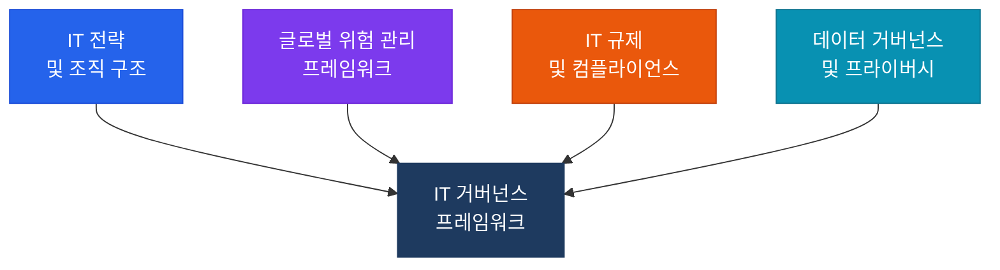

# IT 거버넌스 및 위험 관리
**Governance & Management of IT — CISA Domain 2**

:::info 관련 표준
CISA Domain 2 / COBIT 2019 / ISO/IEC 27001 / NIST CSF / ISO 42001
:::

조직의 IT 전략이 비즈니스 목표와 정렬되어 있고, 리스크가 통제되고 있는지 감사하는 기준입니다.

## 하위 항목

| 번호 | 주제 | 핵심 키워드 |
|------|------|------------|
| 2.1 | [IT 전략 및 조직 구조](./it-strategy) | IT 위원회, SoD 매트릭스, 직무 분리 |
| 2.2 | [글로벌 위험 관리 프레임워크](./frameworks) | COBIT, NIST, ISO 27001, ISO 42001, ERM |
| 2.3 | [IT 규제 및 컴플라이언스](./compliance) | SOX, GDPR, 수출통제법, 준거성 감사 |
| 2.4 | [데이터 거버넌스 및 프라이버시](./data-governance) | 데이터 수명주기, 개인정보 보호 |
