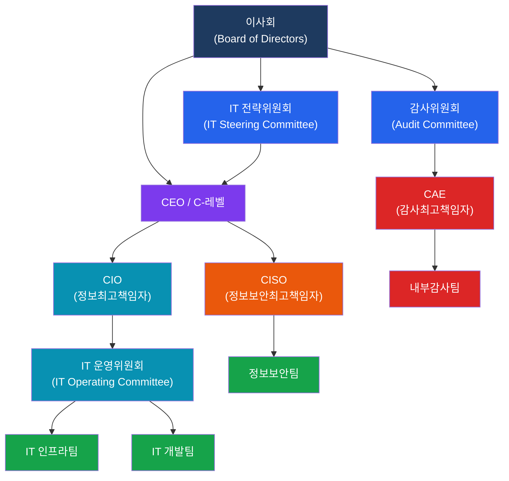

# IT 전략 및 조직 구조
**IT Strategy & Organizational Structure**

:::info 관련 표준
CISA Domain 2.1 / COBIT EDM01–EDM05 / ISO/IEC 38500:2024 / ITIL 4 / King IV Report
:::

<table>
  <colgroup>
    <col style={{width: '20%'}} />
    <col style={{width: '80%'}} />
  </colgroup>
  <tbody>
    <tr><td><strong>문서번호</strong></td><td>BP-GOV-01</td></tr>
    <tr><td><strong>제개정일</strong></td><td>2025-01-15 (초판) / 2026-03-01 (2차 개정)</td></tr>
    <tr><td><strong>관리부서</strong></td><td>IT 전략기획팀 / IT 감사실</td></tr>
    <tr><td><strong>적용범위</strong></td><td>IT 전략 수립, 조직 거버넌스, 직무 분리 통제 전반</td></tr>
    <tr><td><strong>통제목적</strong></td><td>이사회와 경영진이 IT 방향을 효과적으로 설정하고 모니터링하여 IT 투자가 전사 전략과 정렬되고 리스크가 적절히 관리됨을 보증</td></tr>
  </tbody>
</table>

---

## 1. 개요 및 배경

### 1.1 IT 거버넌스(IT Governance)의 정의

IT 거버넌스란 이사회(Board of Directors)와 경영진이 IT 방향 설정, 자원 배분, 성과 측정, 리스크 관리에 대한 책임을 체계적으로 이행하는 구조와 프로세스의 총체입니다. ISO/IEC 38500:2024는 IT 거버넌스를 "의사결정 원칙과 책임 프레임워크"로 정의하며, 평가(Evaluate)·지시(Direct)·모니터링(Monitor) 세 가지 원칙을 핵심으로 제시합니다.

**CISA 시험 핵심 포인트**
- IT 거버넌스는 이사회·경영진 책임, IT 관리는 CIO·IT 부서 책임으로 명확히 구분
- 거버넌스 부재 시 IT 투자 낭비, 규제 위반, 사이버 침해 리스크 증가
- 내부감사인은 거버넌스 구조의 설계 적정성과 운영 효과성을 모두 평가

### 1.2 IT 거버넌스의 필요성

| 필요성 | 세부 내용 |
|--------|-----------|
| 전략 정렬 | IT 투자와 프로젝트가 비즈니스 목표에 기여하는지 검증 |
| 가치 창출 | IT 투자 대비 ROI 측정 및 비즈니스 가치 실현 보장 |
| 리스크 관리 | IT 관련 리스크를 조직 허용 수준 이내로 통제 |
| 자원 최적화 | 인력·예산·인프라 등 IT 자원의 효율적 배분 |
| 성과 측정 | KPI 기반의 IT 성과 측정 및 지속적 개선 체계 운영 |

---

## 2. 핵심 개념 및 원칙

### 2.1 IT 전략위원회 vs IT 운영위원회

| 구분 | IT 전략위원회 (IT Steering Committee) | IT 운영위원회 (IT Operating Committee) |
|------|--------------------------------------|----------------------------------------|
| 설치 근거 | 이사회 결의 또는 정관 | 경영진 내규 또는 업무분장 |
| 주요 구성원 | 이사회 멤버, C-레벨 임원, 사외이사 | CIO, CISO, 사업부장, IT 관리자 |
| 회의 주기 | 분기 1회 이상 | 월 1회 이상 |
| 주요 역할 | IT 전략 승인, 대규모 투자 결정, 거버넌스 정책 승인 | IT 프로젝트 우선순위 조정, 운영 이슈 해결, 자원 배분 실행 |
| CISA 감사 포인트 | 이사회 보고 적정성, 의사결정 문서화 | 회의록 완전성, 결정 사항 이행 여부 |

### 2.2 주요 IT 임원 역할 및 보고 체계

**CIO (Chief Information Officer)**
- IT 전략 수립 및 실행 총괄
- IT 조직 운영, 예산 관리, 프로젝트 포트폴리오 관리
- 보고 라인: CEO 또는 CFO (조직에 따라 상이)
- 이사회 IT 전략위원회에 정기 보고 의무

**CISO (Chief Information Security Officer)**
- 정보보안 전략, 정책, 위험 관리 총괄
- 보안 사고 대응, 컴플라이언스 관리
- 보고 라인: CEO 또는 CIO (독립성 확보를 위해 CEO 직보 권장)
- 감사위원회에 보안 현황 정기 보고 권장

**CAE (Chief Audit Executive, 감사최고책임자)**
- 내부감사 부서 총괄, 감사 계획 수립 및 실행
- 독립성 유지를 위해 감사위원회에 직보
- 행정적 보고는 CEO에게 가능하나, 기능적 보고는 감사위원회로 유지 필수

**보고 체계 설계 기준**
- CAE의 이중 보고 구조(Dual Reporting Line): 기능적 보고 → 감사위원회, 행정적 보고 → CEO
- CISO의 독립성: CIO 하부 배치 시 이해충돌 가능 → 독립된 보고 라인 권장
- 이사회는 IT 성과 및 리스크 요약 보고를 분기 1회 이상 수령해야 함

### 2.3 직무 분리(SoD: Separation of Duties)

**SoD의 목적**
단일 개인이 거래 전 과정을 통제하여 오류나 부정행위를 은폐할 수 없도록 업무를 분리하는 내부통제 메커니즘입니다.

**상충 직무(Conflicting Duties) 유형 분류**

| 충돌 유형 | 직무 A | 직무 B | 리스크 |
|-----------|--------|--------|--------|
| 승인-실행 충돌 | 거래 승인 | 거래 입력/실행 | 승인 없는 거래 실행 |
| 기록-관리 충돌 | 자산 관리 | 회계 기록 | 자산 횡령 후 기록 조작 |
| IT-비즈니스 충돌 | 시스템 개발 | 생산 환경 배포 | 인가되지 않은 코드 배포 |
| 생성-검토 충돌 | 보고서 생성 | 보고서 검토·승인 | 오류 있는 보고서 승인 |
| 접근-감사 충돌 | 시스템 접근 | 접근 로그 관리 | 로그 삭제를 통한 은폐 |

**SoD 매트릭스 설계 방법**
1. 핵심 업무 프로세스별 업무 기능 목록 작성 (예: AP, AR, 급여, 조달)
2. 각 기능 간 충돌 여부 평가 → R(금지)/Y(경고)/G(허용) 분류
3. 현재 역할 배정과 SoD 매트릭스 비교 → 위반 사항 식별
4. 보상 통제(Compensating Controls) 설계: 불가피한 SoD 위반에 대한 감독 강화

**SoD 위반 탐지 자동화**
- IAM(Identity & Access Management) 시스템과 ERP(SAP, Oracle) 연동
- 역할 프로비저닝 시 자동 SoD 충돌 검사 (예: SAP GRC Access Control)
- 정기적인 User Access Review(UAR): 분기 1회 이상 역할 재인증
- SIEM 연동: 비정상 접근 패턴 실시간 탐지 및 알림

### 2.4 IT 성과 관리

**BSC(균형성과표) IT 관점**

| 관점 | IT BSC 지표 예시 |
|------|-----------------|
| 재무 관점 | IT 비용/매출 비율, IT 투자 ROI, TCO(총소유비용) |
| 고객 관점 | 시스템 가용성 SLA 달성률, IT 서비스 만족도, 사용자 지원 해결 시간 |
| 내부 프로세스 관점 | 프로젝트 일정 준수율, 변경 성공률, 보안 취약점 패치율 |
| 학습·성장 관점 | IT 인력 역량 지수, 교육 시간/인, 직원 보유율 |

**OKR(Objectives and Key Results) 적용 기준**
- Objective: 정성적이고 야심찬 목표 (예: "2026년 디지털 전환 선도 기업 달성")
- Key Results: 측정 가능한 성과 지표 3~5개 (예: "클라우드 전환율 80% 달성", "레거시 시스템 30% 감축")
- 분기 리뷰: OKR 진행 상황 점검 및 우선순위 재조정
- 감사 포인트: OKR이 IT 전략 문서와 연결되어 있는지, 이사회 보고에 반영되는지 확인

---

## 3. IT 거버넌스 계층 구조

> **핵심**: CAE는 이사회 산하 감사위원회에 기능적 보고를 하여 독립성을 유지합니다. CISO는 CIO와 분리된 보고 라인을 가져야 이해충돌을 방지할 수 있습니다.

---

## 4. CISA 감사 체크리스트

<table>
  <colgroup>
    <col style={{width: '7%'}} />
    <col style={{width: '23%'}} />
    <col style={{width: '38%'}} />
    <col style={{width: '32%'}} />
  </colgroup>
  <thead>
    <tr><th>ID</th><th>통제 목적</th><th>감사 수행 절차</th><th>필수 증적 파일</th></tr>
  </thead>
  <tbody>
    <tr>
      <td><strong>AUD-GOV-01</strong></td>
      <td>IT 거버넌스 위원회가 적절히 구성·운영되고 있음</td>
      <td>
        1. IT 전략위원회 및 IT 운영위원회 구성원 명단 확인 
        2. 최근 12개월간 회의록 검토 (주요 의사결정 사항 포함 여부) 
        3. 이사회 보고 기록과 거버넌스 정책 승인 문서 대조 
        4. 위원회 구성원의 IT 전문성 적정성 평가
      </td>
      <td>
        IT 전략위원회 구성원 명단 
        연간 회의 일정 및 회의록 
        이사회 보고서 (최근 4분기) 
        거버넌스 정책 승인 문서
      </td>
    </tr>
    <tr>
      <td><strong>AUD-GOV-02</strong></td>
      <td>SoD 매트릭스가 최신 상태로 유지되며 위반 사항이 관리됨</td>
      <td>
        1. SoD 매트릭스 최종 업데이트 일자 및 승인자 확인 
        2. 현재 사용자 역할 배정과 SoD 매트릭스 비교 분석 
        3. SoD 위반 사항에 대한 보상 통제 문서화 여부 확인 
        4. IAM 시스템의 자동 SoD 충돌 탐지 기능 작동 여부 테스트
      </td>
      <td>
        SoD 매트릭스 (최근 개정본) 
        사용자 역할 배정 목록 
        SoD 위반 보고서 및 예외 승인서 
        IAM 시스템 충돌 탐지 로그
      </td>
    </tr>
    <tr>
      <td><strong>AUD-GOV-03</strong></td>
      <td>IT 성과지표(KPI/OKR)가 전략과 연계되어 정기적으로 관리됨</td>
      <td>
        1. IT KPI 목록과 IT 전략 목표의 연계성 검토 
        2. 최근 4분기 KPI 실적 데이터 수집 및 목표 달성률 분석 
        3. KPI 미달 항목에 대한 원인 분석 및 개선 조치 여부 확인 
        4. 이사회/경영진 보고서에 IT 성과지표 포함 여부 확인
      </td>
      <td>
        IT 전략 계획서 (연간) 
        KPI/OKR 대시보드 (최근 4분기) 
        성과 미달 항목 원인 분석 보고서 
        이사회 보고 자료
      </td>
    </tr>
    <tr>
      <td><strong>AUD-GOV-04</strong></td>
      <td>CIO·CISO·CAE의 보고 체계가 독립성을 보장하도록 설계됨</td>
      <td>
        1. 조직도 상 CIO·CISO·CAE의 보고 라인 확인 
        2. CAE의 감사위원회 직접 보고 여부 및 관련 규정 검토 
        3. CISO의 보고 라인이 CIO와 독립적인지 확인 
        4. 이해충돌 방지 정책 및 직무 독립성 확인서 검토
      </td>
      <td>
        조직도 (최신본) 
        내부감사 규정 또는 감사헌장 
        CISO 직무기술서 및 보고 체계 문서 
        이해충돌 방지 정책
      </td>
    </tr>
  </tbody>
</table>

---

## 5. 관련 표준 및 참고

| 표준/프레임워크 | 버전 | 주요 적용 내용 |
|---------------|------|--------------|
| ISO/IEC 38500 | 2024 | IT 거버넌스 원칙 (평가·지시·모니터링) |
| COBIT 2019 | 2019 | EDM01~EDM05: 거버넌스 목표 및 평가 기준 |
| ITIL 4 | 2019 | IT 서비스 관리와 거버넌스 연계 |
| IIA Standards | 2024 | 내부감사 국제기준, CAE 독립성 요건 |
| King IV Report | 2016 | IT 거버넌스 이사회 책임 (남아공, 글로벌 참고) |
| NIST SP 800-53 | Rev.5 | PM-계열 통제: 프로그램 관리 및 거버넌스 |

---

## 관련 문서

- [2.2 글로벌 위험 관리 프레임워크](/docs/it-governance/frameworks) — COBIT 거버넌스 목표 상세
- [2.3 IT 규제 및 컴플라이언스](/docs/it-governance/compliance) — SOX Section 404 ITGC 요건
- [1.1 내부감사 기준 및 역할](/docs/audit-process/audit-charter) — CAE 역할 및 감사 독립성
- [4.1 IT 운영 관리](/docs/it-operations/itsm) — 운영 조직 구조
- [5.1 정보보안 거버넌스](/docs/information-security/iam) — CISO 역할 및 보안 조직
