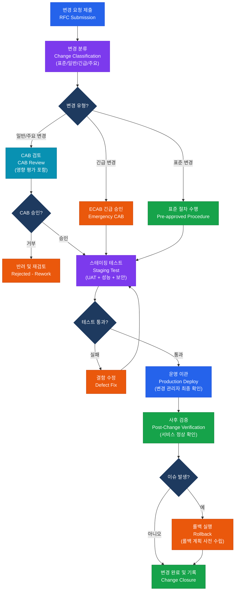

# 형상 및 릴리스 관리
**Configuration & Release Management**

:::info 관련 표준
CISA Domain 3.3 / ITIL v4 / ISO/IEC 10007:2003 / CMMI-DEV / SOX ITGC 변경 관리
:::

<table>
  <colgroup>
    <col style={{width: '20%'}} /><col style={{width: '80%'}} />
  </colgroup>
  <tbody>
    <tr><td><strong>문서번호</strong></td><td>BP-DEV-03</td></tr>
    <tr><td><strong>제개정일</strong></td><td>2025-03-05 (v2.0)</td></tr>
    <tr><td><strong>관리부서</strong></td><td>IT 운영팀</td></tr>
    <tr><td><strong>적용범위</strong></td><td>전사 IT 시스템 변경·릴리스 — 개발·스테이징·운영 환경 전체</td></tr>
    <tr><td><strong>통제목적</strong></td><td>무단 변경 방지 및 승인된 변경의 안전한 이관을 통해 시스템 가용성·무결성 유지</td></tr>
  </tbody>
</table>

---

## 1. 개요 및 배경

형상 관리(Configuration Management)는 소프트웨어·하드웨어·문서 등 IT 자산의 형상 항목(CI, Configuration Item)을 식별·통제·추적·감사하는 체계적 프로세스다. 릴리스 관리(Release Management)는 검증된 변경 사항을 운영 환경에 안전하게 배포하고 이해관계자에게 전달하는 프로세스다.

**형상 및 릴리스 관리의 필요성**:

- **SOX ITGC 변경 관리**: 재무 시스템 무단 변경 방지를 위한 승인 프로세스 필수
- **시스템 안정성**: 검증 없는 변경이 운영 장애의 주요 원인(업계 통계 약 80%)
- **감사 추적**: 누가, 언제, 어떤 변경을 했는지 추적 가능한 이력 유지
- **환경 일관성**: Dev-Staging-Prod 환경 간 불일치(Configuration Drift)로 인한 장애 예방

---

## 2. 핵심 개념 및 원칙

### 2.1 형상 관리 4대 활동

| 활동 | 설명 | 주요 산출물 |
|------|------|-----------|
| **1. 식별** (Identification) | 형상 항목(CI) 정의, 고유 ID 부여, 형상 기준선(Baseline) 수립 | CI 목록, 형상 관리 데이터베이스(CMDB) |
| **2. 통제** (Control) | 변경 요청→승인→구현→이관의 공식 절차, 무단 변경 방지 | 변경 요청서(RFC), CAB 승인 기록 |
| **3. 상태 보고** (Status Accounting) | CI의 현재 상태 및 변경 이력 기록, 버전 추적 | 형상 상태 보고서, 변경 이력 로그 |
| **4. 감사** (Audit) | 실제 CI와 CMDB 기록의 일치 여부 확인 | 형상 감사 보고서, 불일치 시정 계획 |

**형상 항목(CI) 유형 예시**:
- 소프트웨어: 애플리케이션 소스코드, 실행 파일, 설정 파일
- 하드웨어: 서버, 네트워크 장비, 스토리지
- 문서: 시스템 아키텍처 문서, 운영 절차서
- 서비스: 외부 API 연동, 클라우드 서비스 설정

### 2.2 환경 분리 3단계 통제 요건

| 환경 | 목적 | 통제 요건 | 접근 권한 |
|------|------|---------|---------|
| **개발 (Dev)** | 신규 기능 개발, 버그 수정 | 개발자 자유 접근 허용, 실제 고객 데이터 사용 금지, 마스킹 데이터 사용 | 개발팀 전체 |
| **스테이징/UAT (Staging)** | 통합 테스트, 사용자 수용 테스트, 성능 테스트 | 운영 환경과 동일 구성 유지, 변경 이관 승인 필요, 마스킹된 운영 데이터 사용 | 개발팀 + QA팀 + 비즈니스 대표 |
| **운영 (Production)** | 실제 서비스 제공 | CAB 승인 없는 변경 금지, 개발자 직접 접근 금지(예외: 긴급 상황 + 감사 로그), 모든 변경 이력 보존 | IT 운영팀만(개발자 제한) |

**환경 간 분리 핵심 통제**:
- 개발자는 운영 환경 소스코드를 직접 수정 불가
- 운영 DB에 개발/테스트 목적 접근 금지
- 각 환경별 독립된 접근 계정 및 인증 체계
- 이관(Promotion)은 자동화된 CI/CD 파이프라인을 통해서만 허용

### 2.3 CAB(변경 자문 위원회) 구성 및 변경 승인 매트릭스

**CAB 구성원**:

| 역할 | 책임 |
|------|------|
| IT 운영 관리자 (위원장) | 회의 주재, 최종 승인 |
| 아키텍처/기술 리드 | 기술적 영향 평가 |
| 정보보안 담당자 | 보안 위험 평가 |
| 비즈니스 대표 | 비즈니스 영향 및 서비스 가용성 판단 |
| 변경 관리자 | 절차 준수 확인, 기록 관리 |
| (긴급 시) ECAB | 긴급 변경 자문 위원회 (소규모, 신속 소집) |

**변경 유형별 승인 매트릭스**:

| 변경 유형 | 정의 | 승인 절차 | 소요 시간 | 예시 |
|----------|------|---------|---------|------|
| **표준 변경** (Standard) | 사전 승인된 반복 변경, 낮은 위험 | 사전 정의된 절차 따름 (CAB 불필요) | 즉시 | 정기 패치, 표준 사용자 계정 생성 |
| **일반 변경** (Normal) | 계획된 비긴급 변경, 중간 위험 | RFC 제출 → CAB 검토 → 승인 | 3~5 영업일 | 신규 기능 배포, DB 스키마 변경 |
| **긴급 변경** (Emergency) | 서비스 중단 방지 또는 복구 목적 | ECAB 긴급 승인 → 구현 → 사후 정식 승인 | 수 시간 이내 | 보안 취약점 핫픽스, 장애 복구 패치 |
| **주요 변경** (Major) | 대규모 아키텍처 변경, 높은 위험 | RFC + 영향 평가 + 전체 CAB + 경영진 승인 | 2~4주 | 시스템 교체, 클라우드 마이그레이션 |

### 2.4 릴리스 유형 분류 기준

| 릴리스 유형 | 버전 표기 | 내용 | 예시 |
|----------|---------|------|------|
| **Major** | X.0.0 | 하위 호환성 미보장 대규모 변경, 새로운 아키텍처 | v1.0.0 → v2.0.0: API 인터페이스 전면 개편 |
| **Minor** | X.Y.0 | 하위 호환 신규 기능 추가 | v2.0.0 → v2.1.0: 신규 리포트 모듈 추가 |
| **Patch** | X.Y.Z | 버그 수정, 보안 패치 (기능 변경 없음) | v2.1.0 → v2.1.1: XSS 취약점 수정 |
| **Hotfix** | X.Y.Z-HF | 운영 긴급 패치 (일반 릴리스 절차 우선 적용) | v2.1.1-HF1: 운영 크래시 긴급 수정 |

### 2.5 Configuration Drift(설정 드리프트) 탐지

**정의**: 시간이 지남에 따라 시스템의 실제 설정이 승인된 기준선(Baseline)에서 벗어나는 현상.

**발생 원인**:
- 운영자의 수동 직접 변경(임시 조치 후 미복구)
- 자동 업데이트·패치 적용
- 스케일 아웃 시 신규 인스턴스 설정 불일치

**탐지 방법**:

| 방법 | 도구 예시 | 주기 |
|------|---------|------|
| IaC(인프라 코드화) 상태 비교 | Terraform Plan, CloudFormation Drift Detection | 실시간/일별 |
| 형상 관리 도구 | Chef, Puppet, Ansible (Idempotent 적용) | 실시간 |
| 기준선 스캔 | AWS Config, Azure Policy | 실시간 |
| 수동 형상 감사 | CMDB vs 실제 환경 비교 | 분기별 |

---

## 3. 프로세스/방법론

### 3.1 변경 관리 전체 프로세스

### 3.2 데이터 마이그레이션 감사 5단계

| 단계 | 활동 | 감사 포인트 |
|------|------|-----------|
| **1. 매핑 검증** | 소스-타깃 필드 매핑 정의서 검토, 변환 규칙 명세 확인 | 비즈니스 규칙과 매핑의 일치성, 누락 필드 여부 |
| **2. 추출** | 소스 시스템 데이터 추출, 추출 건수·체크섬 기록 | 추출 시점 스냅샷 보존, 소스 데이터 변경 방지 |
| **3. 변환** | 데이터 클렌징, 형식 변환, 코드 매핑 | 변환 오류 로그, 예외 처리 결과, 변환 전후 레코드 수 비교 |
| **4. 적재** | 타깃 시스템 데이터 로드, 적재 로그 확인 | 적재 성공·실패 건수, 중복 방지, 트랜잭션 원자성 |
| **5. 검증** | 레코드 수 일치, 체크섬 비교, 비즈니스 규칙 준수 확인 | 소스-타깃 레코드 수 100% 일치 또는 허용 차이 근거, 샘플 데이터 검증(최소 5%) |

---

## 4. CISA 감사 체크리스트

<table>
  <colgroup>
    <col style={{width: '7%'}} /><col style={{width: '23%'}} />
    <col style={{width: '38%'}} /><col style={{width: '32%'}} />
  </colgroup>
  <thead>
    <tr><th>ID</th><th>통제 목적</th><th>감사 수행 절차</th><th>필수 증적 파일</th></tr>
  </thead>
  <tbody>
    <tr>
      <td><strong>AUD-CR01</strong></td>
      <td>환경 분리 완전성 (Environment Segregation)</td>
      <td>
        1. Dev/Staging/Prod 환경별 네트워크 분리 구성 확인 
        2. 개발자 운영 환경 직접 접근 계정 유무 조회 
        3. 운영 DB에 개인정보 포함 여부(마스킹 적용 확인) 
        4. 환경 간 데이터 이관 절차 및 승인 이력 확인
      </td>
      <td>
        네트워크 구성도(환경별) 
        운영 환경 접근 계정 목록 
        데이터 마스킹 적용 확인서
      </td>
    </tr>
    <tr>
      <td><strong>AUD-CR02</strong></td>
      <td>CAB 승인 이력 완전성 (CAB Approval Completeness)</td>
      <td>
        1. 최근 6개월 변경 이력 전수 목록 입수 
        2. 표준 변경 이외 모든 변경의 RFC 및 CAB 승인 확인 
        3. 긴급 변경의 사후 정식 승인 완료 여부 확인 
        4. 운영 환경 배포 기록과 CAB 승인 건수 일치 여부
      </td>
      <td>
        변경 관리 시스템 전체 이력 
        CAB 회의록(최근 6개월) 
        긴급 변경 사후 승인 기록
      </td>
    </tr>
    <tr>
      <td><strong>AUD-CR03</strong></td>
      <td>이관 전 테스트 증적 (Pre-deployment Testing Evidence)</td>
      <td>
        1. 최근 릴리스 5건의 스테이징 테스트 결과 확인 
        2. UAT 서명 및 승인 절차 준수 여부 
        3. 테스트 커버리지 목표 달성 확인(단위/통합/성능) 
        4. 보안 취약점 스캔 결과 및 조치 여부
      </td>
      <td>
        스테이징 테스트 결과 보고서 
        UAT 승인 서명 문서 
        취약점 스캔 보고서 및 조치 내역
      </td>
    </tr>
    <tr>
      <td><strong>AUD-CR04</strong></td>
      <td>롤백 계획 수립 및 검증 (Rollback Plan Adequacy)</td>
      <td>
        1. 최근 릴리스 5건의 롤백 계획 포함 여부 확인 
        2. 롤백 계획의 구체성(단계별 절차·책임자·소요 시간) 
        3. 연간 롤백 훈련(DR Test) 수행 여부 
        4. 실제 롤백 발생 건의 실행 시간과 목표 비교
      </td>
      <td>
        변경 계획서(롤백 섹션 포함) 
        롤백 훈련 결과 보고서 
        실제 롤백 실행 기록
      </td>
    </tr>
  </tbody>
</table>

---

## 5. 관련 표준 및 참고

| 표준 | 발행 기관 | 주요 내용 |
|------|---------|---------|
| ITIL v4 Change Enablement | Axelos | 변경 관리 프로세스 및 CAB |
| ISO/IEC 10007:2003 | ISO/IEC | 형상 관리 가이드라인 |
| CMMI-DEV v2.0 | CMMI Institute | 소프트웨어 개발 성숙도 (CM 프로세스 영역) |
| COBIT 2019 BAI06 | ISACA | IT 변경 관리 목표 |
| SOX ITGC 변경 관리 | PCAOB | 재무 시스템 변경 통제 감사 기준 |

---

## 관련 문서

- [시스템 개발 생명주기](./sdlc.md)
- [사후 검토 및 평가](./post-implementation.md)
- [IT 운영 및 서비스 관리](../05-it-operations/service-management.md)
