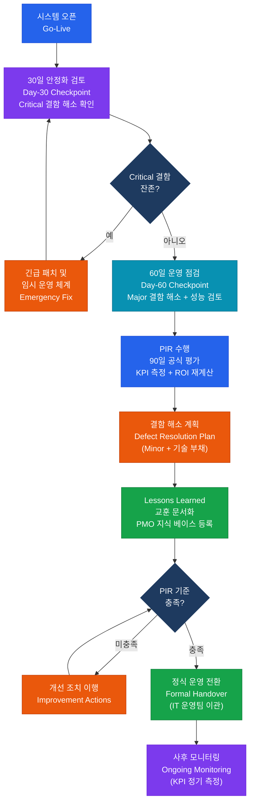

# 사후 검토 및 평가
**Post-Implementation Review (PIR)**

:::info 관련 표준
CISA Domain 3.4 / ISACA Val IT 2.0 / PMBOK 7th Edition / ITIL v4 / ISO/IEC 25010
:::

<table>
  <colgroup>
    <col style={{width: '20%'}} /><col style={{width: '80%'}} />
  </colgroup>
  <tbody>
    <tr><td><strong>문서번호</strong></td><td>BP-DEV-04</td></tr>
    <tr><td><strong>제개정일</strong></td><td>2025-01-20 (v1.2)</td></tr>
    <tr><td><strong>관리부서</strong></td><td>PMO / IT 감사실</td></tr>
    <tr><td><strong>적용범위</strong></td><td>시스템 오픈 후 안정화 — 신규 시스템 및 대규모 업그레이드 전체</td></tr>
    <tr><td><strong>통제목적</strong></td><td>IT 투자의 비즈니스 가치 실현 여부 검증 및 프로젝트 교훈 조직 지식화를 통한 지속적 개선</td></tr>
  </tbody>
</table>

---

## 1. 개요 및 배경

사후 검토(Post-Implementation Review, PIR)는 시스템 오픈 이후 일정 기간이 경과한 시점에 수행하는 공식 평가 활동으로, IT 투자의 목표 달성 여부를 검증하고 향후 프로젝트 개선을 위한 교훈을 도출하는 것이 목적이다.

ISACA Val IT 2.0 프레임워크는 IT 투자가 창출하는 가치를 프로그램 관리, 투자 관리, 가치 거버넌스 3개 도메인으로 관리하며, PIR은 가치 실현(Value Realization)의 핵심 검증 메커니즘이다.

**PIR의 주요 가치**:
- 비즈니스 케이스(Business Case)에서 약속한 편익의 실제 달성 여부 확인
- 예상치 못한 비용·리스크·기회의 식별
- 초기 안정화 결함의 체계적 해소를 통한 서비스 품질 확보
- 조직의 프로젝트 역량 향상을 위한 교훈 문서화

**PIR 수행 시점 — 오픈 후 30/60/90일 체크포인트**:

| 체크포인트 | 주요 목적 | 주요 활동 |
|----------|---------|---------|
| **30일** | 초기 안정화 확인 | Critical 결함 해소 여부, 운영 부하 분석, 긴급 지원 체계 가동 상태 |
| **60일** | 운영 정상화 확인 | Major 결함 해소, 사용자 교육 완료, 성능 지표 기준선 수립 |
| **90일** | 가치 실현 평가 | KPI 초기 측정, ROI 재계산, Lessons Learned 최종 문서화, 정식 운영 전환 결정 |

---

## 2. 핵심 개념 및 원칙

### 2.1 비즈니스 가치 실현율 측정

**가치 실현율(Value Realization Rate)** = (실제 달성 편익 / 계획 편익) × 100%

**KPI 측정 프레임워크**:

| 편익 유형 | 측정 지표 예시 | 측정 주기 | 측정 방법 |
|----------|-------------|---------|---------|
| **비용 절감** | 운영 인력 감소 FTE, 인프라 비용 절감액 | 월별 | 비용 대비 분석 |
| **매출 증가** | 신규 채널 매출, 전환율 향상 | 월별 | 판매 시스템 데이터 |
| **생산성 향상** | 업무 처리 시간 단축률, 오류율 감소 | 주별 | 업무 로그 분석 |
| **고객 만족** | NPS, CSAT, 콜센터 문의 감소율 | 분기별 | 설문, CRM 데이터 |
| **리스크 감소** | 보안 사고 건수, 컴플라이언스 위반 건수 | 월별 | 인시던트 관리 시스템 |

**ROI 재계산 공식**:

```
ROI = [(실제 편익 - 실제 총비용) / 실제 총비용] × 100%

실제 총비용 = 개발 비용 + 구축 비용 + 운영 비용(현재까지) + 추가 발생 비용
```

비즈니스 케이스 승인 시 예상 ROI와 실제 ROI의 차이를 분석하고, 차이 발생 원인(요건 변경, 일정 지연, 추가 구현 등)을 식별하여 향후 추정 정확도를 개선한다.

### 2.2 초기 안정화 결함 분류 및 SLA

| 결함 등급 | 정의 | 해결 SLA | 에스컬레이션 기준 |
|----------|------|---------|----------------|
| **Critical (P1)** | 시스템 전면 사용 불가 또는 데이터 손상 발생 | 4시간 이내 해결 또는 임시 조치 | 1시간 내 미조치 시 CTO 에스컬레이션 |
| **Major (P2)** | 핵심 기능 사용 불가, 우회 방법 없음 | 24시간 이내 해결 | 8시간 내 미조치 시 IT 관리자 에스컬레이션 |
| **Minor (P3)** | 기능 저하 또는 불편, 우회 방법 존재 | 5 영업일 이내 해결 | 다음 릴리스 사이클 포함 계획 |
| **Cosmetic (P4)** | UI/레이아웃 이슈, 업무 영향 없음 | 다음 정기 배포 | 없음 |

**결함 SLA 달성률 목표**:
- Critical: 100% SLA 준수
- Major: 95% 이상 SLA 준수
- Minor: 80% 이상 SLA 준수

### 2.3 기술 부채(Technical Debt) 측정 및 관리

**기술 부채 정의**: 단기 납기·비용 압박으로 인한 최적화되지 않은 설계·코드 결정이 미래 유지보수·변경 비용 증가로 이어지는 누적 부담.

**기술 부채 유형**:

| 유형 | 설명 | 예시 |
|------|------|------|
| **설계 부채** | 아키텍처 단순화를 위한 타협 | 모놀리식 구조 유지, 적절한 레이어 분리 미적용 |
| **코드 부채** | 복잡하고 이해하기 어려운 코드 | 하드코딩된 값, 중복 코드, 낮은 테스트 커버리지 |
| **테스트 부채** | 자동화 테스트 부족 | 수동 테스트 의존, 회귀 테스트 미흡 |
| **문서 부채** | 문서 미작성 또는 구식 문서 | 인라인 주석 없음, 운영 매뉴얼 미갱신 |
| **인프라 부채** | 구식 환경, 보안 패치 미적용 | EoL OS, 취약한 미들웨어 버전 유지 |

**기술 부채 측정 지표**:
- 코드 복잡도(Cyclomatic Complexity) 평균
- 테스트 커버리지(%)
- SonarQube 등 코드 품질 도구의 부채 시간(Debt Days)
- EoL(End of Life) 컴포넌트 비율

**관리 원칙**: 각 스프린트 용량의 20%를 기술 부채 해소에 배정하는 '20% 규칙' 적용 권고.

---

## 3. 프로세스/방법론

### 3.1 Lessons Learned 문서화 프로세스

**5단계 프로세스**:

1. **수집**: 프로젝트 팀원, 비즈니스 사용자, 운영팀 대상 설문 및 인터뷰
2. **분류**: 계획·실행·기술·거버넌스·리스크 영역별 분류
3. **분석**: 근본 원인 분석(5 Whys, 어골도) 적용하여 표면 현상과 원인 구분
4. **문서화**: 표준 양식에 따라 문제-원인-권고사항-담당자 기록
5. **공유 및 지식화**: PMO 지식 베이스 등록, 차기 프로젝트 착수 시 필수 검토

**Lessons Learned 문서 필수 항목**:

| 항목 | 설명 |
|------|------|
| 프로젝트 정보 | 명칭, 기간, 예산, 팀 규모 |
| 잘된 점 (What Worked Well) | 재활용할 성공 요인 |
| 개선 필요 사항 (What Needs Improvement) | 재발 방지 필요 문제 |
| 권고사항 (Recommendations) | 구체적 개선 조치 및 담당 조직 |
| 첨부 자료 | 관련 지표, 인시던트 로그, 설문 결과 |

### 3.2 PIR 전체 수행 프로세스



### 3.3 PIR 보고서 구조

| 섹션 | 내용 |
|------|------|
| 1. 요약 | PIR 수행 기간, 참여자, 주요 발견 사항 및 권고사항 |
| 2. 프로젝트 개요 | 목표, 예산, 일정, 범위 요약 |
| 3. 목표 달성 현황 | KPI 목표 대비 실적 표 |
| 4. 재무 분석 | 실제 비용, 편익, ROI 재계산 |
| 5. 품질 평가 | 결함 통계, 현재 잔여 결함, 해소 계획 |
| 6. 기술 부채 현황 | 부채 유형별 현황 및 해소 우선순위 |
| 7. Lessons Learned | 잘된 점, 개선 필요 사항, 권고사항 |
| 8. 정식 운영 전환 승인 | PMO/IT 감사실 서명 |

---

## 4. CISA 감사 체크리스트

<table>
  <colgroup>
    <col style={{width: '7%'}} /><col style={{width: '23%'}} />
    <col style={{width: '38%'}} /><col style={{width: '32%'}} />
  </colgroup>
  <thead>
    <tr><th>ID</th><th>통제 목적</th><th>감사 수행 절차</th><th>필수 증적 파일</th></tr>
  </thead>
  <tbody>
    <tr>
      <td><strong>AUD-PIR01</strong></td>
      <td>PIR 수행 여부<br/>(PIR Execution)</td>
      <td>
        1. 최근 2년 내 오픈 시스템 목록 입수<br/>
        2. 각 시스템의 PIR 수행 여부 확인 (30/60/90일 포함)<br/>
        3. PIR 보고서의 완전성 검토 (8개 섹션 포함 여부)<br/>
        4. PMO/IT 감사실 승인 서명 확인
      </td>
      <td>
        PIR 보고서(전체)<br/>
        30/60/90일 체크포인트 기록<br/>
        PMO 승인 서명 문서
      </td>
    </tr>
    <tr>
      <td><strong>AUD-PIR02</strong></td>
      <td>KPI 달성률 측정 적정성<br/>(KPI Achievement Measurement)</td>
      <td>
        1. 비즈니스 케이스의 목표 KPI와 PIR의 실제 KPI 비교<br/>
        2. KPI 측정 방법론의 일관성 및 객관성 확인<br/>
        3. 목표 미달성 KPI에 대한 원인 분석 여부 확인<br/>
        4. ROI 재계산 결과 및 편익 추적 계획 확인
      </td>
      <td>
        비즈니스 케이스 승인 문서<br/>
        KPI 목표-실적 비교표<br/>
        편익 실현 추적 보고서
      </td>
    </tr>
    <tr>
      <td><strong>AUD-PIR03</strong></td>
      <td>잔여 결함 해소 계획 적정성<br/>(Defect Resolution Plan)</td>
      <td>
        1. 90일 시점 잔여 결함 목록 입수<br/>
        2. 결함 등급(Critical/Major/Minor)별 분류 적정성 확인<br/>
        3. Critical/Major 결함의 해소 일정 및 담당자 명시 여부<br/>
        4. 기술 부채 해소 계획의 예산·일정 현실성 평가
      </td>
      <td>
        잔여 결함 목록(등급 포함)<br/>
        결함 해소 계획서<br/>
        기술 부채 관리 대장
      </td>
    </tr>
    <tr>
      <td><strong>AUD-PIR04</strong></td>
      <td>Lessons Learned 문서화<br/>(Lessons Learned Documentation)</td>
      <td>
        1. Lessons Learned 문서의 존재 및 표준 양식 준수 확인<br/>
        2. PMO 지식 베이스 등록 여부 확인<br/>
        3. 차기 프로젝트 착수 시 해당 교훈 검토 절차 존재 여부<br/>
        4. 주요 권고사항의 조직 정책·절차 반영 여부 확인
      </td>
      <td>
        Lessons Learned 문서<br/>
        PMO 지식 베이스 등록 확인<br/>
        차기 프로젝트 교훈 적용 증적
      </td>
    </tr>
  </tbody>
</table>

---

## 5. 관련 표준 및 참고

| 표준 | 발행 기관 | 주요 내용 |
|------|---------|---------|
| ISACA Val IT 2.0 | ISACA | IT 가치 관리 — 투자·프로그램·가치 거버넌스 |
| PMBOK 7th Edition | PMI | 프로젝트 성과 영역 — 편익 실현 포함 |
| ITIL v4 CSI (Continual Improvement) | Axelos | 지속적 개선 프로세스 |
| ISO/IEC 25010:2023 | ISO/IEC | 소프트웨어 품질 특성 (기능성·성능·보안·유지보수성 등) |
| COBIT 2019 BAI11 | ISACA | 프로젝트 및 프로그램 관리 목표 |

---

## 관련 문서

- [형상 및 릴리스 관리](./configuration-release.md)
- [시스템 개발 생명주기](/docs/system-development/sdlc-devsecops)
- [IT 거버넌스 프레임워크](/docs/it-governance/it-strategy)
