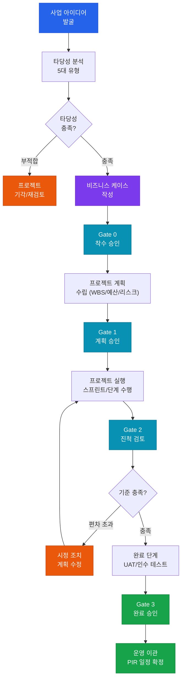

# 프로젝트 거버넌스 및 타당성
**Project Governance & Feasibility Analysis**

:::info 관련 표준
CISA Domain 3.1 / PMBOK 7th Edition / PRINCE2 / ISO 21500 / ISACA COBIT 2019 BAI01
:::

| 항목 | 내용 |
|------|------|
| **문서번호** | BP-DEV-01 |
| **제개정일** | 2025-01-15 |
| **관리부서** | PMO / IT 감사실 |
| **적용범위** | 전사 IT 프로젝트 |
| **통제목적** | IT 투자 타당성 검증 및 프로젝트 전 생애주기 거버넌스 확보 |

---

## 1. 개요 및 배경

IT 프로젝트는 조직의 전략적 목표를 실현하는 핵심 수단이나, 통제되지 않은 프로젝트는 예산 초과·일정 지연·품질 미달 등 심각한 손실을 초래한다. ISACA CISA 도메인 3은 **시스템 획득·개발·구현(Acquisition, Development, and Implementation)** 전 과정에서 감사인이 검토해야 할 통제 프레임워크를 다룬다.

프로젝트 거버넌스(Project Governance)는 단일 프로젝트 관리를 넘어, 조직 전체의 **포트폴리오(Portfolio) → 프로그램(Program) → 프로젝트(Project)** 계층 구조에서 의사결정 권한·책임·프로세스를 규정한다.

### 1.1 포트폴리오 · 프로그램 · 프로젝트 관계

| 구분 | 정의 | 관리 초점 | CISA 감사 포인트 |
|------|------|-----------|----------------|
| **포트폴리오(Portfolio)** | 전략 목표 달성을 위한 프로젝트·프로그램 집합 | 전략 정합성, 투자 우선순위 | 이사회·경영진 승인 여부 |
| **프로그램(Program)** | 상호 연관된 프로젝트 집합의 조율 | 시너지 실현, 상호의존성 관리 | 통합 리스크 관리 체계 |
| **프로젝트(Project)** | 유일한 산출물을 만드는 한시적 활동 | 범위·일정·비용·품질 | Phase Gate 통과 기준 준수 |

---

## 2. 핵심 개념 및 원칙

### 2.1 투자 타당성 분석 (Feasibility Analysis) 5대 유형

투자 결정 전 다음 5가지 타당성을 체계적으로 검토해야 한다.

| 타당성 유형 | 핵심 검토 사항 | 감사 증적 |
|------------|--------------|----------|
| **기술적 타당성 (Technical)** | 현행 인프라 수용 가능 여부, 기술 성숙도, 내부 역량 | 기술 아키텍처 검토서, PoC 결과 |
| **경제적 타당성 (Economic)** | TCO(총소유비용), ROI, NPV, IRR 분석 | 비용편익분석서, 재무 모델 |
| **운영적 타당성 (Operational)** | 조직·프로세스 변화 수용성, 사용자 교육 계획 | 현업 인터뷰 결과, 변화관리 계획 |
| **법적·규제 타당성 (Legal)** | 개인정보 규제, 산업 규제, 계약 의무 준수 | 법률 검토 의견서, 규제 매핑 |
| **시간적 타당성 (Schedule)** | 목표 일정 달성 가능성, 의존성 분석 | 마스터 일정표, WBS |

### 2.2 비즈니스 케이스 (Business Case) 필수 구성요소

비즈니스 케이스는 투자 의사결정의 근거 문서로서, 다음 요소가 반드시 포함되어야 한다.

1. **문제/기회 정의** — 현재 상태(As-Is)와 목표 상태(To-Be) 명시
2. **대안 분석** — 최소 3개 대안(현행 유지 포함) 비교
3. **비용-편익 분석** — 정량적·정성적 편익 모두 포함
4. **리스크 분석** — 투자 실패 시나리오 및 완화 방안
5. **권고안 및 ROI** — 투자 회수 기간(Payback Period) 명시
6. **이해관계자 영향 분석** — 변화 수용성 평가
7. **성공 기준(Success Criteria)** — 측정 가능한 KPI 정의

**비즈니스 케이스 검증 기준**: 경영진(C-Level) 승인 여부, 재무팀 독립 검토 여부, 이사회 보고 여부(일정 금액 이상)

### 2.3 PMO 유형 및 감사 포인트

| PMO 유형 | 권한 수준 | 주요 역할 | 감사 포인트 |
|---------|---------|---------|-----------|
| **지원형 (Supportive)** | 낮음 | 방법론·템플릿 제공, 컨설팅 | 표준 준수율, 템플릿 활용 여부 |
| **통제형 (Controlling)** | 중간 | 방법론 준수 강제, 보고 수집 | 게이트 검토 수행 이력, 예외 승인 기록 |
| **지시형 (Directive)** | 높음 | 프로젝트 직접 관리, PM 배정 | PM 자격·권한 위임 문서, 의사결정 로그 |

### 2.4 방법론별 감사 기준 비교

| 항목 | Waterfall | Agile (Scrum) | Hybrid |
|------|-----------|--------------|--------|
| **요구사항 기준** | 고정(Frozen) | 유동적(Backlog) | 핵심 고정, 상세 유동 |
| **감사 시점** | Phase Gate | Sprint Review | 단계별 + Sprint |
| **산출물** | 단계별 공식 문서 | 스프린트 결과물 | 혼합 |
| **변경 통제** | 공식 CCB 승인 | 제품 책임자 결정 | 중요 변경 CCB |
| **위험 수준** | 후기 발견 위험 높음 | 범위 확장(Scope Creep) 위험 | 관리 복잡성 위험 |
| **CISA 증적** | 단계 승인 문서 | Sprint 계획·검토 회의록 | 혼합 산출물 목록 |

---

## 3. 프로세스 / 방법론

### 3.1 Phase Gate Review 단계별 체크리스트

| 게이트 | 검토 단계 | 핵심 질문 | 통과 기준 |
|--------|---------|---------|---------|
| **Gate 0** | 착수(Initiation) | 전략 정합성 있는가? | 비즈니스 케이스 승인 |
| **Gate 1** | 계획(Planning) | 실행 계획이 현실적인가? | WBS·예산·리스크 등록부 완비 |
| **Gate 2** | 실행(Execution) | 진척이 계획 대비 허용 범위인가? | 일정·비용 편차 ±10% 이내 |
| **Gate 3** | 완료(Closure) | 인수 기준을 충족하는가? | UAT 통과, 운영 이관 승인 |

### 3.2 프로젝트 리스크 등록부 (Risk Register) 관리

리스크 등록부는 프로젝트 전 기간 동안 살아있는 문서(Living Document)로 관리되어야 한다.

| 항목 | 설명 |
|------|------|
| **리스크 ID** | 고유 식별자 |
| **리스크 설명** | 원인 → 결과 형식으로 기술 |
| **발생 가능성** | 1~5 척도 |
| **영향도** | 1~5 척도 (범위/일정/비용/품질) |
| **리스크 점수** | 가능성 × 영향도 |
| **대응 전략** | 회피/완화/이전/수용 |
| **담당자** | 리스크 소유자 |
| **상태** | 오픈/진행/종료 |
| **최종 업데이트** | 일자 기록 |

### 3.3 프로젝트 거버넌스 흐름도

---

## 4. CISA 감사 체크리스트

<table>
  <colgroup>
    <col style={{width: '7%'}} />
    <col style={{width: '23%'}} />
    <col style={{width: '38%'}} />
    <col style={{width: '32%'}} />
  </colgroup>
  <thead>
    <tr><th>ID</th><th>통제 목적</th><th>감사 수행 절차</th><th>필수 증적 파일</th></tr>
  </thead>
  <tbody>
    <tr>
      <td><strong>AUD-01</strong></td>
      <td>비즈니스 케이스의 경영진 승인 확인</td>
      <td>
        1. 비즈니스 케이스 문서 입수 
        2. 승인 결재선 및 서명 확인 
        3. 타당성 분석 5개 항목 완비 여부 검토 
        4. 재무팀 독립 검토 의견 존재 여부 확인
      </td>
      <td>
        비즈니스 케이스 승인 문서 
        재무팀 검토 의견서 
        이사회/경영진 회의록
      </td>
    </tr>
    <tr>
      <td><strong>AUD-02</strong></td>
      <td>Phase Gate Review 프로세스 수행 여부</td>
      <td>
        1. 프로젝트별 Gate 검토 회의록 수집 
        2. 각 Gate 통과 기준 문서 확인 
        3. 기준 미달 시 예외 승인 여부 확인 
        4. Gate 검토자 적격성(PMO/경영진) 확인
      </td>
      <td>
        Phase Gate 검토 회의록 
        Gate 통과 기준 문서 
        예외 승인 기록(해당 시)
      </td>
    </tr>
    <tr>
      <td><strong>AUD-03</strong></td>
      <td>프로젝트 리스크 등록부 최신 유지</td>
      <td>
        1. 리스크 등록부 최종 업데이트 일자 확인 
        2. 상위 리스크 3개 대응 조치 실행 여부 점검 
        3. 신규 리스크 식별 프로세스 존재 여부 확인 
        4. 리스크 소유자 지정 여부 확인
      </td>
      <td>
        리스크 등록부 최신본 
        리스크 검토 회의록 
        리스크 대응 조치 기록
      </td>
    </tr>
    <tr>
      <td><strong>AUD-04</strong></td>
      <td>이해관계자 소통 계획 수립 및 이행</td>
      <td>
        1. 이해관계자 분석 문서 입수 
        2. 소통 계획(Communication Plan) 존재 여부 확인 
        3. 정기 보고 이력(주간 보고, 월간 보고) 확인 
        4. 주요 의사결정 로그 완전성 검토
      </td>
      <td>
        이해관계자 분석 문서 
        소통 계획서 
        정기 보고서 이력 
        의사결정 로그
      </td>
    </tr>
  </tbody>
</table>

---

## 5. 관련 표준 및 참고

| 표준/프레임워크 | 관련 섹션 | 주요 내용 |
|--------------|---------|---------|
| **PMBOK 7th** | 프로젝트 성과 영역 | 12가지 원칙 기반 성과 중심 관리 |
| **PRINCE2 7th** | 비즈니스 케이스 테마 | 지속적 비즈니스 타당성 검증 |
| **ISO 21500:2021** | 프로젝트·프로그램·포트폴리오 | 국제 표준 프로젝트 관리 지침 |
| **COBIT 2019 BAI01** | 프로그램 및 프로젝트 관리 | IT 투자 거버넌스 통제 목표 |
| **ISACA Val IT** | 가치 창출 관리 | IT 투자 포트폴리오 관리 |

---

## 관련 문서

- [2.1 IT 거버넌스 프레임워크](/docs/it-governance/it-strategy)
- [3.2 개발 프로세스 통제 (SDLC & DevSecOps)](/docs/system-development/sdlc-devsecops)
- [3.4 사후 검토 및 평가 (PIR)](/docs/system-development/post-implementation)
- [4.1 변경 관리 프로세스](/docs/it-operations/patch-change)
- [6.1 감사 절차 개요](/docs/audit-process/audit-execution)
