# 개발 프로세스 통제
**SDLC & DevSecOps Controls**

:::info 관련 표준
CISA Domain 3.2 / OWASP SAMM 2.0 / NIST SP 800-218 (SSDF) / ISO/IEC 27034 / NIST SP 800-53 SA 계열
:::

| 항목 | 내용 |
|------|------|
| **문서번호** | BP-DEV-02 |
| **제개정일** | 2025-01-15 |
| **관리부서** | 개발팀 / 보안팀 |
| **적용범위** | 소프트웨어 개발 전 생애주기 |
| **통제목적** | 소프트웨어 개발 전 단계에서 보안 통제를 내재화하여 취약점 사전 제거 |

---

## 1. 개요 및 배경

소프트웨어 결함의 85% 이상은 설계·코딩 단계에서 발생하지만, 운영 단계에서 발견될 경우 수정 비용은 개발 단계 대비 **30배 이상** 증가한다. CISA 감사인은 SDLC 전 단계에서 보안 통제가 적절히 수행되고 있는지 검토해야 한다.

**DevSecOps**는 개발(Development)·보안(Security)·운영(Operations)을 통합하는 문화·프랙티스·도구 체계로, Shift-Left Security 원칙에 따라 보안을 개발 가장 초기 단계부터 내재화한다.

### 1.1 Shift-Left Security 개념

전통적 보안 검토는 개발 완료 후 침투 테스트(Pen Test) 방식으로 수행되었으나, Shift-Left는 보안 활동을 파이프라인의 왼쪽(초기)으로 이동시킨다.

| 전통적 접근 (Shift-Right) | Shift-Left Security |
|--------------------------|-------------------|
| 개발 완료 후 보안 검토 | 요구사항 단계부터 보안 요구사항 정의 |
| 별도 보안 팀이 수동 수행 | 개발 팀 내 보안 자동화 도구 통합 |
| 발견 → 재개발 비용 높음 | 조기 발견으로 수정 비용 최소화 |
| 릴리스 직전 병목 발생 | CI/CD 파이프라인 내 지속적 검증 |

---

## 2. 핵심 개념 및 원칙

### 2.1 SDLC 6단계 및 단계별 보안 활동

| 단계 | 주요 활동 | 보안 활동 | 산출물 |
|------|---------|---------|------|
| **1. 요구사항 (Requirements)** | 기능 요구사항 정의 | 보안 요구사항 도출, 위협 모델링(Threat Modeling) | 보안 요구사항 명세서 |
| **2. 설계 (Design)** | 아키텍처 설계 | 보안 아키텍처 검토, STRIDE 위협 분석 | 보안 설계 검토서 |
| **3. 구현 (Implementation)** | 코딩 | SAST 수행, 시큐어 코딩 가이드 준수 | 코드 검토 결과, SAST 리포트 |
| **4. 테스트 (Testing)** | 기능·통합 테스트 | DAST 수행, 침투 테스트, SCA | DAST 결과, 취약점 목록 |
| **5. 배포 (Deployment)** | 운영 환경 이관 | 배포 승인 게이트, 코드 서명 검증 | 배포 승인 기록 |
| **6. 유지보수 (Maintenance)** | 운영·패치 | 취약점 패치 관리, 보안 모니터링 | 패치 이력, SIEM 로그 |

### 2.2 보안 테스팅 기법 비교 (SAST / DAST / SCA)

| 항목 | SAST | DAST | SCA |
|------|------|------|-----|
| **전체 명칭** | Static Application Security Testing | Dynamic Application Security Testing | Software Composition Analysis |
| **분석 대상** | 소스코드·바이너리 | 실행 중인 애플리케이션 | 오픈소스·서드파티 라이브러리 |
| **적용 단계** | 구현 단계 (코딩 중) | 테스트·스테이징 단계 | 빌드 단계 이후 |
| **검출 유형** | SQL Injection, XSS 등 코드 결함 | 런타임 취약점, 인증 우회 | 알려진 CVE, 라이선스 위반 |
| **장점** | 초기 발견, 빠른 피드백 | 실제 공격 재현 가능 | 공급망 위험 식별 |
| **단점** | 오탐률 높음 | 코드 커버리지 제한 | 최신 CVE DB 필요 |
| **도구 예시** | SonarQube, Checkmarx, Semgrep | OWASP ZAP, Burp Suite | Snyk, OWASP Dependency-Check |

### 2.3 OWASP Top 10 기반 시큐어 코딩 체크리스트

| 순위 | 취약점 | 감사 확인 사항 |
|-----|--------|------------|
| A01 | 접근 통제 취약 (Broken Access Control) | 최소 권한 원칙 적용, RBAC 구현 여부 |
| A02 | 암호화 실패 (Cryptographic Failures) | TLS 1.2+ 적용, 민감 데이터 암호화 저장 |
| A03 | 인젝션 (Injection) | Prepared Statement, ORM 사용 여부 |
| A04 | 안전하지 않은 설계 (Insecure Design) | 위협 모델링 수행 여부 |
| A05 | 보안 설정 오류 (Security Misconfiguration) | 기본 설정 변경, 불필요 기능 비활성화 |
| A06 | 취약하고 오래된 컴포넌트 (Vulnerable Components) | SCA 수행 이력, CVE 패치 현황 |
| A07 | 식별 및 인증 실패 (Auth Failures) | MFA 적용, 세션 관리 정책 |
| A08 | 소프트웨어 무결성 실패 (Integrity Failures) | 코드 서명, 무결성 검증 체계 |
| A09 | 보안 로깅 실패 (Logging Failures) | 감사 로그 완전성, 로그 위변조 방지 |
| A10 | SSRF | 외부 URL 호출 허용 목록(Allowlist) 관리 |

### 2.4 CI/CD 파이프라인 보안 통제 자동화

| 통제 항목 | 적용 단계 | 자동화 방법 | 실패 시 처리 |
|---------|---------|-----------|-----------|
| **코드 서명 (Code Signing)** | 커밋 | GPG 서명 검증 훅 | 서명 없는 커밋 거부 |
| **SAST 임계치** | 빌드 전 | CI 파이프라인 통합 | Critical 이상 발견 시 빌드 중단 |
| **취약 라이브러리 차단** | 빌드 | SCA 도구 자동 실행 | CVSS 9.0 이상 차단 |
| **컨테이너 이미지 스캔** | 빌드 후 | Trivy/Grype 자동 실행 | 취약 이미지 레지스트리 등록 거부 |
| **DAST 게이트** | 스테이징 | ZAP 자동 스캔 | High 이상 미해결 시 배포 차단 |
| **배포 승인 게이트** | 운영 이관 전 | 4-eyes 원칙 (2인 승인) | 단독 승인 배포 불가 |

---

## 3. 프로세스 / 방법론

### 3.1 DevSecOps 파이프라인 흐름도

```mermaid
flowchart LR
    subgraph DEV ["개발 단계"]
        A["코드 작성<br/>(Commit)"]
        B["코드 리뷰<br/>(Peer Review)"]
        C["SAST<br/>(정적 분석)"]
    end
    subgraph BUILD ["빌드 단계"]
        D["빌드<br/>(Compile)"]
        E["SCA<br/>(구성 분석)"]
        F["컨테이너<br/>이미지 스캔"]
    end
    subgraph TEST ["테스트 단계"]
        G["단위·통합<br/>테스트"]
        H["DAST<br/>(동적 분석)"]
    end
    subgraph STAGE ["스테이징"]
        I["UAT<br/>수행"]
        J["배포 승인<br/>게이트"]
    end
    subgraph PROD ["운영"]
        K["운영 배포<br/>(Production)"]
        L["보안 모니터링<br/>(SIEM)"]
    end

    A --> B --> C
    C --> D --> E --> F
    F --> G --> H
    H --> I --> J
    J --> K --> L

    C -. "Critical 발견시<br/>빌드 중단" .-> A
    H -. "High 이상<br/>배포 차단" .-> G
    J -. "미승인 시<br/>이관 거부" .-> I

    style A fill:#2563EB,stroke:#1D4ED8,color:#fff
    style C fill:#7C3AED,stroke:#6D28D9,color:#fff
    style E fill:#7C3AED,stroke:#6D28D9,color:#fff
    style H fill:#7C3AED,stroke:#6D28D9,color:#fff
    style J fill:#EA580C,stroke:#C2410C,color:#fff
    style K fill:#16A34A,stroke:#15803D,color:#fff
    style L fill:#0891B2,stroke:#0E7490,color:#fff
```

### 3.2 위협 모델링 (STRIDE) 적용 방법

| 위협 유형 | 설명 | 대응 통제 |
|---------|------|---------|
| **S - Spoofing** | 신원 위장 | 강력 인증(MFA), 인증서 |
| **T - Tampering** | 데이터 변조 | 무결성 검증, 디지털 서명 |
| **R - Repudiation** | 행위 부인 | 감사 로그, 타임스탬프 |
| **I - Information Disclosure** | 정보 노출 | 암호화, 접근 통제 |
| **D - Denial of Service** | 서비스 거부 | Rate Limiting, WAF |
| **E - Elevation of Privilege** | 권한 상승 | 최소 권한, RBAC |

---

## 4. CISA 감사 체크리스트

<table>
  <colgroup>
    <col style={{width: '7%'}} />
    <col style={{width: '23%'}} />
    <col style={{width: '38%'}} />
    <col style={{width: '32%'}} />
  </colgroup>
  <thead>
    <tr><th>ID</th><th>통제 목적</th><th>감사 수행 절차</th><th>필수 증적 파일</th></tr>
  </thead>
  <tbody>
    <tr>
      <td><strong>AUD-01</strong></td>
      <td>보안 요구사항이 기능 요구사항과 함께 정의되었는가</td>
      <td>
        1. 요구사항 명세서(SRS) 입수 
        2. 보안 요구사항 섹션 존재 여부 확인 
        3. OWASP ASVS 또는 내부 기준 매핑 여부 검토 
        4. 위협 모델링 수행 기록 확인
      </td>
      <td>
        보안 요구사항 명세서 
        위협 모델링 결과서 
        요구사항 추적 매트릭스(RTM)
      </td>
    </tr>
    <tr>
      <td><strong>AUD-02</strong></td>
      <td>SAST/DAST 도구가 CI/CD에 통합되어 수행되었는가</td>
      <td>
        1. CI/CD 파이프라인 설정 파일 검토 
        2. SAST 스캔 결과 리포트 입수 및 Critical 취약점 해소 확인 
        3. DAST 스캔 결과 리포트 입수 및 High 이상 해소 확인 
        4. 취약점 임계치(Threshold) 정책 존재 여부 확인
      </td>
      <td>
        SAST 스캔 결과 리포트 
        DAST 스캔 결과 리포트 
        취약점 해소 확인서 
        CI/CD 파이프라인 설정
      </td>
    </tr>
    <tr>
      <td><strong>AUD-03</strong></td>
      <td>코드 리뷰 프로세스가 수행되고 이력이 남았는가</td>
      <td>
        1. 코드 리뷰 정책 문서 확인 
        2. 버전 관리 시스템(Git)의 Pull Request 이력 샘플링 
        3. 리뷰어 2인 이상 승인 여부 확인 
        4. 보안 관련 코멘트 반영 여부 샘플 확인
      </td>
      <td>
        코드 리뷰 정책 문서 
        Pull Request 승인 이력 
        보안 코멘트 해소 기록
      </td>
    </tr>
    <tr>
      <td><strong>AUD-04</strong></td>
      <td>운영 배포 전 승인 게이트가 적용되었는가</td>
      <td>
        1. 배포 승인 정책 문서 입수 
        2. 최근 배포 이력에서 승인 기록 샘플링(5건 이상) 
        3. 단독 배포(Self-Approval) 사례 존재 여부 확인 
        4. 긴급 배포(Hotfix) 절차 및 소급 승인 여부 확인
      </td>
      <td>
        배포 승인 정책 문서 
        배포 승인 기록 이력 
        긴급 배포 소급 승인 기록 
        배포 로그
      </td>
    </tr>
  </tbody>
</table>

---

## 5. 관련 표준 및 참고

| 표준/프레임워크 | 관련 섹션 | 주요 내용 |
|--------------|---------|---------|
| **NIST SP 800-218 (SSDF)** | Prepare, Protect, Produce, Respond | 소프트웨어 공급망 보안 개발 프레임워크 |
| **OWASP SAMM 2.0** | 거버넌스·설계·구현·검증·운영 | 소프트웨어 보안 성숙도 모델 |
| **ISO/IEC 27034** | 애플리케이션 보안 | 앱 보안 컨트롤 프레임워크 |
| **NIST SP 800-53 SA** | SA-11, SA-15, SA-17 | 개발자 보안 테스팅, 개발 프로세스 요구사항 |
| **OWASP Top 10** | A01~A10 | 가장 위험한 웹 취약점 10가지 |
| **CWE Top 25** | 소프트웨어 결함 목록 | 가장 위험한 소프트웨어 결함 25가지 |

---

## 관련 문서

- [3.1 프로젝트 거버넌스 및 타당성](/docs/system-development/project-governance)
- [3.3 형상 및 릴리스 관리](/docs/system-development/configuration-release)
- [5.1 접근 통제 및 인증](/docs/information-security/iam)
- [5.3 취약점 관리](/docs/information-security/infrastructure-security)
- [4.2 IT 운영 모니터링](/docs/it-operations/itsm)
