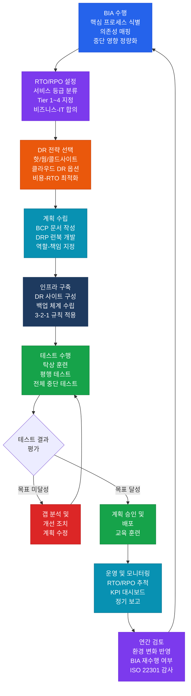

# BCP/DRP (비즈니스 연속성 및 재해 복구)
**Business Continuity Planning & Disaster Recovery Planning**

:::info 관련 표준
CISA Domain 4.4 · ISO 22301:2019 · NIST SP 800-34 Rev.1 · BCI Good Practice Guidelines 2023
:::

<table>
  <colgroup>
    <col style={{width: '20%'}} />
    <col style={{width: '80%'}} />
  </colgroup>
  <tbody>
    <tr><td><strong>문서 번호</strong></td><td>BP-OPS-05</td></tr>
    <tr><td><strong>제개정일</strong></td><td>2026-05-18</td></tr>
    <tr><td><strong>관리 부서</strong></td><td>IT 운영팀 / 비즈니스 연속성팀</td></tr>
    <tr><td><strong>적용 범위</strong></td><td>전사 핵심 IT 서비스 (Tier 1/2 시스템, 핵심 비즈니스 프로세스 지원 인프라)</td></tr>
    <tr><td><strong>통제 목적</strong></td><td>재해·중단 발생 시 합의된 RTO/RPO 내에 핵심 비즈니스 기능을 복구하고, 정기 테스트 및 유지보수를 통해 계획의 실효성을 지속 보장한다.</td></tr>
  </tbody>
</table>

---

## 1. 개요 및 배경

비즈니스 연속성 계획(BCP)과 재해 복구 계획(DRP)은 상호 보완적이지만 목적과 범위가 구분된다.

| 구분 | BCP (Business Continuity Planning) | DRP (Disaster Recovery Planning) |
|------|-------------------------------------|----------------------------------|
| **초점** | 비즈니스 기능 연속성 (사람 + 프로세스 + 기술) | IT 시스템 및 인프라 복구 (기술 중심) |
| **대상** | 전사 비즈니스 프로세스, 인력, 시설, 공급망 | 서버, 네트워크, 데이터, 애플리케이션 |
| **기간** | 재해 발생 전 ~ 정상 운영 복귀 전체 기간 | 재해 발생 후 IT 시스템 복구 완료까지 |
| **책임자** | 최고경영진, 비즈니스 부서장 | CIO, IT 운영팀장 |
| **산출물** | BCP 문서, 위기관리 계획, 대체 운영 절차 | DRP 문서, 복구 절차서, 시스템 복구 런북 |
| **테스트 방법** | 탁상훈련, 시뮬레이션, 전체 중단 테스트 | 실제 페일오버 테스트, 백업 복원 테스트 |

**핵심 구분**: BCP는 "비즈니스가 어떻게 계속 운영할 것인가"를, DRP는 "IT 시스템을 어떻게 복구할 것인가"를 다룬다. DRP는 BCP의 하위 구성 요소이다.

### 1.1 ISO 22301:2019 핵심 요구사항

ISO 22301은 비즈니스 연속성 관리 시스템(BCMS)의 국제 표준으로, 다음 핵심 조항을 포함한다.

| 조항 | 요구사항 | 주요 내용 |
|------|---------|---------|
| **6.1** | 리스크 및 기회 파악 | 중단 리스크 식별, BIA 수행 의무화 |
| **8.2** | 비즈니스 영향 분석(BIA) | 핵심 프로세스 식별, RTO/RPO/MTPD 설정 |
| **8.3** | 연속성 전략 및 해결책 | DR 전략 결정, 대체 운영 방안 수립 |
| **8.4** | 연속성 계획 및 절차 | BCP/DRP 문서화, 책임자 지정 |
| **8.5** | 훈련 및 테스트** | 연 1회 이상 연습 실시 의무 |
| **9.1** | 성과 모니터링 | RTO/RPO 달성률 측정, KPI 관리 |
| **10.2** | 지속적 개선 | 테스트 결과 기반 계획 개선 |

---

## 2. 핵심 개념 및 원칙

### 2.1 핵심 복구 지표 정의

| 지표 | 영문명 | 정의 | 설정 기준 |
|------|--------|------|----------|
| **RTO** | Recovery Time Objective | 중단 발생 후 서비스를 복구해야 하는 목표 시간 | BIA 중단 영향 비용 분석 결과 + 기술적 복구 가능성 |
| **RPO** | Recovery Point Objective | 복구 시 데이터 손실을 허용하는 최대 시점 (최근 백업 시점) | 데이터 변경 빈도 + 허용 손실 데이터량 + 비즈니스 요구 |
| **MTPD** | Maximum Tolerable Period of Disruption | 비즈니스가 중단을 견딜 수 있는 최대 허용 기간 (이 시간 초과 시 사업 존립 위기) | 계약·규제 의무, 재무 영향, 평판 리스크 분석 |
| **WRT** | Work Recovery Time | IT 시스템 복구 완료 후 정상 업무 재개까지 소요되는 시간 (데이터 검증, 사용자 재교육 등) | 데이터 무결성 검증 소요 시간 + 업무 복귀 절차 |

**관계식**: `RTO = 복구 시간 + WRT` / `MTPD ≥ RTO`

### 2.2 RTO/RPO 등급 기준표

| 서비스 등급 | RTO 목표 | RPO 목표 | 적용 시스템 예시 | 요구 DR 전략 |
|-----------|---------|---------|--------------|------------|
| **Tier 1 (미션 크리티컬)** | 1시간 이내 | 15분 이내 | 핵심 뱅킹 시스템, ERP, 결제 게이트웨이 | 핫사이트 또는 클라우드 액티브-액티브 |
| **Tier 2 (비즈니스 크리티컬)** | 4시간 이내 | 1시간 이내 | CRM, HR 시스템, 주요 웹서비스 | 웜사이트 또는 클라우드 파일럿 라이트 |
| **Tier 3 (업무 지원)** | 24시간 이내 | 4시간 이내 | 내부 포털, 보고 시스템, 협업 도구 | 웜사이트 또는 콜드사이트 |
| **Tier 4 (일반)** | 72시간 이내 | 24시간 이내 | 아카이브 시스템, 비핵심 내부 도구 | 콜드사이트 또는 백업 복원 |

### 2.3 DR 전략 비교 매트릭스

| 전략 유형 | 정의 | RTO | RPO | 구축 비용 | 운영 비용 | 적합 등급 |
|---------|------|-----|-----|---------|---------|---------|
| **핫사이트 (Hot Site)** | 주 사이트와 동일한 환경이 상시 동기화 운영 — 즉시 전환 가능 | 수분~1시간 | 수초~15분 | 매우 높음 | 매우 높음 | Tier 1 |
| **웜사이트 (Warm Site)** | 인프라 준비됨, 최신 데이터 동기화 필요 — 수 시간 내 전환 | 2~8시간 | 1~4시간 | 높음 | 중간 | Tier 2 |
| **콜드사이트 (Cold Site)** | 공간/전력만 확보, 하드웨어 및 데이터 복구 작업 필요 | 24~72시간 | 24시간 | 낮음 | 낮음 | Tier 3~4 |
| **클라우드 DR (Active-Active)** | 멀티 리전 동시 운영 — 자동 장애 조치 (AWS Route 53, Azure Traffic Manager 등) | 수초~수분 | 거의 0 | 중간~높음 | 중간 | Tier 1~2 |
| **클라우드 DR (Pilot Light)** | 최소 핵심 인프라만 클라우드 유지, 장애 시 스케일아웃 | 수시간 | 1시간 | 낮음~중간 | 낮음 | Tier 2~3 |
| **클라우드 DR (Warm Standby)** | 소규모 구성으로 상시 운영, 장애 시 스케일업 | 수분~1시간 | 수분 | 중간 | 중간 | Tier 1~2 |

---

## 3. BIA 수행 방법론 및 BCP/DRP 생애주기

### 3.1 BIA(비즈니스 영향 분석) 수행 절차

BIA는 BCP/DRP의 기반으로, 다음 4단계로 수행된다.

**1단계: 핵심 프로세스 식별**
- 전사 비즈니스 프로세스 목록 작성 (인터뷰, 조직도, 프로세스 맵 활용)
- 각 프로세스의 비즈니스 가치, 수익 기여도, 규제 의무 여부 평가

**2단계: 의존성 매핑**
- IT 시스템, 인프라, 외부 서비스, 인력, 시설 간 의존성 매트릭스 작성
- 단일 장애점(SPOF: Single Point of Failure) 식별

**3단계: 중단 영향 정량화**
- 시간대별 중단 영향 비용 산출 (1시간/4시간/24시간/1주일)
- 영향 유형: 재무적(매출 손실, 페널티), 운영적(생산성 저하), 규제적(컴플라이언스 위반), 평판적
- 영향 등급화: 낮음(1) / 보통(2) / 높음(3) / 치명적(4)

**4단계: RTO/RPO 결정**
- 영향 분석 결과 기반으로 시스템별 RTO/RPO 목표 설정
- IT 팀의 기술적 복구 가능성 검토 및 비즈니스 요구와 조율

### 3.2 백업 전략: 3-2-1 규칙

**3-2-1 백업 원칙**:
- **3개** 이상의 데이터 복사본 유지 (원본 1 + 백업 2)
- **2가지** 이상의 서로 다른 미디어/스토리지 유형 사용 (디스크 + 테이프, 온프레미스 + 클라우드)
- **1개** 이상의 오프사이트 보관 (원격지 데이터센터, 클라우드)

| 백업 유형 | 정의 | 소요 시간 | 복구 속도 | 스토리지 사용량 | 적합 주기 |
|---------|------|---------|---------|--------------|---------|
| **전체 백업 (Full)** | 모든 데이터 완전 복사 | 매우 오래 걸림 | 매우 빠름 (단독 복구) | 매우 큼 | 주 1회 또는 월 1회 |
| **증분 백업 (Incremental)** | 직전 백업(전체 또는 증분) 이후 변경된 데이터만 복사 | 매우 짧음 | 느림 (전체 + 모든 증분 필요) | 매우 작음 | 매일 |
| **차등 백업 (Differential)** | 최근 전체 백업 이후 변경된 모든 데이터 복사 | 중간 (점진적 증가) | 중간 (전체 + 최신 차등만 필요) | 중간 | 매일 또는 주 수회 |

**권장 전략**: 주간 전체 백업 + 일간 증분 백업(빠른 백업 우선) 또는 주간 전체 + 일간 차등(빠른 복구 우선)

### 3.3 BCP/DRP 테스트 5가지 유형 비교

| 테스트 유형 | 설명 | 비용 | 중단 위험 | 효과 | 권장 주기 |
|-----------|------|------|---------|------|---------|
| **탁상 훈련 (Tabletop Exercise)** | 회의실에서 가상 시나리오를 토론 — 실제 시스템 조작 없음 | 매우 낮음 | 없음 | 낮음~중간 (절차 이해도 검증) | 반기 1회 |
| **워크스루 (Walkthrough)** | BCP/DRP 문서를 단계별로 검토 — 실제 시스템 개입 없이 절차 검증 | 낮음 | 없음 | 중간 (문서 완전성 검증) | 연 1회 |
| **시뮬레이션 (Simulation)** | 실제 재해와 유사한 환경 조성, 부분적 시스템 개입 — 실제 전환 없이 훈련 | 중간 | 낮음 | 중간~높음 (실무 대응 능력 검증) | 연 1회 |
| **평행 테스트 (Parallel Test)** | 주 시스템 운영 유지하면서 DR 사이트를 별도로 가동 — 실제 서비스 중단 없음 | 높음 | 낮음 | 높음 (DR 사이트 실제 복구 능력 검증) | 연 1회 |
| **전체 중단 테스트 (Full Interruption)** | 주 시스템을 실제로 중단하고 DR 사이트로 완전 전환 — 가장 현실적 검증 | 매우 높음 | 높음 | 매우 높음 (완전한 복구 능력 검증) | 3년에 1회 이상 |

---

## 4. BCP/DRP 생애주기 프로세스

---

## 5. CISA 감사 체크리스트

<table>
  <colgroup>
    <col style={{width: '7%'}} />
    <col style={{width: '23%'}} />
    <col style={{width: '38%'}} />
    <col style={{width: '32%'}} />
  </colgroup>
  <thead>
    <tr>
      <th>ID</th>
      <th>통제 목적</th>
      <th>감사 수행 절차</th>
      <th>필수 증적 파일</th>
    </tr>
  </thead>
  <tbody>
    <tr>
      <td><strong>AUD-01</strong></td>
      <td>BIA 최신성 및 완전성 검증</td>
      <td>
        1. 최근 BIA 수행 일자 확인 — 중요 변경(M&amp;A, 신규 시스템 도입, 조직 개편) 이후 재수행 여부 검토 
        2. BIA 범위 적정성 점검: 전사 핵심 프로세스 포함 여부, SPOF 식별 완전성 
        3. 중단 영향 비용 산출 방법론의 합리성 검토 — 재무·운영·규제·평판 영향 4개 유형 포함 여부 
        4. BIA 결과의 경영진 승인 여부 및 RTO/RPO 설정과의 연계성 확인
      </td>
      <td>
        최신 BIA 보고서 (수행일 포함) 
        핵심 프로세스 목록 및 등급 분류표 
        중단 영향 비용 산출 워크시트 
        경영진 BIA 승인 문서
      </td>
    </tr>
    <tr>
      <td><strong>AUD-02</strong></td>
      <td>RTO/RPO 목표의 기술적 달성 가능성 검증</td>
      <td>
        1. 시스템별 RTO/RPO 목표 목록 입수 — BIA 결과와의 정합성 확인 
        2. 각 Tier별 DR 전략(핫/웜/콜드/클라우드)이 설정된 RTO/RPO를 기술적으로 달성 가능한지 아키텍처 검토 
        3. 최근 DR 테스트 결과와 RTO/RPO 목표 비교 — 달성 여부 및 차이 분석 
        4. MTPD 대비 RTO 설정의 적정성 확인 (RTO가 MTPD를 초과하지 않는지 검증)
      </td>
      <td>
        시스템별 RTO/RPO 목표 정의서 
        DR 아키텍처 설계 문서 
        최근 DR 테스트 결과 보고서 (실측 RTO/RPO) 
        MTPD 정의 및 근거 문서
      </td>
    </tr>
    <tr>
      <td><strong>AUD-03</strong></td>
      <td>백업 체계 완전성 및 복원 테스트 유효성 검증</td>
      <td>
        1. 3-2-1 백업 규칙 준수 여부 확인: 3개 복사본 존재, 2가지 미디어, 오프사이트 1개 
        2. 백업 성공률 모니터링 로그 검토 (최근 3개월) — 실패 발생 시 알림 및 재처리 여부 
        3. 백업 데이터 복원 테스트 이행 여부 확인 — 최소 분기 1회 이상, 테스트 결과 기록 존재 여부 
        4. 암호화 백업의 복호화 키 관리 적정성 검토 — 키 분리 보관, 접근 통제 확인 
        5. 오프사이트 백업 매체의 물리적 보안 및 환경 통제(온도, 습도) 확인
      </td>
      <td>
        백업 정책 및 절차서 
        백업 성공/실패 모니터링 로그 (3개월) 
        복원 테스트 수행 기록 (테스트 일자, 결과, 복구 시간) 
        오프사이트 보관 시설 검사 기록 
        암호화 키 관리 절차서
      </td>
    </tr>
    <tr>
      <td><strong>AUD-04</strong></td>
      <td>BCP/DRP 훈련 수행 충분성 및 결과 조치 검증</td>
      <td>
        1. 최근 12개월 BCP/DRP 훈련 이력 확인 — 유형(탁상/시뮬레이션/평행/전체중단)별 수행 여부 
        2. 훈련 참여자 범위 적정성 검토 — 비즈니스 부서, IT 운영팀, 경영진 포함 여부 
        3. 훈련 시나리오 현실성 평가 — 최신 위협 환경(랜섬웨어, 데이터센터 화재, 전력 차단 등) 반영 여부 
        4. 훈련 결과 보고서의 발견 사항(gap) 및 개선 조치 이행 추적 확인
      </td>
      <td>
        연간 BCP/DRP 훈련 계획서 
        훈련 수행 결과 보고서 (최근 2회 이상) 
        훈련 참석자 서명부 또는 참가 기록 
        발견 사항 및 개선 조치 추적 시트 
        경영진 훈련 결과 보고 이력
      </td>
    </tr>
    <tr>
      <td><strong>AUD-05</strong></td>
      <td>BCP/DRP 계획의 연간 검토 및 갱신 적정성 검증</td>
      <td>
        1. BCP/DRP 문서 최종 개정 일자 확인 — 연 1회 이상 공식 검토·승인 이력 존재 여부 
        2. 중요 변경 사항(신규 시스템, 조직 개편, 규제 변화, 주요 인시던트 발생) 반영 여부 확인 
        3. 복구 담당자 연락처 및 역할 정보의 최신성 검토 — 퇴직/이동 인원 반영 여부 
        4. 외부 공급업체 DR 지원 계약(UC) 유효성 및 최신 연락처 확인 
        5. ISO 22301 또는 내부 감사에서 지적된 사항의 조치 완료 여부 확인
      </td>
      <td>
        BCP/DRP 최신 버전 문서 (개정 이력 포함) 
        연간 검토 회의록 및 경영진 승인 문서 
        복구 담당자 목록 최신 버전 
        외부 공급업체 DR 계약서 (유효기간 확인) 
        직전 감사 지적 사항 조치 완료 확인서
      </td>
    </tr>
  </tbody>
</table>

---

## 6. 관련 표준 및 참고

| 표준/프레임워크 | 버전 | 주요 관련 영역 |
|---------------|------|--------------|
| **ISO 22301** | 2019 | BCMS 요구사항, BIA 의무화, 연습 및 테스트, 지속적 개선 |
| **NIST SP 800-34** | Rev.1 | 연방 정보시스템 연속성 계획 가이드, BIA 방법론, IT 컨틴전시 계획 |
| **ISO/IEC 27031** | 2011 | ICT 준비 태세 및 비즈니스 연속성, DR 전략 선택 기준 |
| **BCI GPG** | 2023 | BCI Good Practice Guidelines — 국제 BCP 모범 관행 |
| **CISA Review Manual** | 최신판 | Domain 4: Business Impact Analysis, Recovery Strategies, Testing |
| **AWS Disaster Recovery** | 최신 | Well-Architected Framework — DR 전략 4가지 (Backup, Pilot Light, Warm Standby, Active-Active) |

---

## 관련 문서

- [4.2 서비스 수준 및 운영 통제 (ITSM)](/docs/it-operations/itsm)
- [4.3 변경 및 패치 관리](/docs/it-operations/patch-change)
- [4.5 IT 자산 및 구성 관리](/docs/it-operations/itam)
- [3.1 데이터 분류 및 보호](/docs/it-governance/data-governance)
