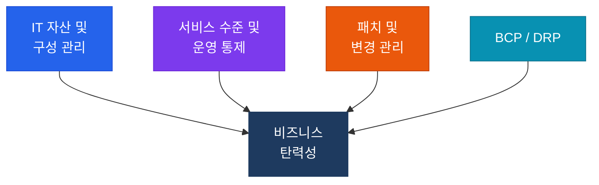

# IT 운영 및 비즈니스 탄력성
**IS Operations, Maintenance & Service Management — CISA Domain 4**

:::info 관련 표준
CISA Domain 4 / ITIL v4 / ISO/IEC 20000 / ISO 22301
:::

인프라의 안정적 운영과 중단 없는 비즈니스를 보장하기 위한 아카이브입니다.

## 하위 항목

| 번호 | 주제 | 핵심 키워드 |
|------|------|------------|
| 4.1 | [IT 자산 및 구성 관리](./itam) | ITAM, CMDB, Asset Register |
| 4.2 | [서비스 수준 및 운영 통제](./itsm) | ITSM, SLA, KPI/KRI, 인시던트, RCA |
| 4.3 | [패치 및 변경 관리](./patch-change) | 패치 관리, Emergency Change, 사후 승인 |
| 4.4 | [BCP/DRP](./bcp-drp) | BIA, RTO/RPO, 백업, DR 테스트 |
