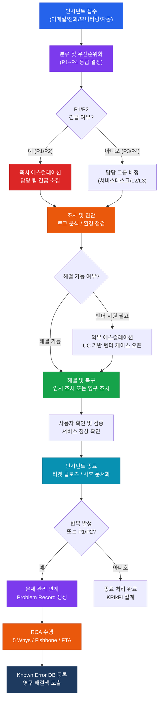
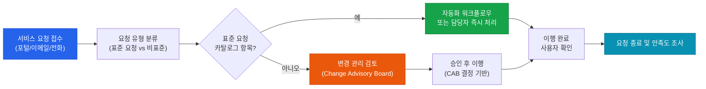

# 서비스 수준 및 운영 통제
**IT Service Management & Service Level Control**

:::info 관련 표준
CISA Domain 4.2 · ITIL v4 Service Value System · ISO/IEC 20000-1:2018 · COBIT 2019 DSS01–DSS02
:::

<table>
  <colgroup>
    <col style={{width: '20%'}} />
    <col style={{width: '80%'}} />
  </colgroup>
  <tbody>
    <tr><td><strong>문서 번호</strong></td><td>BP-OPS-02</td></tr>
    <tr><td><strong>제개정일</strong></td><td>2026-05-18</td></tr>
    <tr><td><strong>관리 부서</strong></td><td>IT 서비스운영팀</td></tr>
    <tr><td><strong>적용 범위</strong></td><td>전사 IT 서비스 운영 (인프라, 애플리케이션, 헬프데스크 포함)</td></tr>
    <tr><td><strong>통제 목적</strong></td><td>IT 서비스의 가용성·품질·응답성을 합의된 수준으로 유지하고, 인시던트·문제 관리를 통해 서비스 중단을 최소화하며 근본 원인을 제거한다.</td></tr>
  </tbody>
</table>

---

## 1. 개요 및 배경

IT 서비스 관리(ITSM, IT Service Management)는 고객과 비즈니스 목표에 부합하는 IT 서비스를 체계적으로 계획·제공·지원·개선하는 일련의 정책, 프로세스, 절차의 집합이다. ITIL v4(IT Infrastructure Library version 4)는 전 세계 사실상 표준 ITSM 프레임워크로, 서비스 가치 시스템(SVS: Service Value System)을 중심으로 가치 창출을 정의한다.

CISA 관점에서 ITSM 감사는 다음을 주요 관심 영역으로 다룬다.

- SLA(Service Level Agreement) 설계의 적정성 및 측정 가능성
- 인시던트 등급화·에스컬레이션·해결 프로세스의 공식화
- 문제(Problem) 관리와 근본 원인 분석(RCA)의 체계성
- KPI/KRI 모니터링을 통한 지속적 서비스 개선

### 1.1 ITIL v4 서비스 가치 시스템(SVS) 4대 차원

| 차원 | 내용 | CISA 감사 포인트 |
|------|------|-----------------|
| **조직 및 인력** (Organizations & People) | 역할·책임·문화·역량 관리 | RACI 매트릭스 존재 여부, 교육 이수 기록 |
| **정보 및 기술** (Information & Technology) | 서비스 지원 도구, 데이터 관리, AI/자동화 | CMDB 정확도, 도구 라이선스 관리 |
| **파트너 및 공급업체** (Partners & Suppliers) | 외부 공급자 관계, 계약, 의존성 관리 | 공급자 SLA 연계, UC 검토 이력 |
| **가치 흐름 및 프로세스** (Value Streams & Processes) | 서비스 설계·전환·운영 프로세스 | 프로세스 문서화, 예외 처리 통제 |

---

## 2. 핵심 개념 및 원칙

### 2.1 SLA / OLA / UC 비교

| 구분 | 명칭 | 당사자 | 내용 | 법적 구속력 |
|------|------|--------|------|------------|
| **SLA** | Service Level Agreement | IT 제공자 ↔ 비즈니스 고객 | 서비스 가용성, 응답시간, 해결시간, 성능 기준 합의 | 내부 합의 또는 계약 |
| **OLA** | Operational Level Agreement | IT 내부 팀 간 (예: 헬프데스크 ↔ 인프라팀) | SLA 이행을 뒷받침하는 내부 운영 수준 약정 | 내부 합의 |
| **UC** | Underpinning Contract | IT 제공자 ↔ 외부 공급업체 | 외부 벤더의 서비스 제공 조건, 페널티 조항 포함 | 법적 계약 |

### 2.2 SLA 주요 지표 설계 기준

| 지표 | 정의 | 권고 목표값 | 측정 주기 |
|------|------|------------|----------|
| **가용성(Availability)** | (합의 서비스 시간 - 다운타임) / 합의 서비스 시간 × 100 | 99.5% 이상 (미션 크리티컬 99.9%) | 월간 |
| **MTTR** | Mean Time To Repair — 장애 발생부터 서비스 복구까지 평균 시간 | P1: 4시간 이내, P2: 8시간 이내 | 인시던트 건별 |
| **MTBF** | Mean Time Between Failures — 장애 간 평균 정상 운영 시간 | 720시간(30일) 이상 | 월간 |
| **초회 해결율(FCR)** | 헬프데스크 1차 접수 시 재에스컬레이션 없이 해결된 비율 | 75% 이상 | 주간/월간 |
| **재오픈율(Reopen Rate)** | 종료 처리된 인시던트 중 동일 증상으로 재접수된 비율 | 5% 이하 | 월간 |
| **응답시간(Response Time)** | 인시던트 접수부터 담당자 초기 응답까지 소요 시간 | P1: 15분, P2: 1시간, P3: 4시간 | 인시던트 건별 |

### 2.3 인시던트 우선순위 등급 기준

| 등급 | 영향도 | 긴급도 | 비즈니스 영향 | 응답 시간 | 해결 목표 |
|------|--------|--------|--------------|----------|---------|
| **P1 (긴급)** | 전사/다수 사용자 서비스 완전 중단 | 즉시 | 재무·운영·평판 심각한 피해 | 15분 이내 | 4시간 이내 |
| **P2 (높음)** | 주요 서비스 부분 중단 또는 성능 심각 저하 | 높음 | 비즈니스 프로세스 지장 | 1시간 이내 | 8시간 이내 |
| **P3 (보통)** | 단일 사용자 또는 비핵심 서비스 영향 | 보통 | 업무 불편 수준 | 4시간 이내 | 3영업일 이내 |
| **P4 (낮음)** | 장애 아님, 정보 요청 또는 단순 문의 | 낮음 | 영향 없음 | 8시간 이내 | 5영업일 이내 |

### 2.4 에스컬레이션 매트릭스

| 단계 | 트리거 조건 | 에스컬레이션 대상 | 알림 방법 |
|------|------------|-----------------|----------|
| **Level 1** (기능적) | P1 미해결 30분 초과 / P2 미해결 2시간 초과 | 서비스데스크 팀장 | 자동 티켓 알림 |
| **Level 2** (계층적) | P1 미해결 1시간 초과 / SLA 위반 임박 | IT 운영 관리자 | 전화 + 이메일 |
| **Level 3** (경영진) | P1 미해결 2시간 초과 / 고객 불만 접수 | IT 본부장, CIO | 전화 + 긴급 회의 소집 |
| **외부 에스컬레이션** | 벤더 지원 필요 / UC 조항 적용 | 공급업체 기술지원팀 | 공식 케이스 오픈 |

### 2.5 RCA 방법론 비교

| 방법론 | 설명 | 적합 상황 | 장점 | 단점 |
|--------|------|----------|------|------|
| **5 Whys** | "왜"를 5회 반복하여 근본 원인까지 추적 | 단순·선형적 장애 원인 분석 | 빠르고 쉬움, 도구 불필요 | 복잡한 다중 원인 분석 어려움 |
| **Fishbone (Ishikawa)** | 원인을 6M(Man, Machine, Method, Material, Measurement, Mother Nature)으로 분류하여 도식화 | 복합 원인, 팀 브레인스토밍 | 원인 범주화 용이, 시각적 | 원인 간 인과관계 표현 미흡 |
| **Fault Tree Analysis (FTA)** | 톱 이벤트(장애)에서 역방향으로 논리적 AND/OR 트리 구성 | 복잡한 시스템 장애, 안전 크리티컬 환경 | 정량적 확률 계산 가능 | 시간·전문성 소요 큼 |

---

## 3. 인시던트 관리 프로세스

### 3.1 서비스 요청 처리 흐름

서비스 요청(SR: Service Request)은 인시던트와 달리 서비스 장애가 아닌 정상 서비스 범위 내 요청(비밀번호 재설정, 계정 생성, 소프트웨어 설치 등)이다.

---

## 4. CISA 감사 체크리스트

<table>
  <colgroup>
    <col style={{width: '7%'}} />
    <col style={{width: '23%'}} />
    <col style={{width: '38%'}} />
    <col style={{width: '32%'}} />
  </colgroup>
  <thead>
    <tr>
      <th>ID</th>
      <th>통제 목적</th>
      <th>감사 수행 절차</th>
      <th>필수 증적 파일</th>
    </tr>
  </thead>
  <tbody>
    <tr>
      <td><strong>AUD-01</strong></td>
      <td>SLA 달성률 모니터링 체계 적정성 검증</td>
      <td>
        1. 최근 12개월 SLA 측정 보고서 입수 및 가용성·MTTR·응답시간 지표 달성률 확인 
        2. SLA 측정 도구(ITSM 플랫폼)의 데이터 무결성 검증 — 수동 입력 여부, 자동화 측정 범위 확인 
        3. SLA 미달 발생 시 원인 분석 및 개선 조치 이행 여부 추적 
        4. 비즈니스 부서와의 SLA 검토 회의 개최 여부 확인 (분기 1회 이상)
      </td>
      <td>
        월간 SLA 보고서 (12개월) 
        SLA 미달 원인 분석 보고서 
        비즈니스 부서 SLA 검토 회의록 
        ITSM 도구 측정 설정 스크린샷
      </td>
    </tr>
    <tr>
      <td><strong>AUD-02</strong></td>
      <td>인시던트 등급 분류 및 에스컬레이션 준수 검증</td>
      <td>
        1. 감사 기간 내 P1/P2 인시던트 전수 추출 — 등급 분류 기준 적정 적용 여부 샘플 검토 
        2. 에스컬레이션 매트릭스 대비 실제 에스컬레이션 시간 비교 분석 (SLA 응답 시간 준수율) 
        3. 인시던트 티켓의 분류·배정·해결·종료 각 단계 타임스탬프 존재 여부 확인 
        4. 잘못 분류된 인시던트(재분류 이력) 비율 산출 및 원인 파악
      </td>
      <td>
        P1/P2 인시던트 티켓 목록 및 상세 내역 
        인시던트 등급 분류 기준 문서 
        에스컬레이션 기록 (타임스탬프 포함) 
        재분류 이력 통계 보고서
      </td>
    </tr>
    <tr>
      <td><strong>AUD-03</strong></td>
      <td>RCA(근본 원인 분석) 수행 완전성 및 품질 검증</td>
      <td>
        1. 감사 기간 내 P1 인시던트 전수, P2 샘플(30%) 대상 RCA 보고서 입수 
        2. RCA 보고서 완전성 점검: 5 Whys 또는 Fishbone 기법 적용 여부, 근본 원인 명확성, 재발 방지 조치 구체성 
        3. RCA에서 도출된 개선 조치의 이행 추적(action item tracker) 존재 여부 확인 
        4. Known Error DB 최신화 여부 및 유사 인시던트 재발 감소 효과 검증
      </td>
      <td>
        P1 인시던트 RCA 보고서 전수 
        P2 샘플 RCA 보고서 
        개선 조치 이행 추적 시트 
        Known Error DB 최신 버전
      </td>
    </tr>
    <tr>
      <td><strong>AUD-04</strong></td>
      <td>MTTR 추세 분석 및 지속적 서비스 개선 활동 검증</td>
      <td>
        1. 최근 12개월 등급별(P1~P3) MTTR 월별 추세 데이터 입수 및 목표값 대비 분석 
        2. MTBF 및 재오픈율 추세 분석 — 악화 추세 구간의 원인 규명 여부 확인 
        3. KPI 달성 부진 지표에 대한 CSI(Continual Service Improvement) 계획 존재 여부 검토 
        4. ITSM 위원회 또는 운영 검토 회의에서 KPI 검토 주기 및 의사결정 이력 확인
      </td>
      <td>
        월별 MTTR/MTBF 추세 보고서 (12개월) 
        재오픈율·초회해결율 추세 통계 
        CSI 계획서 및 이행 결과 보고서 
        ITSM 운영 검토 회의록 (최근 4분기)
      </td>
    </tr>
  </tbody>
</table>

---

## 5. 관련 표준 및 참고

| 표준/프레임워크 | 버전 | 주요 관련 영역 |
|---------------|------|--------------|
| **ITIL v4** | 2019 | SVS 4대 차원, Practice Guides (Incident Management, Problem Management, Service Level Management) |
| **ISO/IEC 20000-1** | 2018 | 서비스 관리 시스템 요구사항, SLA 관리, 인시던트·문제 관리 조항 |
| **COBIT 2019** | 2019 | DSS01(운영 관리), DSS02(서비스 요청·인시던트 관리), DSS03(문제 관리) |
| **CISA Review Manual** | 최신판 | Domain 4: Information Systems Operations and Business Resilience |
| **HDI Support Center Standard** | 최신판 | 헬프데스크 KPI 벤치마크, FCR 측정 기준 |

---

## 관련 문서

- [4.1 시스템 운영 통제](/docs/it-operations/itam)
- [4.3 변경 및 패치 관리](/docs/it-operations/patch-change)
- [4.4 BCP/DRP (비즈니스 연속성 및 재해 복구)](/docs/it-operations/bcp-drp)
- [4.5 IT 자산 및 구성 관리](/docs/it-operations/itam)
