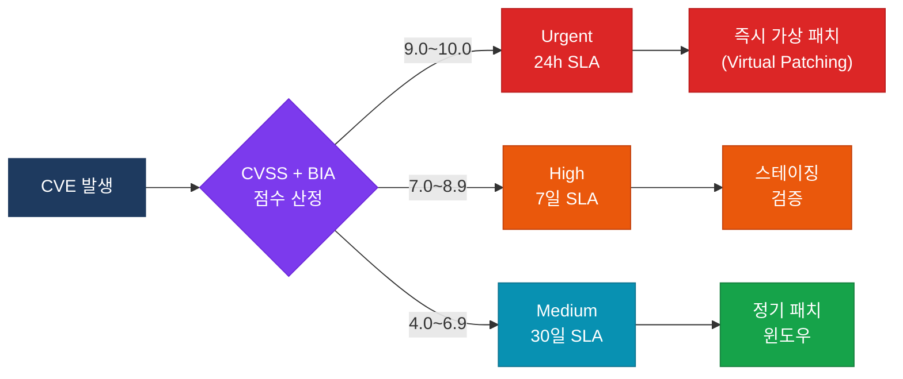
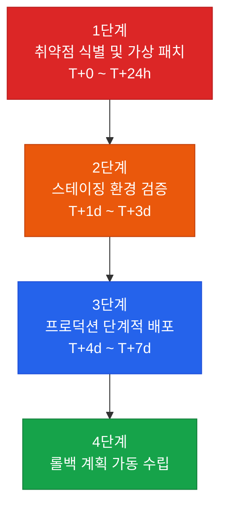
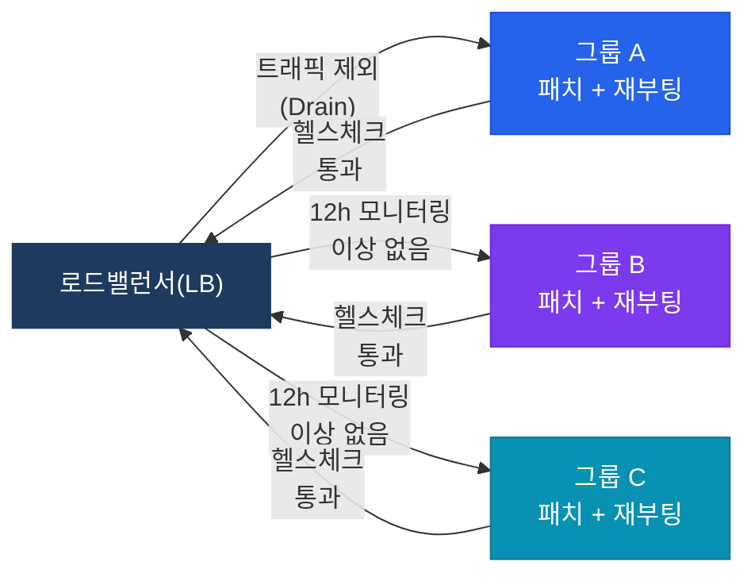
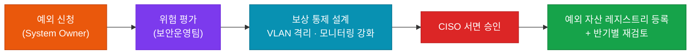

# 패치 및 변경 관리
**Patch & Change Management — BP-OPS-04**

:::info 관련 표준
CISA Domain 4.3 / 5.2 | ISO/IEC 27001 A.12.6 (기술적 취약점 관리) · A.14.2.2 (변경 통제 절차) | NIST SP 800-40 Rev.4 | ITIL v4 Change Control
:::

| 항목 | 내용 |
|------|------|
| **문서번호** | BP-OPS-04 |
| **제·개정일** | 2026. 05. 17 |
| **관리부서** | IT 보안운영팀 / IT 감사실 |
| **적용범위** | 전사 프로덕션 서버 (Windows / Linux) |
| **통제목적** | 가용성(Availability) 저하 없이 취약점을 적시에 제거하고 무단 변경 리스크를 통제 |

:::note 적용 환경 안내
본 문서의 SLA 기준은 **24/7 무중단 엔터프라이즈 환경**(반도체 Fab, 중요 기간계 시스템)을 기준으로 설계되었습니다.
OT(운영기술) 환경이나 레거시 제조 제어망처럼 재부팅 주기가 분기 단위로 제한되는 경우, 위험 수용(Risk Acceptance) 절차를 거쳐 SLA를 별도 조정할 수 있습니다.
:::

---

## 1. 개요 및 배경

엔터프라이즈 제조 및 서비스 인프라는 단 1초의 중단으로도 막대한 재무적 손실을 초래합니다.
본 문서는 전통적인 패치 방식(최신 패치 즉시 적용 후 재부팅)의 한계를 극복하고,
**위험 기반 우선순위 산정**과 **단계적 배포(Phased Deployment)**를 통해
시스템 무중단과 보안 무결성을 동시에 달성하는 행동 지침을 정의합니다.

---

## 2. 위험 기반 패치 분류 및 SLA

모든 취약점(CVE)을 즉시 배포하지 않으며, **CVSS 점수 + 자산의 비즈니스 영향도(BIA)**를 결합하여 처리 시한(SLA)을 차등 적용합니다.

| 위험 등급 | CVSS 스코어 | 대상 자산 정의 | 필수 조치 시한 (SLA) |
|-----------|------------|--------------|---------------------|
| **Urgent (긴급)** | 9.0 ~ 10.0 | 외부 노출 서버 또는 핵심 DB / 제조 제어 서버 | 24시간 이내 (또는 즉시 완화 통제) |
| **High (고위험)** | 7.0 ~ 8.9 | 내부 백엔드 서버 및 주요 인프라 서버 | 7일 이내 |
| **Medium (중위험)** | 4.0 ~ 6.9 | 내부 테스트/스테이징 환경 및 일반 자산 | 30일 이내 (정기 패치 윈도우) |

---

## 3. 4단계 무중단 패치 워크플로우

### 1단계 — 취약점 식별 및 가상 패치 (T+0 ~ T+24h)

**행동 지침**: Urgent 취약점 발생 시, 운영 서버 재부팅을 유발하는 OS 패치를 즉시 적용하는 대신 **가상 패치(Virtual Patching)** 기술을 적용합니다.

**실무 액션**:
- 네트워크 방화벽, IPS 및 WAF에 해당 CVE 차단 룰셋(Signature)을 즉시 반영
- 호스트 기반 EDR/백신 솔루션의 취약점 방어 기능을 활성화하여 1차 방어벽 구축

### 2단계 — 스테이징 환경 검증 (T+1d ~ T+3d)

**행동 지침**: 프로덕션 환경과 **100% 동일한 형상(Configuration)**을 가진 스테이징 샌드박스에서 패치를 사전 테스트합니다.

**실무 액션**:
- 패치 적용 후 최소 48시간 동안 CPU/Memory 임계치 변화, 백업 스크립트 정상 작동 여부, 유관 API 연동 무결성을 모니터링
- CAATs 스크립트를 활용하여 패치 전후 시스템 설정 값(Registry/Config) 변화를 비교 기록

### 3단계 — 프로덕션 단계적 배포 (T+4d ~ T+7d)

**행동 지침**: 서버 그룹을 최소 3개 이상의 로테이션 그룹(A / B / C)으로 분할하여 순차 적용합니다.
Active-Active 클러스터 구조의 경우, 부하를 반대편으로 전환(Failover)한 후 진행합니다.

### 4단계 — 롤백 계획 수립 및 가동

**행동 지침**: 모든 변경 작업 전에는 반드시 **실패 시 즉각 복구 계획**이 승인되어야 합니다.

**실무 액션**:
- 패치 직전 VM Snapshot 또는 이미지 백업을 의무적으로 수행
- 작업 지시서에 롤백 데드라인을 명시 (예: *"작업 시작 후 45분 이내 정상화되지 않을 시 즉시 롤백 프로세스 시작"*)

---

## 4. CISA 감사 체크리스트

:::tip 활용 안내
본 체크리스트는 내부 감사원 및 외부 컴플라이언스 대응 시 **증적 자산(Audit Evidence)**으로 직접 활용합니다.
:::

<table>
  <colgroup>
    <col style={{width: '7%'}} />
    <col style={{width: '23%'}} />
    <col style={{width: '38%'}} />
    <col style={{width: '32%'}} />
  </colgroup>
  <thead>
    <tr>
      <th>ID</th>
      <th>통제 목적</th>
      <th>감사 수행 절차</th>
      <th>필수 증적 파일</th>
    </tr>
  </thead>
  <tbody>
    <tr>
      <td><strong>AUD-01</strong></td>
      <td>모든 변경 사항이 공식 승인을 거쳐 추적되고 있는가?</td>
      <td>ITSM 시스템에서 샘플 기간 내 발행된 변경 요청서(CR)와 승인 이력을 교차 검증</td>
      <td>변경 승인 이력 로그 긴급 변경 사후 승인서</td>
    </tr>
    <tr>
      <td><strong>AUD-02</strong></td>
      <td>패치 작업 시 직무 분리(SoD)가 이루어졌는가?</td>
      <td>패치 요청자(보안팀)와 프로덕션 반영자(운영팀)의 계정이 분리되어 있는지 IAM 시스템에서 확인</td>
      <td>IAM 권한 매트릭스 리포트 작업자 접근 로그</td>
    </tr>
    <tr>
      <td><strong>AUD-03</strong></td>
      <td>패치 실패에 대한 복구 대책이 실효성 있게 수립되었는가?</td>
      <td>무작위 선택 5건의 변경 작업 지시서 내 롤백 시나리오와 사전 백업 수행 기록 포함 여부 검토</td>
      <td>백업 성공 로그 작업 지시서(롤백 계획 포함)</td>
    </tr>
    <tr>
      <td><strong>AUD-04</strong></td>
      <td>미패치 취약점에 대한 대체 통제가 존재하는가?</td>
      <td>SLA 초과 패치 유예 서버 목록을 추출하고, 가상 패치 및 방화벽 차단 정책 활성화 여부 확인</td>
      <td>예외 처리 승인서 방화벽/IPS 룰셋 적용 스크린샷</td>
    </tr>
  </tbody>
</table>

---

## 5. 예외 처리 프로세스

레거시 애플리케이션 호환성 등으로 필수 패치 적용이 불가능한 경우, 아래 절차에 따라 위험을 공식 수용(Risk Acceptance)해야 합니다.

**신청 시 필수 기재 항목**:
- 패치 불가 사유 및 관련 레거시 애플리케이션 식별자
- 비즈니스 영향도 및 예상 패치 적용 가능 시점
- 기간 중 적용할 보상 통제(Compensating Controls) 내역

---

## 관련 문서

- [5.2 인프라 및 서버 보안 하드닝](/docs/information-security/infrastructure-security) — 가상 패치 대상 서버의 Hardening 기준 및 방화벽 룰셋 설계
- [4.2 서비스 수준 및 운영 통제](/docs/it-operations/itsm) — 변경 관리와 연계된 SLA 및 인시던트 관리
- [6.1 RCM 라이브러리](/docs/audit-toolkits/rcm) — 변경 관리 프로세스 위험-통제 매핑 테이블
