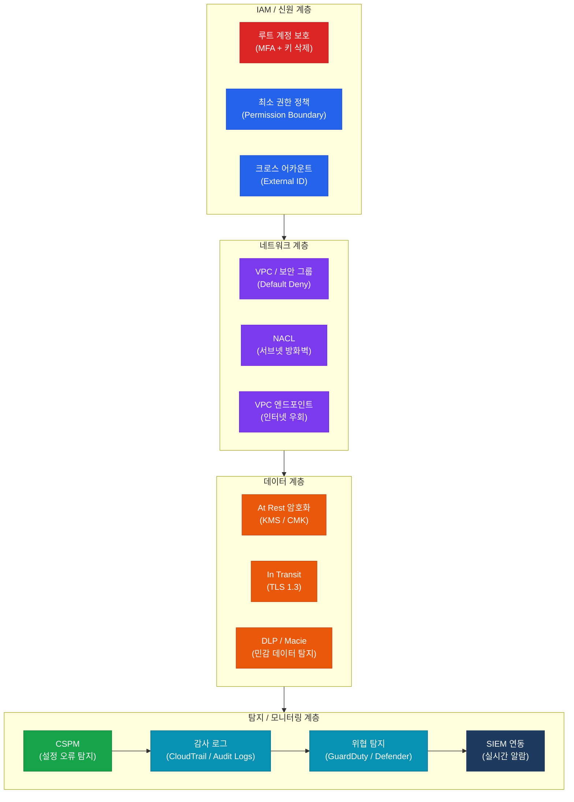

# 클라우드 및 가상화 보안 감사
**Cloud & Virtualization Security Auditing**

:::info 관련 표준
CISA Domain 5.3 / CSA CCM v4 / ISO/IEC 27017 / ISO/IEC 27018 / NIST SP 800-144 / CIS Cloud Benchmarks / CSA STAR
:::

<table>
  <colgroup>
    <col style={{width: '20%'}} />
    <col style={{width: '80%'}} />
  </colgroup>
  <tbody>
    <tr><td><strong>문서번호</strong></td><td>BP-SEC-03</td></tr>
    <tr><td><strong>제개정일</strong></td><td>2026-05-18</td></tr>
    <tr><td><strong>관리부서</strong></td><td>클라우드운영팀 / 보안팀</td></tr>
    <tr><td><strong>적용범위</strong></td><td>전사 클라우드 환경 (AWS / Azure / GCP 및 하이브리드 클라우드)</td></tr>
    <tr><td><strong>통제목적</strong></td><td>공동 책임 모델 기반의 명확한 보안 책임 분담과 지속적 설정 오류 탐지를 통해 클라우드 환경에서의 데이터 유출, 계정 탈취, 서비스 중단 위험을 최소화</td></tr>
  </tbody>
</table>

---

## 1. 개요 및 배경

클라우드 컴퓨팅 환경은 온프레미스 대비 신속한 자원 프로비저닝, 비용 효율성, 글로벌 확장성을 제공하지만, 동시에 새로운 보안 위협과 감사 과제를 수반한다. 조직이 클라우드로 이전함에 따라 기존 경계 기반 보안 모델이 무력화되고, 잘못된 설정(Misconfiguration)이 대규모 데이터 유출의 주된 원인으로 부상하고 있다.

Gartner에 따르면 2025년까지 클라우드 보안 사고의 99%는 고객 측 책임인 잘못된 구성에서 기인할 것으로 전망된다. CISA 감사 관점에서 클라우드 보안은 다음 세 가지 영역을 중심으로 평가된다.

- **책임 경계 명확화**: 공동 책임 모델(SRM) 기반 통제 설계 및 계약서 반영 여부
- **지속적 설정 관리**: CSPM을 통한 실시간 설정 오류 탐지 및 자동 교정 체계
- **가시성 확보**: 클라우드 감사 로그의 완전성, 보존, SIEM 연동 수준

---

## 2. 핵심 개념 및 원칙

### 2.1 공동 책임 모델(Shared Responsibility Model)

공동 책임 모델은 클라우드 보안 책임을 클라우드 서비스 제공자(CSP)와 고객이 서비스 유형에 따라 분담하는 프레임워크이다. CISA 감사에서는 고객 측 책임 영역의 통제 이행 여부를 집중 점검한다.

| 보안 영역 | IaaS | PaaS | SaaS |
|-----------|------|------|------|
| **물리적 보안** | CSP | CSP | CSP |
| **네트워크 인프라** | CSP | CSP | CSP |
| **하이퍼바이저/런타임** | CSP | CSP | CSP |
| **OS 패치 및 하드닝** | **고객** | CSP | CSP |
| **미들웨어/런타임 설정** | **고객** | **고객** | CSP |
| **애플리케이션 보안** | **고객** | **고객** | **고객** |
| **데이터 분류 및 암호화** | **고객** | **고객** | **고객** |
| **계정/IAM 관리** | **고객** | **고객** | **고객** |
| **네트워크 접근 제어(보안 그룹)** | **고객** | **공동** | CSP |
| **감사 로그 설정 및 보존** | **고객** | **공동** | **공동** |

### 2.2 클라우드 보안 위협 Top 5

| 순위 | 위협 | 설명 | 예방 통제 |
|------|------|------|-----------|
| **1** | 잘못된 설정(Misconfiguration) | S3 버킷 공개, 보안 그룹 0.0.0.0/0 허용 | CSPM 지속 모니터링, IaC 보안 검사 |
| **2** | 과도한 권한(Overprivileged IAM) | 와일드카드(*) 정책, 미사용 고권한 계정 | 최소 권한 원칙, 권한 사용률 분석 |
| **3** | 안전하지 않은 API | 인증 없는 API 엔드포인트, 구버전 API | API GW 인증, TLS 강제, Rate Limiting |
| **4** | 데이터 유출(Data Exfiltration) | 암호화 미적용, DLP 부재 | At Rest/In Transit 암호화, VPC 엔드포인트 |
| **5** | 계정 탈취(Account Hijacking) | 루트 계정 키 노출, MFA 미적용 | 루트 계정 키 삭제, MFA 필수화, 이상 탐지 |

### 2.3 CSPM(Cloud Security Posture Management)

CSPM은 클라우드 환경의 보안 설정 상태를 지속적으로 평가하고, 정책 위반 및 설정 오류를 자동으로 탐지하는 솔루션이다.

**주요 기능**

- 멀티클라우드(AWS/Azure/GCP) 설정 통합 가시성
- CIS Cloud Benchmark, NIST, PCI DSS, ISO 27001 기반 자동 컴플라이언스 평가
- 설정 오류 자동 교정(Auto-Remediation) — 예: 공개 S3 버킷 즉시 차단
- 클라우드 자원 인벤토리 자동 갱신
- IaC(Terraform, CloudFormation) 보안 스캔 — 배포 전 취약점 탐지

**대표 도구**: Prisma Cloud, Wiz, AWS Security Hub, Microsoft Defender for Cloud, GCP Security Command Center

### 2.4 CWPP(Cloud Workload Protection Platform)

CWPP는 클라우드 워크로드(VM, 컨테이너, 서버리스)를 보호하는 통합 플랫폼이다.

| 워크로드 유형 | 주요 위협 | CWPP 통제 |
|---------------|-----------|-----------|
| **가상 머신(VM)** | OS 취약점, 루트킷 | 취약점 스캔, EDR, 런타임 보호 |
| **컨테이너** | 이미지 취약점, 권한 상승 | 이미지 스캔(Trivy), 불변 인프라, Pod Security |
| **서버리스(Lambda)** | 코드 인젝션, 과도한 IAM | 코드 분석, 최소 권한 실행 역할(Role) |
| **Kubernetes** | API Server 노출, RBAC 오용 | RBAC 최소 권한, 네트워크 정책, Admission Controller |

### 2.5 클라우드 IAM(Identity and Access Management)

**루트 계정 보호 필수 통제**

- AWS 루트 계정 Access Key 삭제 (절대 사용 금지)
- 루트 계정 MFA 활성화 — 하드웨어 MFA 토큰 권고
- 루트 계정 사용 시 CloudWatch 알람 설정
- 일상 업무에 루트 계정 사용 금지 — IAM 관리자 계정 별도 운영

**최소 권한 원칙 구현**

- IAM 정책: 와일드카드(`*`) 리소스/액션 사용 금지 — 명시적 리소스 ARN 지정
- 권한 경계(Permission Boundary) 적용 — 개발자의 IAM 남용 방지
- AWS IAM Access Analyzer / Azure PIM을 통한 미사용 권한 탐지 및 제거
- 정기 자격증명 감사: 90일 이상 미사용 키/패스워드 비활성화

**서비스 계정 및 크로스 어카운트 접근**

- EC2 인스턴스 역할(Instance Role): 하드코딩된 자격증명 금지, IAM Role 사용
- 크로스 어카운트 접근: 외부 ID(External ID) 조건 필수 적용
- 서비스 계정 키 자동 교체: 90일 주기

### 2.6 클라우드 감사 로그

| 서비스 | AWS | Azure | GCP |
|--------|-----|-------|-----|
| **API 감사 로그** | CloudTrail | Azure Activity Log | Cloud Audit Logs |
| **리소스 접근 로그** | S3 Access Logs | Azure Storage Logs | GCS Access Logs |
| **네트워크 흐름** | VPC Flow Logs | NSG Flow Logs | VPC Flow Logs |
| **보안 이벤트** | GuardDuty | Microsoft Sentinel | Security Command Center |
| **통합 모니터링** | CloudWatch | Azure Monitor | Cloud Monitoring |

**로그 관리 요건**

- 보존 기간: 최소 1년(감사 목적), 장기 보관 3년 이상(법적 요건)
- S3/Storage 버킷: CloudTrail 로그 버킷 별도 계정 분리 및 MFA Delete 활성화
- 로그 무결성: CloudTrail Log File Validation 활성화
- SIEM 연동: 실시간 스트리밍(Kinesis/Event Hub) 통해 SIEM 수집

---

## 3. 클라우드 보안 통제 계층

---

## 4. CISA 감사 체크리스트

<table>
  <colgroup>
    <col style={{width: '7%'}} />
    <col style={{width: '23%'}} />
    <col style={{width: '38%'}} />
    <col style={{width: '32%'}} />
  </colgroup>
  <thead>
    <tr>
      <th>ID</th>
      <th>통제 목적</th>
      <th>감사 수행 절차</th>
      <th>필수 증적 파일</th>
    </tr>
  </thead>
  <tbody>
    <tr>
      <td><strong>AUD-25</strong></td>
      <td>공동 책임 모델 기반 보안 통제 설계 적정성</td>
      <td>
        1. 클라우드 서비스 계약서(CSA) 및 SLA에 보안 책임 분담 조항 명시 여부 확인 
        2. IaaS/PaaS/SaaS별 고객 책임 항목 매트릭스 문서화 여부 검토 
        3. 고객 책임 영역(OS 패치, IAM, 데이터 암호화)에 대한 통제 이행 여부 표본 점검 
        4. 클라우드 보안 정책 및 절차서 내 공동 책임 내용 반영 여부 확인
      </td>
      <td>
        클라우드 서비스 계약서(CSA/SLA) 
        공동 책임 매트릭스 문서 
        클라우드 보안 정책서 
        CSP별 보안 책임 가이드 (공식 문서)
      </td>
    </tr>
    <tr>
      <td><strong>AUD-26</strong></td>
      <td>CSPM 운영 및 설정 오류 탐지 체계 검증</td>
      <td>
        1. CSPM 솔루션 도입 및 전체 클라우드 계정 연결 여부 확인 
        2. CSPM 스캔 결과 — 고위험 설정 오류(예: 공개 S3, 0.0.0.0/0 SG) 건수 및 조치 현황 
        3. 자동 교정(Auto-Remediation) 정책 설정 및 이력 확인 
        4. CIS Cloud Benchmark 컴플라이언스 점수 확인 — 목표: 80% 이상
      </td>
      <td>
        CSPM 스캔 결과 보고서 (최근 분기) 
        설정 오류 조치 완료 현황 
        자동 교정 이력 로그 
        CIS 컴플라이언스 대시보드 캡처
      </td>
    </tr>
    <tr>
      <td><strong>AUD-27</strong></td>
      <td>클라우드 IAM 최소 권한 원칙 준수</td>
      <td>
        1. 루트/전역 관리자 계정 MFA 활성화 여부 확인 
        2. 루트 계정 Access Key 존재 여부 확인 (존재 시 즉시 삭제 권고) 
        3. IAM Access Analyzer 결과 검토 — 외부 접근 가능 리소스 목록 
        4. 90일 이상 미사용 IAM 사용자/키/역할 목록 추출 및 비활성화 여부 확인 
        5. 와일드카드(*) 정책 보유 계정/역할 수 확인 및 최소화 조치 이행 여부
      </td>
      <td>
        IAM 자격증명 보고서(Credential Report) 
        IAM Access Analyzer 결과 
        미사용 자격증명 조치 이력 
        권한 최소화 검토 보고서
      </td>
    </tr>
    <tr>
      <td><strong>AUD-28</strong></td>
      <td>클라우드 감사 로그 완전성 및 보존 적정성</td>
      <td>
        1. CloudTrail / Cloud Audit Logs / Azure Activity Log 전체 계정/리전 활성화 여부 확인 
        2. 감사 로그 보존 기간 설정 확인 — 최소 1년, 장기 보관 스토리지(Glacier/Archive) 연동 
        3. 로그 무결성 검증(Log File Validation) 활성화 여부 확인 
        4. SIEM 연동 및 실시간 알람(루트 계정 사용, 콘솔 로그인 실패 등) 설정 확인 
        5. 로그 버킷 접근 통제 — 별도 보안 계정 소유 및 MFA Delete 활성화 여부
      </td>
      <td>
        CloudTrail/Audit Logs 활성화 현황 
        로그 보존 정책 문서 
        SIEM 연동 및 알람 설정 화면 
        로그 무결성 검증 설정 캡처 
        로그 접근 통제 정책 문서
      </td>
    </tr>
  </tbody>
</table>

---

## 5. 관련 표준 및 참고

| 표준/문서 | 발행 기관 | 주요 내용 |
|-----------|-----------|-----------|
| CSA CCM v4 | CSA (Cloud Security Alliance) | 클라우드 통제 매트릭스 — 16개 도메인, 197개 통제 |
| ISO/IEC 27017:2015 | ISO/IEC | 클라우드 서비스 정보 보안 실무 지침 |
| ISO/IEC 27018:2019 | ISO/IEC | 퍼블릭 클라우드 개인정보 보호 실무 지침 |
| NIST SP 800-144 | NIST | 퍼블릭 클라우드 컴퓨팅 보안 가이드라인 |
| CIS AWS/Azure/GCP Benchmarks | CIS | CSP별 보안 설정 기준 |
| NIST SP 800-207 | NIST | Zero Trust Architecture |
| AWS Well-Architected Security Pillar | AWS | AWS 보안 설계 모범 사례 |

---

## 관련 문서

- [5.2 인프라 및 서버 보안 하드닝](./infrastructure-security.md)
- [5.4 암호화 및 PKI](./cryptography.md)
- [5.1 접근 통제 및 계정 관리](/docs/information-security/iam)
- [5.5 침해사고 대응 및 디지털 포렌식](./incident-response.md)
