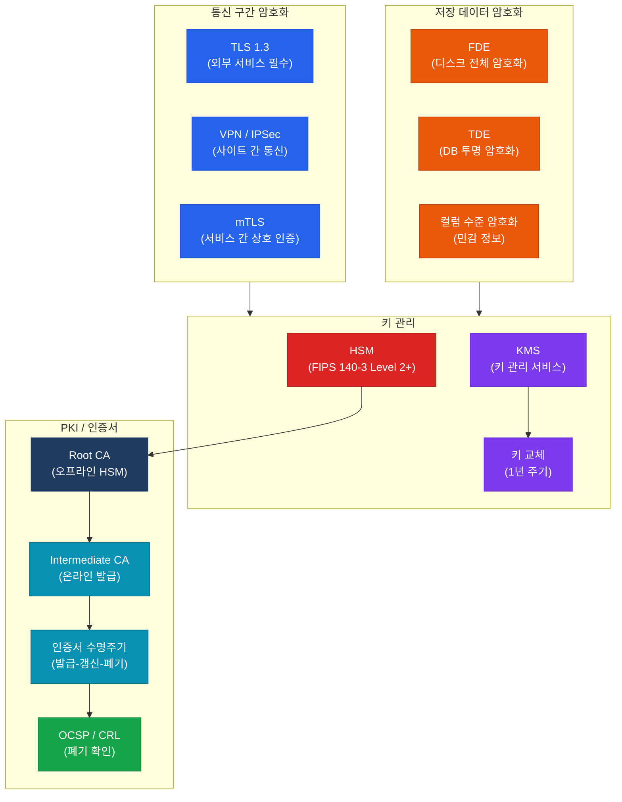

# 암호화 및 PKI
**Cryptography & Public Key Infrastructure**

:::info 관련 표준
CISA Domain 5.4 / NIST SP 800-57 Part 1-3 / NIST SP 800-175B / ISO/IEC 18033 / FIPS 140-3 / NIST PQC 표준화 (FIPS 203/204/205)
:::

<table>
  <colgroup>
    <col style={{width: '20%'}} />
    <col style={{width: '80%'}} />
  </colgroup>
  <tbody>
    <tr><td><strong>문서번호</strong></td><td>BP-SEC-04</td></tr>
    <tr><td><strong>제개정일</strong></td><td>2026-05-18</td></tr>
    <tr><td><strong>관리부서</strong></td><td>IT 보안팀</td></tr>
    <tr><td><strong>적용범위</strong></td><td>전사 데이터 암호화, PKI 인프라, 키 관리 시스템</td></tr>
    <tr><td><strong>통제목적</strong></td><td>승인된 암호화 알고리즘 적용과 체계적인 키/인증서 수명주기 관리를 통해 데이터의 기밀성·무결성을 보장하고, 미래 양자 컴퓨팅 위협에 선제적으로 대비</td></tr>
  </tbody>
</table>

---

## 1. 개요 및 배경

암호화는 정보 보안의 핵심 기반 기술로서, 데이터의 기밀성(Confidentiality), 무결성(Integrity), 인증(Authentication), 부인 방지(Non-Repudiation)를 기술적으로 구현한다. CISA 감사에서 암호화는 단순한 기술 적용 여부를 넘어, 알고리즘 선택의 적정성, 키 관리 수명주기의 완결성, 인증서 관리 체계의 성숙도를 종합적으로 평가한다.

NIST SP 800-57은 암호 알고리즘의 보안 수명을 정의하고 있으며, 현재 MD5, SHA-1, DES, 3DES, RSA-1024는 NIST에 의해 사용 금지 또는 단계적 폐기(Deprecate) 권고 대상이다. 아울러 양자 컴퓨팅의 발전으로 현행 RSA/ECC 기반 공개키 암호화의 위협이 가시화됨에 따라, NIST는 2024년 양자 내성 암호화(PQC) 표준을 공식 발표하였다.

---

## 2. 핵심 개념 및 원칙

### 2.1 암호화 알고리즘 비교표

| 구분 | 알고리즘 | 키 길이 | 용도 | 보안 수준 | FIPS 승인 |
|------|----------|---------|------|-----------|-----------|
| **대칭키** | AES-256 | 256비트 | 데이터 암호화(At Rest, In Transit) | 최고 | O |
| **대칭키** | AES-128 | 128비트 | 성능 우선 환경 | 높음 | O |
| **대칭키(금지)** | DES / 3DES | 56 / 112비트 | 레거시(사용 금지) | 취약 | X |
| **비대칭키** | RSA-2048 | 2048비트 | 키 교환, 전자서명, TLS | 높음 | O |
| **비대칭키** | RSA-3072/4096 | 3072/4096비트 | 장기 보안 요건(2031년 이후) | 매우 높음 | O |
| **비대칭키** | ECC P-256 (ECDSA) | 256비트(ECC) | TLS, 디지털 서명, 모바일 | 높음(RSA-3072 동급) | O |
| **비대칭키(금지)** | RSA-1024 | 1024비트 | 레거시(사용 금지) | 취약 | X |
| **해시** | SHA-256 | 256비트 출력 | 무결성 검증, 전자서명 | 높음 | O |
| **해시** | SHA-3 (Keccak) | 256/512비트 출력 | SHA-2 대안, 고보안 환경 | 최고 | O |
| **해시(금지)** | MD5 / SHA-1 | 128 / 160비트 출력 | 레거시(보안 용도 사용 금지) | 취약 | X |

### 2.2 At Rest 암호화(저장 데이터 암호화)

**전체 디스크 암호화(Full Disk Encryption, FDE)**

- 물리 서버/노트북: BitLocker(Windows), LUKS(Linux), FileVault(macOS)
- 키 관리: TPM(Trusted Platform Module) 2.0과 연동하여 부팅 시 자동 복호화
- 서버 FDE: SAN/NAS 스토리지 컨트롤러 수준 암호화 병행 적용

**DB 투명 암호화(Transparent Data Encryption, TDE)**

- Oracle TDE, MS SQL Server TDE, MySQL Enterprise Encryption 지원
- 애플리케이션 수정 없이 DB 파일 수준 암호화 — I/O 성능 영향 최소
- TDE 마스터 키는 HSM 또는 별도 키 관리 서버에서 관리 (DB 서버 내 저장 금지)

**파일/열 수준 암호화**

- 민감 데이터(주민번호, 카드번호, 계좌번호): 컬럼 수준 암호화(CLE) 적용
- 파일 서버: EFS(Encrypting File System) 또는 파일 레벨 DRM 적용
- 클라우드 객체 스토리지: CSE(Client-Side Encryption) 또는 SSE-C 적용

### 2.3 In Transit 암호화(전송 구간 암호화)

**TLS 1.3 요구사항**

- 외부 서비스(인터넷 노출): TLS 1.3 필수 적용
- 내부 서비스 간 통신: TLS 1.2 이상 적용 (TLS 1.3 전환 권고)
- Perfect Forward Secrecy(PFS) 보장 암호 스위트 필수: ECDHE, DHE 기반
- 권장 암호 스위트: `TLS_AES_256_GCM_SHA384`, `TLS_CHACHA20_POLY1305_SHA256`

**취약 프로토콜 금지 목록**

| 프로토콜 | 취약점 | 조치 |
|----------|--------|------|
| SSL 2.0 / 3.0 | POODLE, DROWN 공격 | 즉시 비활성화 |
| TLS 1.0 | BEAST, POODLE over TLS | 즉시 비활성화 |
| TLS 1.1 | BEAST, 약한 암호 스위트 | 즉시 비활성화 |
| RC4 | NOMORE, Fluhrer 공격 | 즉시 비활성화 |
| 약한 암호 스위트 | NULL, EXPORT, DES, 3DES | 비활성화 |

**HSTS(HTTP Strict Transport Security) 적용**

- 외부 웹서비스: HSTS 헤더 설정 — `max-age=31536000; includeSubDomains; preload`
- HSTS Preload 목록 등록 권고

### 2.4 PKI(Public Key Infrastructure) 구조

**CA 계층 구조(3계층 권장)**

- **Root CA**: 오프라인 보관, HSM 내 개인키 저장, 극히 제한된 사용
- **Intermediate CA**: 온라인 운영, 실제 인증서 발급 담당, 역할별(TLS/코드서명/이메일) 분리
- **End-Entity 인증서**: 서버/사용자/디바이스 인증서

**인증서 수명주기(Certificate Lifecycle)**

1. **발급(Issuance)**: CSR(Certificate Signing Request) 생성 → CA 검증 → 인증서 서명
2. **배포(Distribution)**: 인증서 저장소(Key Store) 등록, 자동화 도구(ACME 프로토콜) 활용
3. **갱신(Renewal)**: 만료 60일 전 자동 갱신 알림, 30일 전 강제 갱신 프로세스
4. **폐기(Revocation)**: 개인키 노출, 조직 이탈 시 즉시 폐기 요청
5. **폐기 확인**: CRL(Certificate Revocation List) 또는 OCSP(Online Certificate Status Protocol) 배포

**CRL vs OCSP 비교**

| 구분 | CRL | OCSP |
|------|-----|------|
| 방식 | 주기적 목록 다운로드 | 실시간 개별 상태 조회 |
| 응답 속도 | 느림(대용량 파일) | 빠름(실시간) |
| 프라이버시 | 높음 | 낮음(조회 내역 노출) |
| 권고 방식 | 백업용 | 주요 방식 (OCSP Stapling 권고) |

### 2.5 키 관리 수명주기

**6단계 키 관리 수명주기 (NIST SP 800-57)**

| 단계 | 활동 | 보안 요건 |
|------|------|-----------|
| **1. 생성** | HSM 또는 FIPS 140-3 검증 모듈에서 생성 | 충분한 엔트로피(DRBG 기반), 키 길이 기준 준수 |
| **2. 배포** | 암호화된 채널(TLS)을 통한 전달, 키 분할(Shamir) 활용 | 전송 중 평문 노출 금지 |
| **3. 저장** | HSM 내 저장(최고 등급), 키 암호화 키(KEK)로 보호 | 파일 시스템/코드 내 평문 키 저장 절대 금지 |
| **4. 사용** | 업무 목적별 키 분리, 사용 이력 감사 로그 기록 | 용도 외 사용 금지(암호화 키로 서명 금지) |
| **5. 교체(Rotation)** | 암호화 키: 1년 주기 / 인증서: 만료 전 갱신 | 이전 키로 암호화된 데이터 재암호화 계획 수립 |
| **6. 폐기** | 키 삭제 확인, HSM 제로화(Zeroization) | NIST SP 800-88 기준 복구 불가 삭제 |

**HSM(Hardware Security Module) 활용 기준**

- FIPS 140-3 Level 2 이상 인증 HSM 사용 권고 (고위험 환경: Level 3 이상)
- 루트 CA 개인키, 데이터베이스 마스터 키, 코드서명 키는 HSM 필수 보관
- 클라우드 HSM: AWS CloudHSM, Azure Dedicated HSM, GCP Cloud HSM 활용 가능
- HSM 이중화: Active-Active 또는 Active-Standby 구성

### 2.6 양자 내성 암호화(Post-Quantum Cryptography, PQC)

양자 컴퓨터는 Shor 알고리즘을 통해 RSA, ECC 기반 공개키 암호화를 이론적으로 해독 가능하며, NIST는 이에 대응하기 위한 PQC 표준을 2024년 8월 공식 발표하였다.

**NIST PQC 표준화 현황 (2024년 8월 공식 발표)**

| 표준 | 알고리즘 | 용도 | 기반 수학 문제 |
|------|----------|------|----------------|
| FIPS 203 | CRYSTALS-Kyber (ML-KEM) | 키 캡슐화(KEM) / 키 교환 | 격자(Lattice) 문제 |
| FIPS 204 | CRYSTALS-Dilithium (ML-DSA) | 디지털 서명 | 격자(Lattice) 문제 |
| FIPS 205 | SPHINCS+ (SLH-DSA) | 디지털 서명(백업) | 해시 기반 |

**PQC 전환 로드맵**

- 단기(~2027): 현행 알고리즘 + PQC 병행 적용(하이브리드 방식)
- 중기(~2030): PQC 단독 적용 전환, 레거시 시스템 마이그레이션
- 장기(2031년 이후): RSA-2048, ECC P-256 공식 폐기 예상 (NIST 가이드 기준)

---

## 3. 암호화 적용 계층 구조

---

## 4. CISA 감사 체크리스트

<table>
  <colgroup>
    <col style={{width: '7%'}} />
    <col style={{width: '23%'}} />
    <col style={{width: '38%'}} />
    <col style={{width: '32%'}} />
  </colgroup>
  <thead>
    <tr>
      <th>ID</th>
      <th>통제 목적</th>
      <th>감사 수행 절차</th>
      <th>필수 증적 파일</th>
    </tr>
  </thead>
  <tbody>
    <tr>
      <td><strong>AUD-29</strong></td>
      <td>암호화 알고리즘 적정성 검증</td>
      <td>
        1. 조직 암호화 정책서 검토 — 승인된 알고리즘 목록 및 금지 알고리즘 명시 여부 
        2. 시스템 목록 대비 실제 적용 알고리즘 표본 점검 (DB, 파일 서버, 애플리케이션) 
        3. MD5, SHA-1, DES, 3DES, RC4, RSA-1024 사용 여부 스캔 (Nessus, Qualys) 
        4. 코드베이스 내 하드코딩된 암호화 키 또는 취약 알고리즘 사용 여부 SAST 점검
      </td>
      <td>
        조직 암호화 정책서 
        승인 알고리즘 목록 (Approved Algorithm List) 
        취약점 스캔 결과 (알고리즘 점검) 
        SAST 분석 결과 보고서
      </td>
    </tr>
    <tr>
      <td><strong>AUD-30</strong></td>
      <td>TLS 버전 및 암호 스위트 적정성</td>
      <td>
        1. 외부 노출 서비스 전체에 대한 TLS 스캔 수행 (testssl.sh, SSL Labs) 
        2. SSL 2.0/3.0, TLS 1.0/1.1 활성화 여부 확인 — 발견 시 즉시 비활성화 권고 
        3. 내부 서비스 간 통신(API, DB 연결) TLS 적용 여부 표본 점검 
        4. HSTS 헤더 설정 여부 및 max-age 값 확인 (최소 6개월 이상)
      </td>
      <td>
        TLS 스캔 결과 보고서 (SSL Labs / testssl.sh) 
        웹 서버/로드밸런서 TLS 설정 파일 
        내부 통신 TLS 적용 현황표 
        HSTS 설정 확인 스크린샷
      </td>
    </tr>
    <tr>
      <td><strong>AUD-31</strong></td>
      <td>암호화 키 교체 주기 및 HSM 관리 체계</td>
      <td>
        1. 키 관리 정책서 검토 — 키 유형별 교체 주기 정의 여부 (암호화 키: 1년, 인증서: 만료 전) 
        2. 최근 1년간 키 교체 이력 확인 — 교체 주기 준수율 산출 
        3. HSM 도입 현황 확인 — FIPS 140-3 인증 여부 및 이중화 구성 검토 
        4. 키 저장 위치 점검 — 파일 시스템/소스코드 내 평문 키 저장 여부 확인 
        5. 퇴직자/프로젝트 종료 시 키 폐기 절차 이행 여부 확인
      </td>
      <td>
        키 관리 정책서 및 절차서 
        키 교체 이력 로그 (KMS 감사 로그) 
        HSM 인증서 및 이중화 구성도 
        키 저장 위치 점검 결과 
        키 폐기 이력 문서
      </td>
    </tr>
    <tr>
      <td><strong>AUD-32</strong></td>
      <td>인증서 만료 관리 및 PKI 운영 적정성</td>
      <td>
        1. 전체 인증서 인벤토리 확인 — 만료일 30일 이내 인증서 목록 추출 
        2. 인증서 자동 갱신 체계(ACME/Let's Encrypt/내부 CA) 구축 여부 확인 
        3. Root CA 오프라인 보관 및 HSM 사용 여부 검증 
        4. OCSP Stapling 또는 CRL 배포 정상 동작 여부 확인 
        5. 와일드카드 인증서(*) 남용 여부 — 과도한 범위 적용 여부 검토
      </td>
      <td>
        인증서 인벤토리 목록 (만료일 포함) 
        자동 갱신 설정 문서 또는 스크립트 
        Root CA 보관 절차서 (오프라인 증적) 
        OCSP/CRL 동작 확인 결과 
        PKI 운영 절차서
      </td>
    </tr>
  </tbody>
</table>

---

## 5. 관련 표준 및 참고

| 표준/문서 | 발행 기관 | 주요 내용 |
|-----------|-----------|-----------|
| NIST SP 800-57 Part 1 Rev.5 | NIST | 키 관리 권고 사항 — 알고리즘 보안 수명 및 키 길이 기준 |
| NIST SP 800-175B Rev.1 | NIST | 암호화 표준 사용 가이드 |
| FIPS 140-3 | NIST | 암호화 모듈 보안 요구사항 |
| FIPS 203/204/205 (2024) | NIST | 양자 내성 암호화(PQC) 공식 표준 |
| ISO/IEC 18033 시리즈 | ISO/IEC | 암호화 알고리즘 국제 표준 |
| NIST SP 800-88 Rev.1 | NIST | 미디어 삭제 지침 (키 폐기 참조) |
| RFC 5280 | IETF | X.509 PKI 인증서 및 CRL 표준 |
| RFC 6960 | IETF | OCSP 프로토콜 표준 |

---

## 관련 문서

- [5.2 인프라 및 서버 보안 하드닝](./infrastructure-security.md)
- [5.3 클라우드 및 가상화 보안 감사](./cloud-security.md)
- [5.1 접근 통제 및 계정 관리](/docs/information-security/iam)
- [5.5 침해사고 대응 및 디지털 포렌식](./incident-response.md)
