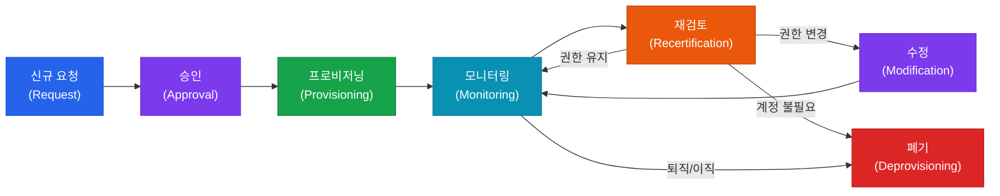

# ID 및 접근 관리
**Identity & Access Management (IAM)**

:::info 관련 표준
CISA Domain 5.1 / ISO/IEC 27001 A.9 / NIST SP 800-63 / NIST SP 800-53 AC / CIS Control 5-6 / PCI DSS Req.7-8
:::

| 항목 | 내용 |
|------|------|
| **문서번호** | BP-SEC-01 |
| **제개정일** | 2025-01-15 |
| **관리부서** | IT 보안팀 / IAM팀 |
| **적용범위** | 전사 사용자 및 시스템 계정 |
| **통제목적** | 사용자 신원 확인 및 최소 권한 기반 접근 통제 보장 |

---

## 1. 개요 및 배경

IAM(Identity and Access Management)은 조직의 디지털 자원에 대한 올바른 사용자가 올바른 이유로 올바른 시점에 올바른 자원에 접근하도록 보장하는 프레임워크입니다. 정보보안의 기본 원칙인 CIA Triad(기밀성·무결성·가용성) 중 특히 기밀성과 무결성을 지원하는 핵심 통제 영역입니다.

CISA 감사인은 IAM 통제의 설계(Design) 적정성과 운영(Operating) 효과성을 모두 평가해야 합니다. 특히 내부자 위협(Insider Threat), 과도한 권한(Over-provisioning), 잔존 계정(Orphan Account)은 빈번히 발견되는 감사 지적 사항입니다.

### 1.1 IAM 3A 프레임워크

| 구성요소 | 정의 | 주요 기술 | 감사 포인트 |
|----------|------|-----------|------------|
| **인증 (Authentication)** | 사용자가 주장하는 신원이 맞는지 검증 | 패스워드, MFA, SSO, 생체인식 | 인증 수단 강도, MFA 적용 범위 |
| **권한부여 (Authorization)** | 인증된 사용자에게 허용된 행위 결정 | RBAC, ABAC, ACL, Policy Engine | 권한 범위 적정성, 과도한 권한 |
| **계정관리 (Administration)** | 계정 및 권한의 생성·변경·삭제 관리 | IGA, Workflow, Provisioning | 수명주기 절차 준수, 고아 계정 |

---

## 2. 핵심 개념 및 원칙

### 2.1 접근 통제 모델 비교

| 모델 | 전체명 | 접근 결정 기준 | 적용 사례 | 장점 | 단점 |
|------|--------|--------------|-----------|------|------|
| **DAC** | Discretionary Access Control | 자원 소유자 재량 | 파일 시스템 권한 | 유연성 높음 | 관리 분산, 일관성 부족 |
| **MAC** | Mandatory Access Control | 시스템 정책(보안 등급) | 군/정보기관 시스템 | 중앙 집중, 고강도 통제 | 운영 복잡성 높음 |
| **RBAC** | Role-Based Access Control | 역할(Role) 기반 | 기업 ERP, 업무시스템 | 관리 용이, 표준화 | 역할 폭발(Role Explosion) |
| **ABAC** | Attribute-Based Access Control | 다중 속성(시간·위치·부서 등) | 제로 트러스트, 클라우드 IAM | 세밀한 통제 | 정책 복잡도 높음 |

### 2.2 최소 권한 원칙 (Least Privilege) 및 Need-to-Know

- **최소 권한 원칙**: 사용자·프로세스·시스템은 업무 수행에 필요한 최소한의 권한만 부여받아야 함
- **Need-to-Know**: 정보에 대한 접근은 해당 정보가 업무 수행에 실제로 필요한 경우에만 허용
- **직무 분리 (SoD, Segregation of Duties)**: 상충되는 업무를 단일 사용자가 수행할 수 없도록 권한 분리
  - 예시: 결재 권한 + 지급 권한 동시 보유 금지, DB 관리 + 감사 로그 관리 동시 보유 금지

### 2.3 PAM (Privileged Access Management)

특권 계정(Privileged Account)은 일반 계정 대비 고위험 계정으로, 별도의 강화된 통제가 필요합니다.

| 특권 계정 유형 | 설명 | 위험 수준 |
|--------------|------|----------|
| 도메인 관리자 (Domain Admin) | AD 전체 제어 권한 | 최고 |
| 로컬 관리자 (Local Admin) | 개별 시스템 전체 제어 | 높음 |
| 서비스 계정 (Service Account) | 응용프로그램 실행용 | 높음 |
| 루트/SUDO 계정 | Unix/Linux 최고 권한 | 최고 |
| DBA 계정 | 데이터베이스 전체 접근 | 높음 |

**PAM 핵심 통제 기법:**
- **Just-In-Time(JIT) 접근**: 필요 시에만 임시로 특권 부여 후 자동 회수
- **세션 녹화(Session Recording)**: 모든 특권 세션을 영상 및 텍스트로 기록
- **패스워드 볼팅(Password Vaulting)**: 특권 계정 자격증명을 중앙 금고에 보관, 자동 교체
- **이중 통제(Dual Control)**: 특정 작업 수행 시 2인 이상의 승인 필요

### 2.4 MFA 유형별 보안 수준 비교

| MFA 유형 | 방식 | 피싱 저항성 | 사용 편의성 | 권장 용도 |
|---------|------|-----------|-----------|---------|
| SMS OTP | 문자 메시지 일회용 번호 | 낮음 (SIM 스와핑 취약) | 높음 | 저위험 서비스 |
| TOTP | 시간 기반 일회용 번호 (Google Authenticator) | 중간 | 높음 | 일반 업무 시스템 |
| FIDO2/WebAuthn | 공개키 기반 하드웨어 인증 | 매우 높음 | 높음 | 고위험 시스템, 특권 계정 |
| 하드웨어 토큰 | 물리적 보안 키 (YubiKey 등) | 매우 높음 | 중간 | 특권 계정, 원격 접근 |
| 생체인식 | 지문·얼굴인식 | 높음 | 매우 높음 | 물리적 접근 통제 결합 |

---

## 3. 계정 수명주기 관리 프로세스

### 3.1 계정 수명주기 흐름도

### 3.2 각 단계별 핵심 통제

| 단계 | 핵심 통제 | 감사 증적 |
|------|-----------|---------|
| **요청 (Request)** | 업무 정당성 문서화, 관리자 승인 | 계정 신청서, 업무 기술서 |
| **승인 (Approval)** | 2단계 승인(직속 관리자 + 시스템 소유자), SoD 충돌 검토 | 승인 이력, SoD 분석 결과 |
| **프로비저닝 (Provisioning)** | 역할 기반 권한 자동 할당, 불필요 기본 권한 제거 | 프로비저닝 로그, 권한 목록 |
| **모니터링 (Monitoring)** | 비정상 접근 패턴 탐지, 특권 세션 기록 | 접근 로그, SIEM 알림 |
| **재검토 (Recertification)** | 분기별/연간 접근 권한 검토, 매니저 확인 | 재검토 완료 보고서 |
| **수정 (Modification)** | 직무 변경 시 즉시 권한 조정, 이전 권한 제거 | 권한 변경 이력 |
| **폐기 (Deprovisioning)** | 퇴직 당일 계정 비활성화, 30일 내 삭제 | 계정 삭제 로그, HR 연동 기록 |

### 3.3 접근 재검토 (Access Recertification) 주기

| 계정 유형 | 재검토 주기 | 재검토 수행자 | 미수행 시 조치 |
|---------|-----------|------------|-------------|
| 일반 사용자 계정 | 연 1회 (또는 반기) | 직속 관리자 | 자동 비활성화 |
| 특권 계정 | 분기 1회 | CISO + 시스템 소유자 | 즉시 회수 |
| 서비스 계정 | 반기 1회 | 애플리케이션 담당자 | 비활성화 후 검토 |
| 외부 협력사 계정 | 계약 종료 시 즉시 + 분기 검토 | 담당 부서장 | 계약 종료 시 즉시 삭제 |

### 3.4 SoD 위반 탐지 자동화

IAM 시스템을 활용한 SoD 위반 자동 탐지 방법:
1. **SoD 매트릭스 정의**: 상충 트랜잭션 조합 목록 작성 (예: 구매 요청 + 구매 승인)
2. **실시간 충돌 탐지**: 권한 부여 시점에 SoD 충돌 즉시 경고
3. **정기 분석**: 기존 권한 보유자 중 SoD 위반자 주기적 식별
4. **보상 통제**: 불가피한 SoD 예외의 경우, 강화된 모니터링 및 경영진 승인 문서화

---

## 4. CISA 감사 체크리스트

<table>
  <colgroup>
    <col style={{width: '7%'}} />
    <col style={{width: '23%'}} />
    <col style={{width: '38%'}} />
    <col style={{width: '32%'}} />
  </colgroup>
  <thead>
    <tr><th>ID</th><th>통제 목적</th><th>감사 수행 절차</th><th>필수 증적 파일</th></tr>
  </thead>
  <tbody>
    <tr>
      <td><strong>IAM-01</strong></td>
      <td>계정 수명주기 절차 준수</td>
      <td>
        1. 지난 6개월간 신규 생성·변경·삭제된 계정 샘플 추출(최소 25건) 
        2. 각 계정에 대한 승인 이력, 업무 정당성 문서 존재 여부 확인 
        3. HR 퇴직자 목록과 활성 계정 목록 교차 비교하여 잔존 계정 식별 
        4. 계정 프로비저닝~폐기 소요 시간 기준(SLA) 준수 여부 검토
      </td>
      <td>
        계정 신청/승인 워크플로우 이력 
        HR 퇴직자 목록 
        활성 계정 목록(AD 추출본) 
        계정 삭제 로그
      </td>
    </tr>
    <tr>
      <td><strong>IAM-02</strong></td>
      <td>특권 계정 모니터링</td>
      <td>
        1. 전체 특권 계정(도메인 관리자, 로컬 관리자, DBA, 루트) 목록 확보 
        2. 특권 계정 수가 업무 필요 인원 대비 적정한지 검토 
        3. PAM 솔루션 도입 여부 및 세션 녹화 범위 확인 
        4. 최근 90일간 특권 계정 활동 로그 검토, 비정상 작업 식별
      </td>
      <td>
        특권 계정 목록 및 업무 근거 
        PAM 시스템 설정 화면 
        특권 세션 녹화 로그 
        SIEM 특권 계정 알림 이력
      </td>
    </tr>
    <tr>
      <td><strong>IAM-03</strong></td>
      <td>MFA 적용률</td>
      <td>
        1. 원격 접근(VPN, RDP, 클라우드 콘솔) 계정 전체 목록 확보 
        2. MFA 미적용 계정 비율 산출 (목표: 특권 계정 100%, 일반 계정 95% 이상) 
        3. MFA 방식별 보안 수준 평가 (SMS OTP 단독 사용 여부 확인) 
        4. MFA 우회 예외 계정 존재 시 업무 근거 및 보상 통제 확인
      </td>
      <td>
        MFA 적용 현황 보고서 
        원격 접근 계정 목록 
        MFA 예외 계정 목록 및 승인서 
        인증 로그
      </td>
    </tr>
    <tr>
      <td><strong>IAM-04</strong></td>
      <td>정기 접근 재검토 수행</td>
      <td>
        1. 접근 재검토 정책(주기, 책임자, 절차) 문서 검토 
        2. 최근 1년간 재검토 수행 이력 확인 (수행일, 검토자, 조치 결과) 
        3. 재검토 후 권한 삭제·수정 조치율 검토 (과거 재검토와 비교) 
        4. SoD 위반 계정 식별·조치 결과 확인
      </td>
      <td>
        접근 재검토 정책 문서 
        재검토 완료 보고서 
        권한 변경/삭제 이력 
        SoD 분석 결과 보고서
      </td>
    </tr>
  </tbody>
</table>

---

## 5. 관련 표준 및 참고

| 표준/프레임워크 | 관련 영역 | 핵심 요구사항 |
|--------------|---------|------------|
| **ISO/IEC 27001 A.9** | 접근 통제 | 접근 통제 정책, 사용자 등록/해지, 권한 검토 |
| **NIST SP 800-63B** | 디지털 신원 | 인증 보증 수준(AAL 1/2/3), MFA 요구사항 |
| **NIST SP 800-53 AC** | 접근 통제 패밀리 | 최소 권한, 계정 관리, 접근 집행 |
| **PCI DSS Req. 7-8** | 지급 카드 데이터 접근 | Need-to-Know 기반 접근, 고유 ID, MFA |
| **CIS Control 5-6** | 계정 및 접근 관리 | 계정 인벤토리, 접근 통제 관리 |
| **COBIT 2019 DSS05** | 보안 서비스 관리 | 신원 및 접근 권한 관리 |

### 주요 용어 정리

| 용어 | 설명 |
|------|------|
| **IGA (Identity Governance & Administration)** | 계정·권한의 거버넌스 및 관리 플랫폼 |
| **SSO (Single Sign-On)** | 1회 인증으로 여러 시스템 접근 |
| **SCIM** | 클라우드 간 사용자 프로비저닝 표준 프로토콜 |
| **Federation** | 서로 다른 도메인 간 신원 정보 공유 (SAML, OIDC) |
| **Zero Trust** | 네트워크 위치에 상관없이 모든 접근 요청을 검증하는 보안 모델 |

---

## 관련 문서

- [5.2 인프라 및 서버 보안](/docs/information-security/infrastructure-security)
- [5.3 클라우드 보안](/docs/information-security/cloud-security)
- [5.5 침해사고 대응](/docs/information-security/incident-response)
- [4.3 변경 관리](/docs/it-operations/patch-change)
- [2.1 IT 거버넌스 프레임워크](/docs/it-governance/it-strategy)
