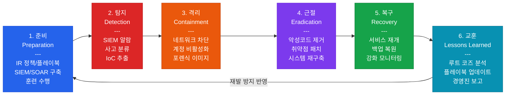

# 침해사고 대응 및 디지털 포렌식
**Incident Response & Digital Forensics**

:::info 관련 표준
CISA Domain 5.5 / NIST SP 800-61 Rev.3 / ISO/IEC 27035 / RFC 3227 / MITRE ATT&CK / STIX/TAXII 2.1
:::

<table>
  <colgroup>
    <col style={{width: '20%'}} />
    <col style={{width: '80%'}} />
  </colgroup>
  <tbody>
    <tr><td><strong>문서번호</strong></td><td>BP-SEC-05</td></tr>
    <tr><td><strong>제개정일</strong></td><td>2026-05-18</td></tr>
    <tr><td><strong>관리부서</strong></td><td>보안운영센터(SOC)</td></tr>
    <tr><td><strong>적용범위</strong></td><td>전사 보안 이벤트 및 침해사고 (내부/외부 위협, 랜섬웨어, 데이터 유출 등)</td></tr>
    <tr><td><strong>통제목적</strong></td><td>체계적인 침해사고 대응 프로세스와 디지털 포렌식 역량을 통해 보안 사고 발생 시 피해를 최소화하고, 법적 증거 가치를 보존하며, 재발 방지를 위한 교훈을 조직 전반에 내재화</td></tr>
  </tbody>
</table>

---

## 1. 개요 및 배경

침해사고 대응(Incident Response, IR)은 보안 사고를 체계적으로 탐지, 격리, 제거하고 정상 운영을 복구하는 일련의 과정이다. NIST SP 800-61은 IR을 4단계(준비-탐지/분석-격리/근절/복구-교훈)로 정의하며, 실무에서는 ISO/IEC 27035의 6단계 모델이 널리 적용된다.

현대의 사이버 위협은 APT(Advanced Persistent Threat), 랜섬웨어, 공급망 공격으로 고도화되고 있으며, 단순한 기술적 대응을 넘어 SIEM/SOAR 기반 자동화 대응, 위협 인텔리전스(CTI) 연동, 법적 효력을 갖춘 디지털 포렌식이 요구된다.

CISA 감사에서 침해사고 대응은 다음을 핵심 평가 요소로 삼는다.

- **대응 역량 성숙도**: 문서화된 플레이북, 훈련 이력, SIEM 탐지 규칙의 최신성
- **대응 속도**: 탐지부터 격리까지의 평균 시간(MTTC: Mean Time to Contain)
- **포렌식 완전성**: Chain of Custody 유지, 휘발성 데이터 우선 수집, 증거 무결성

---

## 2. 핵심 개념 및 원칙

### 2.1 IR 6단계 상세

**1단계: 준비(Preparation)**

사고 발생 이전에 대응 역량을 갖추는 단계로, IR 성공의 70%는 준비 단계에서 결정된다.

- IR 정책/절차서 수립 및 최신 유지 (연 1회 이상 검토)
- CSIRT(Computer Security Incident Response Team) 구성 — 역할/책임/연락망 명시
- SIEM, EDR, NDR, SOAR 등 탐지·대응 도구 구축 및 튜닝
- 플레이북(Playbook) 작성 — 랜섬웨어, 피싱, 내부자 위협, DDoS 등 유형별
- 연간 IR 훈련 및 모의 침투 훈련(Tabletop Exercise) 수행
- 외부 전문 업체 계약(Retained IR Service) 및 사이버 보험 검토

**2단계: 탐지(Detection & Analysis)**

보안 이벤트를 식별하고 침해사고 여부를 판정하는 단계이다.

- SIEM 알람, EDR 탐지, IDS/IPS 경보, SOC 티켓 기반 사고 접수
- 사고 분류(Classification): 중요도(P1/P2/P3), 유형(랜섬웨어/데이터 유출/계정 침해 등)
- 타임라인 재구성: 공격 최초 진입점, 내부 이동 경로, 피해 범위 분석
- IoC(침해지표) 추출 및 위협 인텔리전스 대조 — MITRE ATT&CK 매핑

**3단계: 격리(Containment)**

사고의 확산을 방지하고 피해 범위를 한정하는 단계이다.

- **단기 격리**: 감염 시스템 네트워크 차단 (VLAN 격리, 방화벽 ACL 적용)
- **장기 격리**: 포렌식 이미지 획득 후 시스템 격리 유지
- 계정 침해 시: 해당 계정 즉시 비활성화 + 세션 강제 종료 + 패스워드 초기화
- 격리 수행 전 네트워크 흐름 캡처(PCAP) 및 메모리 덤프 획득 권고

**4단계: 근절(Eradication)**

위협 요소를 완전히 제거하는 단계이다.

- 악성코드 제거 및 백도어(Persistence Mechanism) 식별·제거
- 취약점 패치 및 설정 오류 수정 (공격 진입점 차단)
- 감염 시스템 재이미징(Re-imaging): 복구보다 재구축 권고 (포렌식 이미지 보존 후)
- IOC 기반 횡적 이동 흔적 전사 스캔 — 추가 감염 시스템 식별

**5단계: 복구(Recovery)**

정상 운영 상태로 복구하는 단계이다.

- 백업에서 데이터 복원 — 백업 무결성 검증 선행
- 클린 시스템 재배포 및 강화된 모니터링 설정
- 복구 시스템 정상 동작 확인 후 단계적 서비스 재개
- 복구 후 강화 모니터링 기간 설정 (최소 30일): 재공격 징후 감시

**6단계: 교훈(Lessons Learned)**

사고에서 배운 내용을 조직 역량으로 내재화하는 단계이다.

- 사고 종결 후 2주 이내 교훈 회의(Post-Incident Review) 개최
- 루트 코즈(Root Cause) 분석 및 재발 방지 대책 수립
- IR 플레이북, 탐지 규칙, 보안 설정 업데이트
- 경영진 보고서 작성 — 사고 개요, 피해 규모, 조치 현황, 재발 방지 투자 계획

### 2.2 SIEM 아키텍처

SIEM(Security Information and Event Management)은 다양한 소스의 보안 이벤트를 수집·분석하여 위협을 탐지하는 핵심 인프라이다.

| 단계 | 내용 | 주요 기술 |
|------|------|-----------|
| **1. 로그 수집** | 방화벽, OS, 애플리케이션, 클라우드, 엔드포인트 | Syslog, Beats, API 수집, 에이전트 |
| **2. 정규화** | 다양한 로그 형식을 통일된 스키마로 변환 | CEF, LEEF, ECS(Elastic Common Schema) |
| **3. 상관 분석** | 단일 이벤트가 아닌 패턴/시퀀스 기반 위협 탐지 | 상관 규칙, ML 기반 이상 탐지(UEBA) |
| **4. 알림** | 임계값 초과 또는 탐지 규칙 매칭 시 알람 발생 | 티켓 생성(ITSM 연동), 이메일, SMS |
| **5. 대응** | 알람 조사 → 사고 분류 → SOAR 플레이북 실행 | SOAR 자동화, SOC 분석가 조사 |

**SIEM 주요 탐지 규칙 예시**

- 브루트포스: 5분 내 동일 계정 5회 이상 로그인 실패 후 성공
- 비정상 시간 접속: 업무 시간 외(오전 2-5시) 관리자 계정 로그인
- 권한 상승: 일반 계정에서 관리자 그룹 추가 이벤트
- 대용량 데이터 유출: 단일 세션 1GB 이상 외부 전송

### 2.3 SOAR 자동화 플레이북 설계

SOAR(Security Orchestration, Automation and Response)는 반복적인 보안 작업을 자동화하여 SOC 효율성을 높이는 플랫폼이다.

**플레이북 설계 원칙**

1. **트리거 정의**: SIEM 알람, 이메일 신고, 사용자 제보 등 사고 접수 방식 명시
2. **의사결정 트리**: 사고 유형별 분기 — 자동 처리 가능 여부 판단
3. **자동화 액션**: IP 차단, 계정 비활성화, 샌드박스 분석, 티켓 생성
4. **인간 개입 지점**: 고위험 조치(서버 격리, 서비스 중단)는 분석가 승인 필수
5. **에스컬레이션**: 자동 처리 실패 또는 P1 사고 시 보안 책임자 즉시 알림

**피싱 대응 플레이북 예시**

- 이메일 수신 신고 → 헤더/링크 자동 분석 → IoC 추출 → VirusTotal 조회
- 악성 판정 시: 동일 메일 전사 차단, 수신자 목록 추출, 클릭 여부 확인
- 클릭 사용자 식별 → 계정 패스워드 초기화 + MFA 재등록 + EDR 정밀 스캔

### 2.4 위협 인텔리전스(CTI)

**인텔리전스 유형 구분**

| 구분 | 대상 독자 | 내용 | 예시 |
|------|-----------|------|------|
| **전략적(Strategic)** | 경영진, CISO | 위협 트렌드, 지정학적 위협, 업종별 위협 동향 | 국가 지원 해킹 그룹 연간 동향 보고서 |
| **운영적(Operational)** | 보안 관리자 | 특정 캠페인/공격 그룹의 TTP(전술/기법/절차) | APT-X 그룹의 최신 공격 방식 분석 |
| **전술적(Tactical)** | SOC 분석가 | 즉시 활용 가능한 IoC — IP, 도메인, 해시값 | 악성 IP 차단 목록, 악성 파일 해시 |

**STIX/TAXII 표준**

- **STIX 2.1(Structured Threat Information eXpression)**: 위협 인텔리전스 표현 표준 — 공격 그룹, 캠페인, IoC, TTP를 JSON 형식으로 구조화
- **TAXII 2.1(Trusted Automated eXchange of Indicator Information)**: STIX 데이터의 자동 교환 프로토콜 — HTTPS 기반 REST API
- **MITRE ATT&CK 매핑**: 탐지된 공격 기법을 ATT&CK 매트릭스에 매핑하여 탐지 커버리지 분석

**ISAC(Information Sharing and Analysis Center) 활용**

- FS-ISAC(금융), H-ISAC(헬스케어), MS-ISAC(중소기업) 등 업종별 위협 공유
- KISA 사이버 위협 인텔리전스 공유(C-TAS) 참여

### 2.5 디지털 포렌식

**증거 수집 원칙**

- **변경 최소화**: 원본 증거의 변경 최소화 — 쓰기 방지 장치(Write Blocker) 사용
- **정확성**: 비트 단위 복사(Bit-by-Bit Copy) — dd, FTK Imager 활용
- **무결성 검증**: SHA-256 해시값 생성 및 기록 — 수집 전후 해시 일치 확인
- **Chain of Custody**: 증거 수집부터 법정 제출까지 모든 이전 이력 기록

**Chain of Custody 기록 항목**

- 증거 수집 일시, 장소, 수집자
- 증거 설명 (장비 모델, 시리얼 번호, 용량)
- 수집 방법 및 사용 도구
- 해시값 (수집 시점 SHA-256)
- 보관 장소 및 보관 담당자
- 이전 이력 (수령인, 이전 일시, 목적)

**휘발성 데이터 수집 순서 (RFC 3227 기반)**

RFC 3227은 디지털 증거의 수집 순서를 휘발성 높은 순서대로 규정한다.

| 순서 | 데이터 유형 | 도구 예시 |
|------|-------------|-----------|
| **1순위** | CPU 레지스터, 캐시 메모리 | 전문 포렌식 도구 |
| **2순위** | 라우팅 테이블, ARP 캐시, 프로세스 테이블 | netstat, arp -a, ps aux |
| **3순위** | 메모리(RAM) 덤프 | Volatility, WinPmem, DumpIt |
| **4순위** | 임시 파일 및 스왑 파일 | /tmp, pagefile.sys |
| **5순위** | 디스크 이미지 | dd, FTK Imager, Autopsy |
| **6순위** | 원격 로그, 네트워크 모니터링 데이터 | SIEM 로그, PCAP |
| **7순위** | 아카이브 미디어 (테이프, 백업) | 백업 스토리지 |

### 2.6 침해지표(IoC) 유형

| IoC 유형 | 예시 | 활용 방법 |
|-----------|------|-----------|
| **IP 주소** | 185.220.101.0/24 (Tor Exit Node) | 방화벽 차단, SIEM 알람 |
| **도메인/URL** | evil-c2.example.com | DNS Sinkhole, Proxy 차단 |
| **파일 해시** | SHA-256: a3f8... (악성 실행 파일) | EDR/AV 시그니처 등록 |
| **레지스트리** | HKCU\Software\Run\Backdoor | EDR 탐지 규칙, 무결성 모니터링 |
| **파일 경로** | %APPDATA%\svchost32.exe | YARA 규칙, EDR 탐지 |
| **이메일** | phish@compromised-domain.com | 이메일 게이트웨이 차단 |
| **뮤텍스** | Global\\MalwareMutex2024 | 메모리 분석, EDR |
| **네트워크 시그니처** | User-Agent: Mozilla/4.0 (Emotet) | IDS/IPS 시그니처 |

---

## 3. IR 6단계 흐름

---

## 4. CISA 감사 체크리스트

<table>
  <colgroup>
    <col style={{width: '7%'}} />
    <col style={{width: '23%'}} />
    <col style={{width: '38%'}} />
    <col style={{width: '32%'}} />
  </colgroup>
  <thead>
    <tr>
      <th>ID</th>
      <th>통제 목적</th>
      <th>감사 수행 절차</th>
      <th>필수 증적 파일</th>
    </tr>
  </thead>
  <tbody>
    <tr>
      <td><strong>AUD-33</strong></td>
      <td>IR 플레이북 최신성 및 훈련 이력 검증</td>
      <td>
        1. IR 플레이북 목록 확인 — 랜섬웨어, 피싱, 데이터 유출, 내부자 위협 등 주요 유형 포함 여부 
        2. 플레이북 최종 검토/업데이트 일자 확인 — 6개월 이상 미갱신 시 취약 
        3. 연간 Tabletop Exercise(TTX) 수행 이력 확인 — 시나리오, 참여자, 교훈 반영 여부 
        4. CSIRT 조직도 및 연락망 최신성 확인 — 퇴직자 제거, 신규 인원 반영 여부
      </td>
      <td>
        IR 플레이북 전체 목록 (최신 버전 이력 포함) 
        Tabletop Exercise 수행 결과 보고서 
        CSIRT 조직도 및 연락망 
        IR 정책서 및 절차서 (최종 승인본)
      </td>
    </tr>
    <tr>
      <td><strong>AUD-34</strong></td>
      <td>SIEM 탐지 규칙 최신성 및 탐지 커버리지</td>
      <td>
        1. SIEM 탐지 규칙 총 수 및 최근 3개월 내 신규/업데이트 규칙 수 확인 
        2. MITRE ATT&CK 매핑 커버리지 분석 — 주요 전술(TA) 대비 탐지 규칙 존재 여부 
        3. False Positive 비율 분석 — 전체 알람 대비 실제 조사 건수 비율 (목표: FP율 20% 이하) 
        4. 모든 핵심 로그 소스(방화벽, OS, 클라우드, 엔드포인트) SIEM 수집 여부 확인 
        5. SIEM 로그 보존 기간 확인 — Hot 저장소 90일 이상, Cold 저장소 1년 이상
      </td>
      <td>
        SIEM 탐지 규칙 목록 (업데이트 이력) 
        MITRE ATT&CK 커버리지 매핑 문서 
        SIEM 알람 통계 (월별 FP율 포함) 
        로그 소스 수집 현황표 
        로그 보존 정책 문서
      </td>
    </tr>
    <tr>
      <td><strong>AUD-35</strong></td>
      <td>디지털 포렌식 Chain of Custody 유지 적정성</td>
      <td>
        1. 최근 1년 내 발생 사고(또는 모의 포렌식 훈련) Chain of Custody 양식 검토 
        2. 증거 수집 절차서 확인 — RFC 3227 기반 휘발성 데이터 우선 수집 순서 명시 여부 
        3. 포렌식 이미지 무결성 검증 — SHA-256 해시값 기록 및 원본 대조 가능 여부 
        4. 포렌식 도구 검증 현황 — FTK, Autopsy, Volatility 등 공인 도구 사용 여부 
        5. 증거 보관 장소의 물리적 보안 및 접근 로그 관리 여부
      </td>
      <td>
        Chain of Custody 양식 및 작성 사례 
        포렌식 수행 절차서 
        포렌식 이미지 해시값 기록 문서 
        포렌식 도구 목록 및 검증 이력 
        증거 보관 장소 접근 통제 현황
      </td>
    </tr>
    <tr>
      <td><strong>AUD-36</strong></td>
      <td>침해사고 교훈 반영 및 지속 개선 체계</td>
      <td>
        1. 최근 1년 내 주요 사고(P1/P2) Post-Incident Review 수행 여부 확인 
        2. 교훈 보고서 내 재발 방지 대책의 이행 현황 추적 여부 확인 
        3. IR 플레이북, SIEM 규칙, 보안 정책에 교훈 반영 여부 버전 이력으로 확인 
        4. 경영진/이사회 보고 수행 여부 — 사고 개요 및 재발 방지 투자 계획 포함 여부 
        5. 유사 사고 재발 여부 추적 — 이전 교훈 미이행으로 인한 반복 사고 발생 확인
      </td>
      <td>
        Post-Incident Review 보고서 (사고별) 
        재발 방지 대책 이행 추적 현황표 
        교훈 반영 이력 (플레이북/규칙 버전 이력) 
        경영진/이사회 보고 자료 
        사고 이력 데이터베이스 (재발 여부 포함)
      </td>
    </tr>
  </tbody>
</table>

---

## 5. 관련 표준 및 참고

| 표준/문서 | 발행 기관 | 주요 내용 |
|-----------|-----------|-----------|
| NIST SP 800-61 Rev.3 (2024) | NIST | 컴퓨터 보안 사고 처리 가이드 — IR 수명주기 |
| ISO/IEC 27035-1/2/3 | ISO/IEC | 정보 보안 사고 관리 국제 표준 |
| RFC 3227 | IETF | 디지털 증거 수집 및 보관 가이드라인 |
| MITRE ATT&CK v15 | MITRE | 사이버 공격 전술·기법·절차(TTP) 지식 베이스 |
| STIX 2.1 / TAXII 2.1 | OASIS | 위협 인텔리전스 표현 및 교환 표준 |
| NIST SP 800-86 | NIST | 포렌식 기법의 사고 대응 통합 가이드 |
| NIST SP 800-92 | NIST | 컴퓨터 보안 로그 관리 가이드 |
| CISA IR Playbook (2021) | CISA | 연방 기관용 IR 플레이북 템플릿 |

---

## 관련 문서

- [5.2 인프라 및 서버 보안 하드닝](/docs/information-security/infrastructure-security)
- [5.3 클라우드 및 가상화 보안 감사](/docs/information-security/cloud-security)
- [5.4 암호화 및 PKI](/docs/information-security/cryptography)
- [5.1 접근 통제 및 계정 관리](/docs/information-security/iam)
