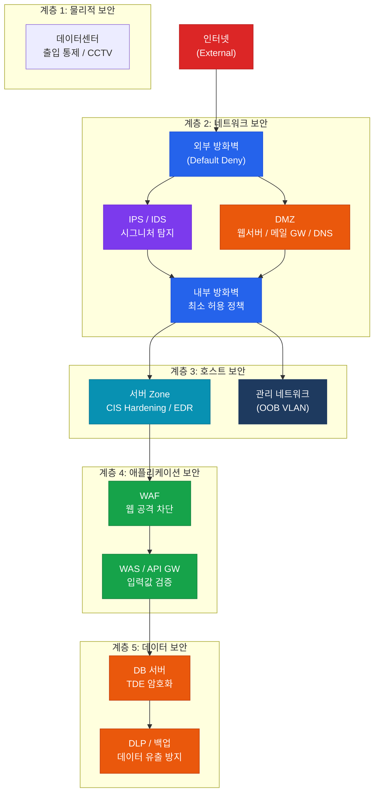

# 인프라 및 서버 보안 하드닝
**Infrastructure & Server Security Hardening**

:::info 관련 표준
CISA Domain 5.2 / CIS Benchmarks v8 / NIST SP 800-123 / ISO/IEC 27001 A.13 / NIST SP 800-41 (방화벽) / PCI DSS Requirement 1, 6
:::

<table>
  <colgroup>
    <col style={{width: '20%'}} />
    <col style={{width: '80%'}} />
  </colgroup>
  <tbody>
    <tr><td><strong>문서번호</strong></td><td>BP-SEC-02</td></tr>
    <tr><td><strong>제개정일</strong></td><td>2026-05-18</td></tr>
    <tr><td><strong>관리부서</strong></td><td>IT 인프라팀 / 보안팀</td></tr>
    <tr><td><strong>적용범위</strong></td><td>전사 네트워크 및 서버 인프라</td></tr>
    <tr><td><strong>통제목적</strong></td><td>심층 방어 아키텍처 구현을 통해 외부 위협으로부터 IT 인프라를 보호하고, 취약점을 선제적으로 탐지·제거하여 침해사고 발생 가능성을 최소화</td></tr>
  </tbody>
</table>

---

## 1. 개요 및 배경

IT 인프라는 조직의 디지털 자산을 수용하는 기반 구조로서, 네트워크, 서버, 운영체제, 가상화 환경 전반을 포함한다. 인프라 보안 하드닝(Hardening)은 불필요한 공격 노출 면적(Attack Surface)을 최소화하고, 알려진 취약점을 사전에 제거함으로써 침해사고 발생 가능성을 낮추는 일련의 보안 강화 활동이다.

현대 위협 환경에서 경계 기반 보안(Perimeter Security) 단독으로는 고도화된 APT 공격, 내부자 위협, 공급망 공격에 효과적으로 대응하기 어렵다. 이에 CISA는 **심층 방어(Defense in Depth)** 와 **Zero Trust** 원칙을 결합한 다층 방어 체계 구축을 핵심 요건으로 요구한다.

CISA 감사에서 인프라 보안은 다음 세 가지 관점에서 평가된다.

- **설계 적정성**: 네트워크 세분화, DMZ 구성, Zero Trust 아키텍처 수준
- **구성 안전성**: CIS Benchmark 기반 하드닝 적용 여부 및 준수율
- **지속적 관리**: 취약점 진단(VA) 및 침투 테스트(PT) 수행 체계

---

## 2. 핵심 개념 및 원칙

### 2.1 심층 방어(Defense in Depth) 5계층

심층 방어는 단일 통제 실패 시에도 다음 계층이 보호 기능을 수행하도록 여러 보안 계층을 중첩 적용하는 전략이다.

| 계층 | 구성 요소 | 주요 통제 |
|------|-----------|-----------|
| **1. 물리적 계층** | 데이터센터, 서버룸 | 출입 통제, CCTV, 랙 잠금, 환경 모니터링 |
| **2. 네트워크 계층** | 방화벽, IDS/IPS, DMZ, VLAN | 트래픽 필터링, 세그멘테이션, 암호화 통신 |
| **3. 호스트 계층** | 서버 OS, 엔드포인트 | OS 하드닝, EDR, 패치 관리, 로컬 방화벽 |
| **4. 애플리케이션 계층** | 웹서버, WAS, API | WAF, 입력 값 검증, 보안 코딩, SAST/DAST |
| **5. 데이터 계층** | DB, 파일 스토리지 | 암호화(At Rest), 접근 통제, DLP, 백업 |

### 2.2 네트워크 세분화 설계 원칙

**VLAN(Virtual LAN) 구성 기준**

- 업무 기능별(인사, 재무, 개발, 운영) VLAN 분리로 내부 수평 이동(Lateral Movement) 차단
- 서버 VLAN은 사용자 VLAN과 물리적/논리적으로 분리
- 관리 네트워크(OOB: Out-of-Band Management)는 별도 VLAN 운영
- VLAN Hopping 방지: Native VLAN 변경, DTP 비활성화

**DMZ(Demilitarized Zone) 구성**

- 인터넷 접점 서비스(웹서버, 이메일 게이트웨이, DNS)는 DMZ 내 배치
- 이중 방화벽 구조: 외부 방화벽(인터넷-DMZ) + 내부 방화벽(DMZ-내부망)
- DMZ에서 내부망으로의 직접 연결은 원칙적으로 차단, 역방향 프록시 활용

**마이크로세그멘테이션(Micro-Segmentation)**

- 애플리케이션 단위의 세분화된 정책으로 워크로드 간 통신 최소화
- SDN(Software-Defined Networking) 또는 NSX 기반 정책 적용
- 컨테이너 환경: Kubernetes NetworkPolicy를 통한 Pod 간 통신 제어

### 2.3 Zero Trust 5대 원칙

Zero Trust는 "절대 신뢰하지 말고 항상 검증(Never Trust, Always Verify)"을 기반으로 하는 보안 패러다임이다.

| 원칙 | 내용 | 구현 방법 |
|------|------|-----------|
| **1. 명시적 검증** | 모든 접근 요청에 대해 사용자, 기기, 위치, 서비스를 검증 | MFA, 디바이스 인증서, 위치 기반 정책 |
| **2. 최소 권한** | 업무 수행에 필요한 최소한의 권한만 부여 | JIT(Just-In-Time) 접근, PAM 솔루션 |
| **3. 침해 가정** | 이미 침해되었다는 가정 하에 네트워크 설계 | 마이크로세그멘테이션, 이상 탐지 |
| **4. 지속적 모니터링** | 모든 세션과 트래픽을 실시간 모니터링 | SIEM, UBA(User Behavior Analytics) |
| **5. 데이터 중심 보호** | 데이터 자체에 보안 정책 적용 | DRM, 암호화, 데이터 분류 |

### 2.4 방화벽/IDS/IPS 룰셋 감사 기준

**방화벽 정책 핵심 원칙**

- **Default Deny(기본 차단)**: 명시적으로 허용된 트래픽 외 전면 차단 — Any/Any Allow 룰 금지
- **최소 허용 원칙**: 특정 소스 IP, 목적지 IP, 포트, 프로토콜을 명시
- **룰셋 정리**: 미사용 룰, 중복 룰, 쉐도우 룰(후행 룰에 의해 차단되는 룰) 주기적 제거
- **변경 관리**: 모든 방화벽 룰 변경은 변경 관리 프로세스(RFC) 경유 필수

**룰셋 검토 주기**

| 검토 유형 | 주기 | 담당 |
|-----------|------|------|
| 전체 룰셋 검토 | 반기(6개월) | 보안팀 + 인프라팀 |
| 신규/변경 룰 검토 | 즉시(변경 시) | 보안팀 승인 |
| 미사용 룰 정리 | 분기(3개월) | 인프라팀 |
| 침투 테스트 결과 반영 | 연 1회 이상 | 보안팀 |

**IDS/IPS 운영 기준**

- 시그니처 업데이트: 최소 일 1회 자동 업데이트
- IPS 모드: 검증 환경에서 IDS(탐지 전용) 운영 후 차단 모드(IPS) 전환
- False Positive 관리: 월 1회 오탐율 분석 및 튜닝

### 2.5 OS/서버 Hardening (CIS Benchmark 기반)

**CIS Benchmark Level 1 필수 항목**

| 분류 | 항목 | 기준 |
|------|------|------|
| **계정 관리** | 기본 계정(root, admin, guest) 비활성화 또는 이름 변경 | 필수 |
| **계정 관리** | 패스워드 복잡성: 최소 12자, 대/소문자/숫자/특수문자 조합 | 필수 |
| **서비스 관리** | 불필요 서비스 비활성화: Telnet, FTP, RSH, rlogin | 필수 |
| **포트 관리** | 불필요 포트 차단: 사용 포트 외 전면 차단 | 필수 |
| **패치 관리** | 최신 보안 패치 적용: 긴급 패치 72시간 이내, 일반 패치 30일 이내 | 필수 |
| **로깅** | 보안 이벤트 로그 활성화 및 중앙 수집(SIEM 연동) | 필수 |
| **원격 접속** | SSH Key 기반 인증, 패스워드 인증 비활성화 | 권고 |
| **파일 권한** | SUID/SGID 파일 목록 관리, /tmp 쓰기 권한 제한 | 필수 |
| **NTP** | 신뢰할 수 있는 NTP 서버 동기화(로그 무결성 확보) | 필수 |
| **감사 로그** | auditd 활성화, 주요 명령어 실행 이력 기록 | 필수 |

### 2.6 취약점 진단(VA) vs 침투 테스트(PT) 비교

| 구분 | 취약점 진단(VA) | 침투 테스트(PT) |
|------|-----------------|-----------------|
| **목적** | 알려진 취약점 목록화 | 실제 공격 가능성 및 영향도 확인 |
| **방법** | 자동화 스캐닝 도구 중심 | 수동 기법 + 자동화 병행 |
| **수행 주기** | 분기 1회 이상(정기) + 변경 시 | 연 1회 이상 |
| **범위** | 전체 시스템 대상 | 협의된 범위(Scope) 내 |
| **수행 주체** | 내부 보안팀 가능 | 외부 전문 업체 권고 |
| **산출물** | 취약점 목록, CVSS 점수, 조치 계획 | 침투 경로 분석 보고서, 개선 권고안 |
| **관련 표준** | CVE, CVSS, OVAL | PTES, OWASP Testing Guide |
| **PCI DSS** | 분기 1회 스캔(ASV 승인) | 연 1회 이상 |

---

## 3. 심층 방어 아키텍처 구조

---

## 4. CISA 감사 체크리스트

<table>
  <colgroup>
    <col style={{width: '7%'}} />
    <col style={{width: '23%'}} />
    <col style={{width: '38%'}} />
    <col style={{width: '32%'}} />
  </colgroup>
  <thead>
    <tr>
      <th>ID</th>
      <th>통제 목적</th>
      <th>감사 수행 절차</th>
      <th>필수 증적 파일</th>
    </tr>
  </thead>
  <tbody>
    <tr>
      <td><strong>AUD-21</strong></td>
      <td>네트워크 세분화 적정성 확인</td>
      <td>
        1. 네트워크 토폴로지 다이어그램 검토 — VLAN 분리, DMZ 이중 방화벽 구조 확인 
        2. VLAN 설정 파일(show vlan brief) 수집 및 업무별 분리 여부 검증 
        3. 서버 VLAN에서 사용자 VLAN으로의 직접 통신 여부 방화벽 로그로 확인 
        4. Native VLAN 변경 및 DTP 비활성화 설정 검토
      </td>
      <td>
        네트워크 토폴로지 다이어그램 (최신본) 
        스위치/라우터 설정 파일 
        VLAN 구성 현황표 
        방화벽 존(Zone) 정책 문서
      </td>
    </tr>
    <tr>
      <td><strong>AUD-22</strong></td>
      <td>방화벽 룰셋 최신성 및 Default Deny 원칙 준수</td>
      <td>
        1. 방화벽 전체 룰셋 추출 — Any/Any Allow 룰 존재 여부 확인 
        2. 미사용 룰(Last Hit 90일 초과) 목록 추출 및 검토 
        3. 최근 6개월 내 전체 룰셋 검토 수행 증적 확인 
        4. 방화벽 변경 요청서(RFC) 대비 실제 룰 변경 이력 대조
      </td>
      <td>
        방화벽 룰셋 전체 목록 (추출본) 
        룰셋 검토 완료 보고서 
        방화벽 변경 요청서(RFC) 목록 
        미사용 룰 정리 이력
      </td>
    </tr>
    <tr>
      <td><strong>AUD-23</strong></td>
      <td>서버 Hardening 기준 준수율 검증</td>
      <td>
        1. CIS Benchmark 자동화 스캔 결과(CIS-CAT, OpenSCAP) 수집 
        2. Level 1 필수 항목 준수율 확인 — 목표치: 90% 이상 
        3. 미준수 항목에 대한 예외 처리 승인 문서 및 보완 통제 확인 
        4. 표본 서버(5대 이상) 직접 점검: 기본 계정, 불필요 서비스, 패치 상태
      </td>
      <td>
        CIS-CAT/OpenSCAP 스캔 결과 보고서 
        Hardening 기준서 (조직 내부 기준) 
        예외 처리 승인 목록 
        패치 적용 현황표
      </td>
    </tr>
    <tr>
      <td><strong>AUD-24</strong></td>
      <td>취약점 진단 및 침투 테스트 수행 체계 적정성</td>
      <td>
        1. 최근 1년 내 VA 수행 이력 확인 — 분기별 수행 여부 
        2. PT 수행 보고서 검토 — 고위험 취약점 조치 완료 여부 확인 
        3. VA/PT 결과의 조치 계획(Action Plan) 및 이행 현황 추적 
        4. 재진단 수행 여부 확인 — 고위험 취약점 조치 후 30일 이내 재점검
      </td>
      <td>
        분기별 VA 수행 보고서 
        연간 PT 수행 보고서 
        취약점 조치 계획서 및 이행 현황 
        재진단 결과 보고서
      </td>
    </tr>
  </tbody>
</table>

---

## 5. 관련 표준 및 참고

| 표준/문서 | 발행 기관 | 주요 내용 |
|-----------|-----------|-----------|
| CIS Benchmarks v8 | CIS (Center for Internet Security) | OS/서버/네트워크 장비별 보안 설정 기준 |
| NIST SP 800-123 | NIST | 서버 보안 가이드 |
| NIST SP 800-41 Rev.1 | NIST | 방화벽 정책 가이드 |
| NIST SP 800-207 | NIST | Zero Trust Architecture |
| ISO/IEC 27001 A.13 | ISO/IEC | 통신 보안 — 네트워크 보안 관리 |
| PCI DSS v4.0 Req. 1 | PCI SSC | 네트워크 접근 통제 요건 |
| PTES (Penetration Testing Execution Standard) | PTES | 침투 테스트 수행 방법론 |

---

## 관련 문서

- [5.1 접근 통제 및 계정 관리](./access-control.md)
- [5.3 클라우드 및 가상화 보안 감사](./cloud-security.md)
- [5.4 암호화 및 PKI](./cryptography.md)
- [5.5 침해사고 대응 및 디지털 포렌식](./incident-response.md)
