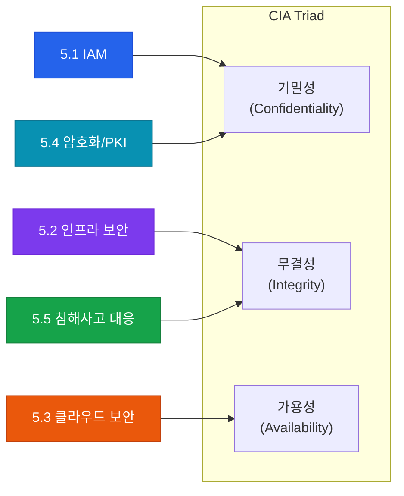

# 정보 자산 보호 및 보안 이벤트 관리
**Protection of Information Assets — CISA Domain 5**

:::info 관련 표준
CISA Domain 5 / ISO/IEC 27001 / NIST SP 800-53 / CIS Controls
:::

자산의 기밀성·무결성·가용성(CIA)을 지키기 위한 보안 통제 기준입니다.

## 하위 항목

| 번호 | 주제 | 핵심 키워드 |
|------|------|------------|
| 5.1 | [ID 및 접근 관리 (IAM)](./iam) | 계정 수명주기, 최소 권한, PAM, Audit Trail |
| 5.2 | [인프라 및 서버 보안](./infrastructure-security) | 네트워크 세분화, IDS/IPS, OS Hardening |
| 5.3 | [클라우드 및 가상화 보안](./cloud-security) | 공동 책임 모델, CSPM, CWPP |
| 5.4 | [암호화 및 PKI](./cryptography) | At Rest/In Transit 암호화, 키 관리 |
| 5.5 | [침해사고 대응 및 디지털 포렌식](./incident-response) | SIEM/SOAR, 위협 인텔리전스, 포렌식 |
