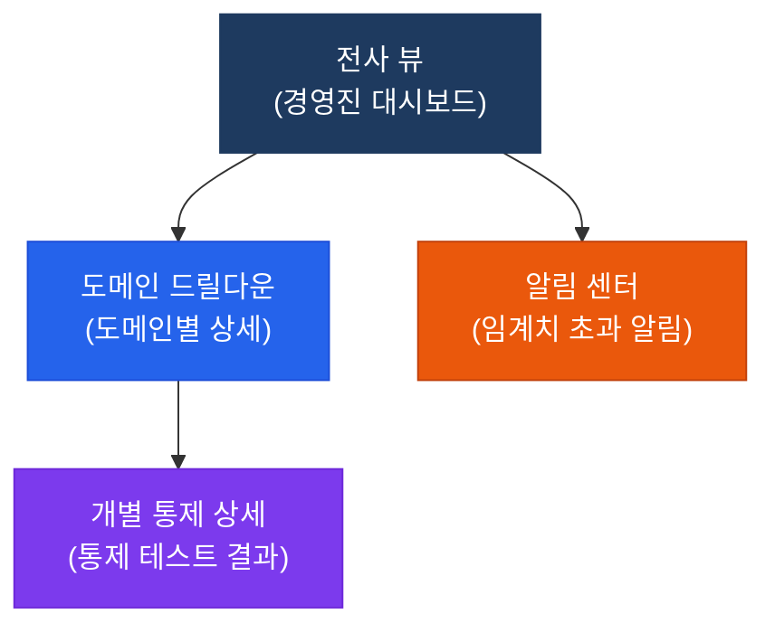
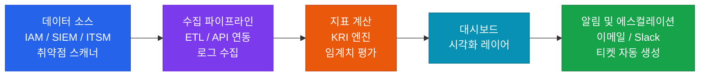

# 상시 모니터링 대시보드 설계 가이드
**Continuous Monitoring Dashboard Design**

:::info 활용 안내
KRI/KPI 기반 상시 모니터링 대시보드 설계 가이드입니다.
본 가이드를 활용하여 전사 IT 위험 지표를 실시간으로 추적하고, 임계치 초과 시 에스컬레이션 절차를 자동화하세요.
참조 표준: `[CISA Domain 3.0 / COBIT 2019 MEA / NIST SP 800-137]`
:::

<table>
  <colgroup>
    <col style={{width: '20%'}} />
    <col style={{width: '80%'}} />
  </colgroup>
  <tbody>
    <tr><td><strong>문서 번호</strong></td><td>BP-TKT-03</td></tr>
    <tr><td><strong>소관 부서</strong></td><td>IT 감사실 / IT 보안운영팀</td></tr>
    <tr><td><strong>적용 범위</strong></td><td>전사 IT 위험 모니터링</td></tr>
    <tr><td><strong>참조 표준</strong></td><td>NIST SP 800-137, COBIT 2019 MEA01/MEA02, ISO/IEC 27004:2016</td></tr>
    <tr><td><strong>최초 제정일</strong></td><td>2024-01-01</td></tr>
    <tr><td><strong>최근 개정일</strong></td><td>2025-05-18</td></tr>
    <tr><td><strong>버전</strong></td><td>v2.1</td></tr>
  </tbody>
</table>

---

## 1. 개요 및 배경

### 1.1 상시 모니터링 vs 지속적 감사

두 개념은 자주 혼용되지만, 목적과 수행 주체가 다릅니다:

<table>
  <colgroup>
    <col style={{width: '22%'}} />
    <col style={{width: '39%'}} />
    <col style={{width: '39%'}} />
  </colgroup>
  <thead>
    <tr>
      <th>구분</th>
      <th>상시 모니터링 (Continuous Monitoring)</th>
      <th>지속적 감사 (Continuous Auditing)</th>
    </tr>
  </thead>
  <tbody>
    <tr>
      <td><strong>정의</strong></td>
      <td>통제의 운영 상태와 위험 지표를 자동화된 도구로 지속적으로 추적하는 관리 활동</td>
      <td>감사인이 자동화 기법을 활용하여 감사 증거를 지속적으로 수집·평가하는 감사 활동</td>
    </tr>
    <tr>
      <td><strong>수행 주체</strong></td>
      <td>IT 운영팀, 정보보안팀, 위험관리팀 (1선/2선 방어선)</td>
      <td>IT 감사팀 (3선 방어선)</td>
    </tr>
    <tr>
      <td><strong>목적</strong></td>
      <td>이상 징후 조기 탐지, 통제 효과성 유지, 위험 임계치 관리</td>
      <td>감사 의견의 적시성 강화, 연속 감사 증거 확보</td>
    </tr>
    <tr>
      <td><strong>주요 산출물</strong></td>
      <td>KRI 대시보드, 알림 리포트, 예외 보고서</td>
      <td>연속 감사 보고서, 실시간 감사 의견</td>
    </tr>
    <tr>
      <td><strong>도구 예시</strong></td>
      <td>SIEM, 취약점 스캐너, IAM 분석, APM</td>
      <td>ACL/IDEA, Tableau, Power BI (감사 분석)</td>
    </tr>
    <tr>
      <td><strong>주기</strong></td>
      <td>실시간 ~ 일별</td>
      <td>주별 ~ 분기별</td>
    </tr>
  </tbody>
</table>

### 1.2 상시 모니터링의 필요성

| 전통적 감사의 한계 | 상시 모니터링으로 극복 |
|-------------------|----------------------|
| 연간 1~2회 점검으로 발견 지연 | 이상 징후 실시간 탐지 |
| 모집단 일부만 샘플 테스트 | 전체 모집단 자동 분석 |
| 감사 시점 이후 사건 미탐지 | 감사 간격(Audit Gap) 제거 |
| 수동 증거 수집 비효율 | 자동화된 증거 수집 및 보관 |

---

## 2. 핵심 구조 및 원칙

### 2.1 KRI 선정 방법론

효과적인 KRI(Key Risk Indicator, 핵심 위험 지표)는 다음 4단계 방법론으로 선정합니다:

**1단계 — 위험 이벤트 식별**: 비즈니스 영향이 큰 IT 위험 이벤트를 식별합니다. 과거 감사 지적사항, 업계 침해사고 사례, 위협 인텔리전스를 참조합니다.

**2단계 — 측정 지표 정의**: 위험 이벤트의 발생 가능성 또는 영향도를 정량적으로 측정할 수 있는 지표를 정의합니다. 지표는 자동화된 데이터 소스에서 주기적으로 추출 가능해야 합니다.

**3단계 — 임계치 설정**: 정상(Green), 경고(Yellow), 위험(Red) 세 단계로 임계치를 설정합니다. 임계치는 업계 벤치마크, 과거 추세 분석, 경영진 위험 허용 수준을 고려하여 결정합니다.

**4단계 — 에스컬레이션 경로 정의**: 임계치 초과 시 누가, 어떤 경로로, 언제까지 보고받아야 하는지를 명확히 정의합니다.

### 2.2 대시보드 계층 구조

| 계층 | 대상 사용자 | 주요 콘텐츠 |
|------|-------------|-------------|
| **전사 뷰** | CIO, CISO, 감사위원회 | 도메인별 위험 점수, 전체 KRI 트래픽 라이트 현황 |
| **도메인 드릴다운** | IT 관리자, 보안 관리자, 감사팀장 | 도메인별 KRI 추세 차트, 예외 건수 추이 |
| **개별 통제 상세** | IT 운영자, 보안 분석가, 감사인 | 개별 KRI 원시 데이터, 예외 목록, 대응 이력 |

---

## 3. 실무 적용 가이드

### 3.1 모니터링 데이터 파이프라인

### 3.2 보고 주기별 산출물

| 보고 주기 | 산출물 | 수신자 | 주요 내용 |
|-----------|--------|--------|-----------|
| **일별** | 일일 이상 알림 보고서 | IT 운영팀, 보안팀 담당자 | 전일 임계치 초과 KRI 목록, 조치 현황 |
| **주별** | 주간 KRI 현황 보고서 | IT 관리자, 보안 관리자 | 주간 KRI 추세, 미조치 예외 현황, 신규 위험 |
| **월별** | 월간 IT 위험 모니터링 보고서 | CISO, IT 감사팀장 | 월간 KRI 종합 분석, 통제 성과 평가, 개선 권고 |
| **분기별** | 분기 IT 위험 대시보드 보고서 | CIO, 감사위원회, 이사회 | 분기 위험 추세, 목표 대비 성과, 경영진 의사결정 지원 |

---

## 4. 도메인별 핵심 KRI 세트

### 4.1 접근 관리 (Access Management) KRI

<table>
  <colgroup>
    <col style={{width: '14%'}} />
    <col style={{width: '18%'}} />
    <col style={{width: '18%'}} />
    <col style={{width: '14%'}} />
    <col style={{width: '17%'}} />
    <col style={{width: '19%'}} />
  </colgroup>
  <thead>
    <tr>
      <th>도메인</th>
      <th>지표명</th>
      <th>측정 방법</th>
      <th>정상 범위</th>
      <th>경고 임계치</th>
      <th>위험 임계치</th>
    </tr>
  </thead>
  <tbody>
    <tr>
      <td>접근 관리</td>
      <td>과도한 권한 계정 수</td>
      <td>IAM 시스템에서 역할 정의 초과 권한 보유 계정 주간 자동 집계</td>
      <td>0건</td>
      <td>1~5건</td>
      <td>6건 이상</td>
    </tr>
    <tr>
      <td>접근 관리</td>
      <td>미사용 계정 비율</td>
      <td>90일 이상 로그인 기록 없는 활성 계정 수 / 전체 활성 계정 수 × 100</td>
      <td>5% 미만</td>
      <td>5% 이상 10% 미만</td>
      <td>10% 이상</td>
    </tr>
    <tr>
      <td>접근 관리</td>
      <td>MFA 미적용률</td>
      <td>MFA 미등록 활성 계정 수 / 전체 활성 계정 수 × 100 (IAM 자동 집계)</td>
      <td>0%</td>
      <td>1% 이상 5% 미만</td>
      <td>5% 이상</td>
    </tr>
    <tr>
      <td>접근 관리</td>
      <td>퇴직자 계정 잔존 건수</td>
      <td>HR 퇴직 처리일 기준 T+1일 이후 활성 상태인 퇴직자 계정 수 (일별 자동 점검)</td>
      <td>0건</td>
      <td>1~2건</td>
      <td>3건 이상</td>
    </tr>
  </tbody>
</table>

### 4.2 변경 관리 (Change Management) KRI

<table>
  <colgroup>
    <col style={{width: '14%'}} />
    <col style={{width: '18%'}} />
    <col style={{width: '18%'}} />
    <col style={{width: '14%'}} />
    <col style={{width: '17%'}} />
    <col style={{width: '19%'}} />
  </colgroup>
  <thead>
    <tr>
      <th>도메인</th>
      <th>지표명</th>
      <th>측정 방법</th>
      <th>정상 범위</th>
      <th>경고 임계치</th>
      <th>위험 임계치</th>
    </tr>
  </thead>
  <tbody>
    <tr>
      <td>변경 관리</td>
      <td>미승인 변경 건수</td>
      <td>ITSM 시스템에서 승인 기록 없이 운영 배포된 변경 건수 자동 집계 (일별)</td>
      <td>0건</td>
      <td>1건</td>
      <td>2건 이상</td>
    </tr>
    <tr>
      <td>변경 관리</td>
      <td>긴급 변경 비율</td>
      <td>긴급 변경 건수 / 전체 변경 건수 × 100 (월별 집계)</td>
      <td>10% 미만</td>
      <td>10% 이상 20% 미만</td>
      <td>20% 이상</td>
    </tr>
    <tr>
      <td>변경 관리</td>
      <td>변경 실패율</td>
      <td>배포 후 롤백 또는 심각 장애 발생 변경 건수 / 전체 변경 건수 × 100 (월별)</td>
      <td>5% 미만</td>
      <td>5% 이상 10% 미만</td>
      <td>10% 이상</td>
    </tr>
  </tbody>
</table>

### 4.3 취약점 관리 (Vulnerability Management) KRI

<table>
  <colgroup>
    <col style={{width: '14%'}} />
    <col style={{width: '18%'}} />
    <col style={{width: '18%'}} />
    <col style={{width: '14%'}} />
    <col style={{width: '17%'}} />
    <col style={{width: '19%'}} />
  </colgroup>
  <thead>
    <tr>
      <th>도메인</th>
      <th>지표명</th>
      <th>측정 방법</th>
      <th>정상 범위</th>
      <th>경고 임계치</th>
      <th>위험 임계치</th>
    </tr>
  </thead>
  <tbody>
    <tr>
      <td>취약점 관리</td>
      <td>Critical 미패치 취약점 수</td>
      <td>취약점 스캐너에서 CVSS 9.0 이상이며 30일 초과 미패치 항목 수 (주별 스캔)</td>
      <td>0건</td>
      <td>1~3건</td>
      <td>4건 이상</td>
    </tr>
    <tr>
      <td>취약점 관리</td>
      <td>High 미패치 취약점 수</td>
      <td>취약점 스캐너에서 CVSS 7.0~8.9이며 60일 초과 미패치 항목 수 (주별 스캔)</td>
      <td>10건 미만</td>
      <td>10건 이상 30건 미만</td>
      <td>30건 이상</td>
    </tr>
    <tr>
      <td>취약점 관리</td>
      <td>평균 패치 소요일 (Critical)</td>
      <td>Critical 취약점 발견일 ~ 패치 완료일 평균 (월별 집계)</td>
      <td>30일 미만</td>
      <td>30일 이상 45일 미만</td>
      <td>45일 이상</td>
    </tr>
  </tbody>
</table>

### 4.4 가용성 (Availability) KRI

<table>
  <colgroup>
    <col style={{width: '14%'}} />
    <col style={{width: '18%'}} />
    <col style={{width: '18%'}} />
    <col style={{width: '14%'}} />
    <col style={{width: '17%'}} />
    <col style={{width: '19%'}} />
  </colgroup>
  <thead>
    <tr>
      <th>도메인</th>
      <th>지표명</th>
      <th>측정 방법</th>
      <th>정상 범위</th>
      <th>경고 임계치</th>
      <th>위험 임계치</th>
    </tr>
  </thead>
  <tbody>
    <tr>
      <td>가용성</td>
      <td>서비스 가용률</td>
      <td>모니터링 도구에서 핵심 서비스의 월간 업타임 자동 집계 (분 단위 측정)</td>
      <td>99.9% 이상</td>
      <td>99.5% 이상 99.9% 미만</td>
      <td>99.5% 미만</td>
    </tr>
    <tr>
      <td>가용성</td>
      <td>MTTR (평균 복구 시간)</td>
      <td>장애 발생 ~ 서비스 정상화까지 소요 시간 평균 (ITSM 티켓 기반 월별 집계)</td>
      <td>4시간 미만</td>
      <td>4시간 이상 8시간 미만</td>
      <td>8시간 이상</td>
    </tr>
    <tr>
      <td>가용성</td>
      <td>SLA 위반 건수</td>
      <td>월간 SLA 목표 미달 서비스 건수 (ITSM 자동 집계)</td>
      <td>0건</td>
      <td>1~2건</td>
      <td>3건 이상</td>
    </tr>
  </tbody>
</table>

### 4.5 보안 이벤트 (Security Events) KRI

<table>
  <colgroup>
    <col style={{width: '14%'}} />
    <col style={{width: '18%'}} />
    <col style={{width: '18%'}} />
    <col style={{width: '14%'}} />
    <col style={{width: '17%'}} />
    <col style={{width: '19%'}} />
  </colgroup>
  <thead>
    <tr>
      <th>도메인</th>
      <th>지표명</th>
      <th>측정 방법</th>
      <th>정상 범위</th>
      <th>경고 임계치</th>
      <th>위험 임계치</th>
    </tr>
  </thead>
  <tbody>
    <tr>
      <td>보안 이벤트</td>
      <td>탐지된 보안 침해사고 수</td>
      <td>SIEM에서 Severity High 이상으로 확인된 보안 사고 건수 (월별 집계)</td>
      <td>0건</td>
      <td>1~2건</td>
      <td>3건 이상</td>
    </tr>
    <tr>
      <td>보안 이벤트</td>
      <td>오탐(False Positive) 비율</td>
      <td>SIEM 알림 중 분석 결과 오탐으로 종결된 건수 / 전체 알림 건수 × 100 (월별)</td>
      <td>20% 미만</td>
      <td>20% 이상 40% 미만</td>
      <td>40% 이상</td>
    </tr>
    <tr>
      <td>보안 이벤트</td>
      <td>평균 탐지 시간 (MTTD)</td>
      <td>실제 침해 발생 추정 시각 ~ SIEM 탐지 시각 평균 (월별 사고 분석 기반)</td>
      <td>1시간 미만</td>
      <td>1시간 이상 4시간 미만</td>
      <td>4시간 이상</td>
    </tr>
    <tr>
      <td>보안 이벤트</td>
      <td>미대응 High 알림 건수</td>
      <td>SIEM High 알림 발생 후 24시간 내 담당자 대응 기록 없는 건수 (일별 자동 집계)</td>
      <td>0건</td>
      <td>1건</td>
      <td>2건 이상</td>
    </tr>
  </tbody>
</table>

---

## 5. SIEM 연동 알림 에스컬레이션 매트릭스

<table>
  <colgroup>
    <col style={{width: '12%'}} />
    <col style={{width: '14%'}} />
    <col style={{width: '18%'}} />
    <col style={{width: '18%'}} />
    <col style={{width: '18%'}} />
    <col style={{width: '20%'}} />
  </colgroup>
  <thead>
    <tr>
      <th>심각도</th>
      <th>임계치 기준</th>
      <th>1차 알림 (즉시)</th>
      <th>2차 에스컬레이션 (미대응 1시간)</th>
      <th>3차 에스컬레이션 (미대응 4시간)</th>
      <th>알림 채널</th>
    </tr>
  </thead>
  <tbody>
    <tr>
      <td><strong>Critical</strong></td>
      <td>위험 임계치 초과 또는 실제 침해사고 탐지</td>
      <td>보안운영팀장, IT 감사팀장</td>
      <td>CISO, CIO</td>
      <td>CEO, 감사위원회 위원장</td>
      <td>전화 + 이메일 + Slack DM + ITSM 자동 티켓 (P1)</td>
    </tr>
    <tr>
      <td><strong>High</strong></td>
      <td>경고 임계치 초과</td>
      <td>보안 분석가, IT 운영 담당자</td>
      <td>보안운영팀장</td>
      <td>CISO</td>
      <td>이메일 + Slack 채널 + ITSM 자동 티켓 (P2)</td>
    </tr>
    <tr>
      <td><strong>Medium</strong></td>
      <td>경고 임계치 근접 (80% 수준)</td>
      <td>해당 도메인 담당자</td>
      <td>팀장</td>
      <td>해당 없음</td>
      <td>이메일 + ITSM 티켓 (P3)</td>
    </tr>
    <tr>
      <td><strong>Low</strong></td>
      <td>모니터링 이상 징후 감지</td>
      <td>해당 도메인 담당자</td>
      <td>해당 없음</td>
      <td>해당 없음</td>
      <td>이메일 + 대시보드 표시</td>
    </tr>
  </tbody>
</table>

**에스컬레이션 원칙**:
- 모든 Critical 알림은 발생 후 15분 이내 1차 담당자 확인 서명 필수
- 대응 기록은 ITSM 티켓에 실시간 기재 (구두 보고 불인정)
- Critical 사고 종결 후 72시간 이내 사후 분석 보고서(PIR) 제출 필수

---

## 6. 관련 표준 및 참고

| 표준/프레임워크 | 관련 영역 | 참고 섹션 |
|----------------|-----------|-----------|
| NIST SP 800-137 | 연방 IT 시스템 상시 모니터링 | Section 3, 4 |
| COBIT 2019 | IT 성과 모니터링 | MEA01, MEA02 |
| ISO/IEC 27004:2016 | 정보보안 모니터링 및 측정 | Section 6, 8 |
| ISACA ITAF 3rd Edition | 지속적 감사 기법 | Practice Guide 2330 |
| CIS Controls v8 | 지속적 취약점 관리 | Control 7 |

---

## 관련 문서

- [6.1 RCM 라이브러리](./rcm)
- [6.2 감사 조서 표준 템플릿](./working-papers)
- [4.1 접근 통제](../04-itgc/access-control)
- [4.3 운영 및 백업](../04-itgc/operations-backup)
